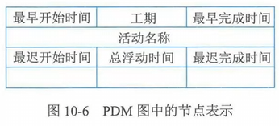

# 十、项目进度管理

## 1 管理基础

## 2 项目进度管理过程

| 过程             | 输入                                                                     | 工具与技术                                                                                                                                                                         | 输出                                                                                                                 |
| ---------------- | ------------------------------------------------------------------------ | ---------------------------------------------------------------------------------------------------------------------------------------------------------------------------------- | -------------------------------------------------------------------------------------------------------------------- |
| 规划进度管理     | 项目章程 项目管理计划 事业环境因素 组织过程资产           | 专家判断 数据分析 会议                                                                                                                                                   | 进度管理计划                                                                                                         |
| 定义活动         | 项目管理计划 事业环境因素 组织过程资产                         | 专家判断 分解 滚动式规则 会议                                                                                                                                       | 活动清单 活动属性 里程碑清单 变更请求 项目管理计划（更新）                                       |
| 排列活动顺序     | 项目管理计划 项目文件 事业环境因素 组织过程资产           | 紧前关系绘图法（单代号网络图、活动节点图、前导图法） 箭线图法（双代号网络图、活动箭线图） 确定和整合依赖关系 提前量和滞后量 项目管理信息系统                   | 项目进度网络图 项目文件（更新）                                                                                 |
| 估算活动持续时间 | 项目管理计划 项目文件 事业环境因素 组织过程资产           | 专家判断 类比估算 参数估算 三点估算（PERT） 自下而上估算 数据分析 决策 会议                                                                     | 持续时间估算 估算依据 项目文件（更新）                                                                     |
| 制定进度计划     | 项目管理计划 项目文件 协议 事业环境因素 组织过程资产 | 进度网络分析 关键路径法 资源优化 数据分析 提前量和滞后量 进度压缩 计划评审技术（PERT、三点估算技术） 项目管理信息系统 敏捷或适应型发布规则 | 进度基准 项目进度计划 进度数据 项目日历 变更请求 项目管理计划（变更） 项目文件（变更） |
| 控制进度         | 项目管理计划 项目文件 工作绩效数据 组织过程资产           | 数据分析 关键路径法 项目管理信息系统 资源优化 提前量和滞后量 进度压缩                                                                                     | 工作绩效信息 进度预测 变更请求 项目管理计划（更新） 项目文件（更新）                             |

## 3 规划进度管理

- 定义：是为规划、编制、管理、执行和控制项目进度而制定政策、程序和文档的过程
- 主要作用：为整个项目期间管理项目进度提供指南和方向
- 开展频率：仅开展一次，或仅在项目的预定义点开展

### 输入

- 项目章程
- 项目管理计划
- 事业环境因素
- 组织过程资产

### 工具与技术

- 专家判断
- 数据分析
- 会议

### 输出

- 进度管理计划
  - 定义：是项目管理计划的组成部分，为编制、监督和控制项目进度建立准则和明确活动要求
  - 特征：进度管理计划可以是正式或非正式的，非常详细或高度概括的
  - 内容
    - 项目进度模型
    - 进度计划的发布和迭代长度
    - 精确度
    - 计量单位
    - 工作分解结构（WBS）
    - 项目进度维护模型
    - 控制临界值
      - 规定偏差临界值，用于监督进度绩效
      - 是在需要采取某种措施前允许出现的最大差异，通常用偏离基准计划中的参数的某个百分数表示
    - 绩效测量规则
    - 报告格式

## 4 定义活动

- 定义：识别和记录为完成项目可交付成果，而采取具体行动的过程
- 主要作用：将工作包分解为进度活动，作为项目工作进行估算、规划、执行、监督和控制的基础
- 开展频率：在整个项目期间开展

### 输入

- 项目管理计划
- 事业环境因素
- 组织过程资产

### 工具与技术

- 专家判断
- 分解
- 滚动式规则
  - 是一种迭代式的规划技术，即详细规划近期要完成的工作，同时在较高层级上粗略规划远期工作
- 会议

### 输出

- 活动清单

  - 包含项目所需的进展活动。对于使用滚动式规划或敏捷技术的项目，活动清单会在项目进展过程中得到定期更新
- 活动属性
- 里程碑清单

  - 里程碑是项目中重要时点或事件，里程碑清单列出了项目所有的里程碑，并指明每个里程碑是强制性的（如合同要求的）还是选择性的（如根据历史信息确定的）
  - 里程碑的持续时间为零，因为它们代表的知识一个重要时间点或事件
- 变更请求
- 项目管理计划（更新）

## 5 排列活动顺序

- 定义：识别和记录项目活动之间关系的过程
- 主要作用：定义工作间的逻辑顺序，以便在既定的所有项目制约因素下获得最高的效率
- 开展频率：在整个项目期间开展
- 目的：旨在将项目活动列表转化为图表，作为发布进度基准的第一步

### 输入

- 项目管理计划
- 项目文件
- 事业环境因素
- 组织过程资产

### 工具与技术

- 紧前关系绘图法（单代号网络图、活动节点图、前导图法）

  - 定义：

    - 方框或长方形（被称作节点）代表活动
    - 节点间用箭头链接，以展示节点之间的逻辑关系

      
  - 四种依赖关系

    - 完成到开始（FS）
    - 完成到完成（FF）
    - 开始到开始（SS）
    - 开始到完成（SF）

      
  - 活动的几个时间

    - 最早开始时间（ES）
    - 最早结束时间（EF）

      - $ EF = ES + 工期 $
    - 最迟开始时间（LS）

      - $ LS = LF - 工期 $
    - 最迟完成时间（LF）

      
- 箭线图法（双代号网络图、活动箭线图）

  - 定义

    - 箭线表示活动
    - 节点表示事件

      
  - 三个基本原则

    - 每一活动和每一事件都必须有唯一的代号，即图中不会有相同的代号
    - 任两项活动的紧前事件和紧后事件，代号至少有一个不同，节点代号沿箭线方向增大
    - 流入（出）同一节点的活动，均有共同的紧后活动（或紧前活动）
  - 虚活动

    - 不消耗时间和资源，只为了弥补箭线图在活动依赖关系方面的不足

      
- 确定和整合依赖关系

  - 四种依赖关系
    - 强制性依赖关系（硬逻辑关系、硬依赖关系）
    - 选择性依赖关系（软逻辑关系）
    - 外部依赖关系：项目活动与非项目活动，往往不在项目团队的控制范围内
    - 内部依赖关系：项目活动之间，通常在项目团队的控制之中
- 提前量和滞后量

  - 提前量：负值
  - 滞后量：正值

    
- 项目管理信息系统

### 输出

- 项目进度网络图
- 项目文件（更新）

## 6 估算活动持续时间

- 定义：根据资源估算的结果，估算完成单项活动所需工作时间段数的过程
- 主要作用：是确定完成每个活动所需花费的时间量
- 开展频率：整个项目期间开展
- 渐进明细：应由团队中最熟悉具体活动的个人或小组提供持续时间估算所需的各种输入，对待持续时间的估算也应该根据输入数据的数量和质量进行渐进明细

  

### 输入

- 项目管理计划
- 项目文件
- 事业环境因素
- 组织过程资产

### 工具与技术

- 专家判断
- 类比估算
  - 定义：是一种使用相似活动或项目的历史数据来估算当前活动或项目的持续时间或成本的技术
  - 特点：相较于其他估算技术，类比估算通常成本较低、耗时较少，准确性也较低
  - 使用范围：类比估算可以针对整个项目或项目中的某个部分进行，也可以与其他估算方法联合使用
- 参数估算
  - 定义：是一种基于历史数据和项目参数，使用某种计算来计算成本或持续时间的估算技术
  - 准确性：取决于参数模型的成熟度和基础数据的可靠性
  - 使用范围：可以针对整个项目或项目中的某个部分，并可以与其他估算方法联合使用
- 三点估算（PERT）
  - 当历史数据不充分时，通过考虑估算中的不确定性和风险，可以提高活动持续时间估算的准确性
  - 三个时间
    - 乐观时间（$ T_o $）
    - 最可能时间（$ T_M $）
    - 悲观时间（$ T_P $）
  - 如果三个估算值服从三角分布：
    - $ T_E = (T_O + T_M + T_P) / 3 $
  - 如果三个估算服从 β 分布：
    - $ T_E = (T_O + 4 T_M + T_P) / 6 $
- 自下而上估算
  - 是一种估算项目持续时间或成本的方法，通过从下到上逐层汇总 WBS 组成部分的估算而得到项目估算
- 数据分析
  - 备选方案分析
  - 储备分析
    - 应急储备：与“已知 - 未知”风险相关，包含在基准中
    - 管理储备：用来应对“未知 - 未知”风险，不包括在基准中，但属于项目总持续时间的一部分
- 决策
- 会议

### 输出

- 持续时间估算：是对完成某项活动、阶段或项目所需的工作时段数的定量估算，其中不包括任何滞后量，但可指出一定的变动区间
- 估算依据
- 项目文件（更新）

## 7 制定进度计划

- 定义：是分析活动顺序、储蓄时间、资源需求和进度制约因素，创建进度模型，从而落实项目执行和监控的过程
- 主要作用：为完成项目活动而制定具有计划日期的进度模型
- 开展频率：在整个项目期间开展
- 关键步骤：
  1. 定义项目里程碑，识别活动并排列活动顺序，估算持续时间，并确定活动的开始和完成日期（识别）
  2. 由分配至各个活动的项目人员审查其被分配的活动（安排）
  3. 项目人员确认开始和完成日期与资源日历和其他项目或任务没有冲突，从而确认计划日期的有效性（确认）
  4. 分析进度计划，确定是否存在逻辑关系冲突，以及在批准进度计划并将其作为基准前是否需要资源平衡，并同步修订和维护项目进度模型，确保进度计划在整个项目期间一直切实可行（检查）

### 输入

- 项目管理计划
- 项目文件
- 协议
- 事业环境因素
- 组织过程资产

### 工具与技术

- 进度网络分析
- 关键路径法
  - 定义：用于在进度模型中估算项目的最短工期，确定逻辑网络路径的进度灵活性
  - 概念：
    - 总浮动时间
      - 活动可以从最早开始日期推迟或拖延的时间，而不至于延误项目完成日期或违反进度制约因素
      - $ 总浮动时间 = 本活动最迟完成时间 - 本活动最早完成时间 $
      - $ 总浮动时间 = 本活动最迟开始时间 - 本活动最早开始时间 $
    - 自由浮动时间
      - 在不延误任何紧后活动的最早开始日期，或不违法进度制约因素的前提下，某进度可以推迟的时间
      - $ 自由浮动时间 = 紧后活动最早开始时间的最小值 - 本活动的最早完成时间 $
  - 进度网络图中可能有多条关键路径
- 资源优化
  - 资源平衡
    - 往往导致关键路径改变
  - 资源平滑
    - 不会改变项目的关键路径，完工日期不会延迟
    - 无法实现所有资源的优化
- 数据分析
  - 假设场景分析
  - 模拟
- 提前量和滞后量
- 进度压缩
  - 定义：在不压缩项目范围的前提下，缩短或加快进度工期，以满足进度制约因素、前置日期或其他进度目标
  - 压缩技术：
    - 赶工
      - 通过增加资源，以最小的成本代价来压缩进度工期的一种技术
      - 可能导致风险和/或成本的增加
    - 快速跟进
      - 一种进度压缩技术，将正常情况下按顺序进行的活动或阶段改为至少是不分并行开展
      - 通常会增加活动间的协调工作，并增加质量风险。可能增加项目成本
- 计划评审技术（PERT、三点估算技术）
  - 理论基础是假设项目持续时间及整个项目完成时间时随机的，且服从某种概率分布
- 项目管理信息系统
- 敏捷或适应型发布规则

### 输出

- 进度基准
- 项目进度计划

  - 特点：可以是概括或详细的
  - 展现方式

    - 列表
    - 图形

      - 横道图（甘特图）

        
      - 里程碑图图

        
      - 项目进度网络图

        

        - 时标图

          
- 进度数据
- 项目日历

  - 其中规定可以开展进度活动的可用工作日和工作班次，它把可用于开展进度活动的时间段（按天或更小的时间单位）与不可用的时间段区分开
- 变更请求
- 项目管理计划（变更）
- 项目文件（变更）

## 8 控制进度

- 定义：监督项目状态，以更新项目进度和管理进度基准变更
- 主要作用：在整个项目期间保持对进度基准的维护
- 开展频率：整个项目期间
- 关注内容
  - 判断项目进度的当前状态
  - 对引起进度变更的因素施加影响
  - 重新考虑必要的进度储备
  - 判断项目进度是否已发生变更
  - 在变更实际发生时对其进行管理

### 输入

- 项目管理计划
- 项目文件
- 工作绩效数据
- 组织过程资产

### 工具与技术

- 数据分析

  - 挣值分析

    - 如进度偏差（SV）、进度绩效指数（SPI）
  - 迭代燃尽图

    
  - 绩效审查
  - 趋势分析
  - 偏差分析
  - 假设情景分析
- 关键路径法
- 项目管理信息系统
- 资源优化
- 提前量和滞后量
- 进度压缩

### 输出

- 工作绩效信息
- 进度预测
- 变更请求
- 项目管理计划（更新）
- 项目文件（更新）
