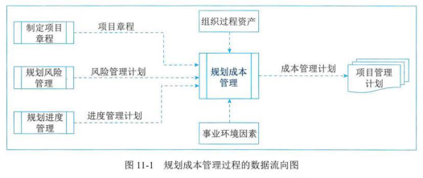
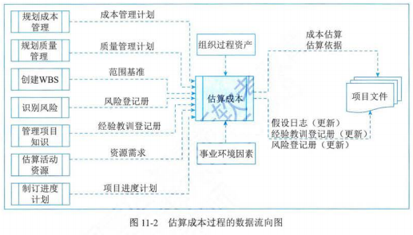
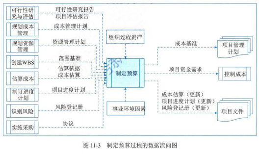
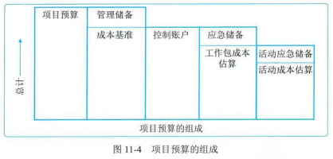
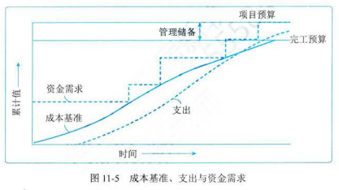
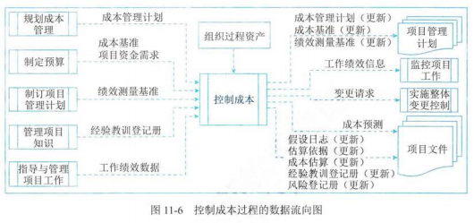

## 1 管理基础

- 项目成本失控的原因
  - 对工程项目认识不足
  - 组织制度不健全
  - 方法问题
  - 技术制约
  - 需求管理不当
- 相关术语和定义
  - 产品的全生命周期成本
    - 是在产品或系统的整个使用生命期内，在获得阶段（设计、生产、安装和测试等活动）、运营与维护及生命周期结束时对产品的处置所发生的全部成本
  - 成本的类型
    - 可变成本（变动成本）：随着生产量、工作量或时间而变的成本
    - 固定成本：不随生产量、工作量或实践的变化而变化的非重复成本
    - 直接成本：直接归属于项目工作的成本
    - 间接成本：来自一般管理费用科目或几个项目共同负担的项目成本所分摊给本项目的费用
    - 机会成本：利用一定的时间或资源生产或交付一种产品或服务，而失去利用这些资源生产或交付其他最佳替代品的机会。泛指一切在作出某一选择后同事失去其他选择，其他选择中最大的损失
    - 沉默成本：由于过去决策已经发生的，而不能由现在或将来任何决策改变的成本。
      - 是一种历史成本，对现有决策而言是不可控成本，会很大程度上影响人们的行为方式与决策，在投资决策时应尽量排除其干扰
  - 应急储备和管理储备
    - 应急储备
    - 管理储备
  - 成本基准
    - 是经批准的按时间安排的成本及支出，并随时反应了经批准的项目成本的变更（所增加或减少的资金数目），被用于度量和监督项目的实际成本

## 2 项目成本管理过程

| 过程         | 输入                                                                                         | 工具与技术                                                                                                         | 输出                                                                                     |
| ------------ | -------------------------------------------------------------------------------------------- | ------------------------------------------------------------------------------------------------------------------ | ---------------------------------------------------------------------------------------- |
| 规划成本管理 | 项目章程 项目管理计划 事业环境因素 组织过程资产                               | 专家判断 数据分析 会议                                                                                   | 成本管理计划                                                                             |
| 估算成本     | 项目管理计划 项目文件 事业环境因素 组织过程资产                               | 专家判断 类比估算 参数估算 自下而上估算 三点估算 数据分析 项目管理信息系统 决策 | 成本估算 估算依据 项目文件（更新）                                             |
| 制定预算     | 项目管理计划 可行性研究文件 项目文件 协议 事业环境因素 组织过程资产 | 专家判断 成本汇总 数据分析 历史信息审核 资金限制平衡 融资                                 | 成本基准 项目资金需求 项目文件（更新）                                         |
| 控制成本     | 项目管理计划 项目资金需求 项目文件 工作绩效数据 组织过程资产             | 专家判断 数据分析 完工尚需绩效指数 项目管理信息系统                                                 | 成本绩效信息 成本预测 变更请求 项目管理计划（更新） 项目文件（更新） |

## 3 规划成本管理

- 定义：确定如何估算、预算、管理、监督和控制项目成本的过程
- 主要作用：在整个项目期间为如何管理项目成本提供指南和方向

### 输入

- 项目章程
- 项目管理计划
- 事业环境因素
- 组织过程资产

### 工具与技术

- 专家判断
- 数据分析
- 会议

### 输出

- 成本管理计划
  - 定义：是项目管理计划的组成部分，描述将如何规划、安排和控制项目成本
  - 内容：
    - 计量单位
    - 精确度
    - 准确度
    - 组织程序链接
    - 控制临界值
    - 绩效测量规则
    - 报告格式
    - 其他细节

## 4 估算成本

- 定义：对完成项目工作所需资源成本进行近似估算的过程
- 主要作用：确定项目所需的资金
- 开展频率：整个项目期间定期开展
- 量化估算：成本估算是对完成活动所需资源的可能成本进行量化评估，是在某特定时点根据已知信息作出的成本预测
- 准确性：将随着项目的进展而逐步提高
- 包括项：进行成本估算，应考虑对项目收费的全部资源，一般包括人工、材料、设备、服务、设施，以及一些特殊的成本种类，如通货膨胀补贴、融资成本或应急成本

### 输入

- 项目管理计划
- 项目文件
- 事业环境因素
- 组织过程资产

### 工具与技术

- 专家判断
- 类比估算
- 参数估算
- 自下而上估算
- 三点估算
- 数据分析
  - 备选方案分析
  - 储备分析
  - 质量成本
- 项目管理信息系统
- 决策

### 输出

- 成本估算
- 估算依据
- 项目文件（更新）

## 5 制定预算

- 定义：是汇总所有活动或工作包的估算成本，建立一个经批准的成本基准的过程
- 主要作用：确定可以依据其来进行监督和控制项目绩效的成本基准
- 项目预算：包括经批准用于执行项目的全部资金
- 成本基准：
  - 经过批准且按时间段分配的项目预算
  - 包括应急储备，但不包括管理储备

### 输入

- 项目管理计划
- 可行性研究文件
- 项目文件
- 协议
- 事业环境因素
- 组织过程资产

### 工具与技术

- 专家判断
- 成本汇总：先把成本估算汇总到 WBS 中的工作包，再由工作包汇总至 WBS 的更高层次（如控制账户），最终得出整个项目的总成本
- 数据分析
  - 储备分析
- 历史信息审核
- 资金限制平衡
  - 应根据对项目资金的限制来平衡资金支出，如果发现资金限制与计划支出间存在差异，则可能需要调整工作的进度计划，以平衡资金的支出水平
  - 如可以通过在项目进度计划中添加强制日期来实现
- 融资：为项目获取资金

### 输出

- 成本基准

  
  
- 项目资金需求：根据成本基准，确定总资金需求和阶段性（如季度或年度）资金需求
- 项目文件（更新）

## 6 控制成本

- 定义：监督项目状态，以更新项目成本和管理成本基准变更的过程
- 主要作用：在整个项目期间保持对成本基准的维护
- 开展频率：整个项目期间开展
- 重点分析：项目资金支出与完成的相应工作之间的关系，有限成本控制的关键在于管理经审批的成本基准
- 目标
  - 对造成成本基准变更的因素施加影响
  - 确保所有变更请求都得到及时处理
  - 当变更实际发生时，管理这些变更
  - 确保成本支出不超过批准的资金限额，即不超出按时段、WBS 组件和活动分配的限额，也不超出项目总限额
  - 监督成本绩效，找出并分析与成本基准间的偏差
  - 对照资金支出，监督工作绩效
  - 防止在成本或资源使用报告中出现未经批准的变更
  - 向干系人报告所有经审批的变更及其相关成本
  - 设法把预期的成本超支控制在可接受的范围内等

### 输入

- 项目管理计划
- 项目资金需求
- 项目文件
- 工作绩效数据
- 组织过程资产

### 工具与技术

- 专家判断
- 数据分析
  - 挣值分析（EVA）
  - 偏差分析
  - 趋势分析
  - 储备分析
- 完工尚需绩效指数
- 项目管理信息系统

| 缩写 | 名称             | 词汇定义                                                                                             | 公式                                                   | 结果说明                                      |
| ---- | ---------------- | ---------------------------------------------------------------------------------------------------- | ------------------------------------------------------ | --------------------------------------------- |
| PV   | 计划价值         | 为计划工作分配的经批准的预算                                                                         | $ PV = 计划完成工作的计划价值之和 $                  |                                               |
| EV   | 挣值             | 对已完成工作的测量，用该工作的批准预算来表述                                                         | $ EV = 已完成工作的计划价值之和 $                    |                                               |
| AC   | 实际成本         | 在给定时间段内，因执行项目活动而实际发生的成本                                                       | $ AC = 已完成工作的实际价值之和 $                    |                                               |
| BAC  | 完工预算         | 为将要执行的工作所建立的全部预算的总和                                                               | $ BAC = 总计划工作的价值 $                           |                                               |
| CV   | 成本变差         | 在某个给定时间点，预算亏空或盈余量，表示为挣值与实际成本之差                                         | $ CV = EV - AC $                                     | 正值 = 低于计划成本 负值 = 超出计划成本  |
| SV   | 进度偏差         | 在某个时间点，项目与计划交付日期相比的亏空或盈余量，表示为挣值与计划价值之差                         | $ SV = EV - PV $                                     | 正值 = 比计划提前 负值 = 比计划滞后      |
| VAC  | 完工偏差         | 对预算亏空或盈余量的一种预算，是完工预算与完工估算之差                                               | $ VAC = BAC - EAC $                                  | 正值 = 低于计划成本 负值 = 超出计划成本 |
| CPI  | 成本绩效指数     | 测量预算资源的成本效率的指标，表示为挣值与实际成本之比                                               | $ CPI = EV / AC $                                    | >1 = 低于计划成本 <1 = 超出计划成本      |
| SPI  | 进度绩效指数     | 测量进度效率的指标，表示为挣值与计划价值之比                                                         | $ SPI = EV / PV $                                    | >1 = 比计划提前 <1 = 比计划滞后          |
| EAC  | 完工估算         | 完成所有工作所需的预期总成本，等于截至目前的实际成本加上完工尚需估算                                 | $ EAC = BAC / CPI $ $ EAC = AC + (BAC - EV) $ |                                               |
| ETC  | 完工尚需估算     | 完成所有剩余项目工作的预算成本                                                                       | $ ETC = EAC - AC $                                   |                                               |
| TCPI | 完工尚需绩效指数 | 为了实现特性的管理目标，剩余资源你的使用必须达成的成本绩效指标，是完成剩余工作所需成本与可用预算之比 | $ TCPI = \frac{BAC - EV}{EAC - AC} $                   | >1 = 难以完成 <1 = 轻易完成              |

### 输出

- 成本绩效信息
- 成本预测
- 变更请求
- 项目管理计划（更新）
- 项目文件（更新）

## 补充

- 估算步骤
  1. 识别并分析成本的构成科目
  1. 根据已识别的项目成本构成科目，估算每一科目的成本大小
  1. 分析成本估算结果，找出各种可以相互替代的成本，协调各个成本之间的比例关系
- 预算步骤
  1. 将项目总成本分摊到项目工作分解结构的各个工作包。分解按照自顶向下，根据占用资源数量多少而设置不同的分解权重
  1. 将各个工作包成本再分配到该工作包所包含的各项活动上
  1. 确定各项成本预算支出的时间计划及项目成本预算计划
- 预算与预算的区别、联系
  - 区别
    - 成本估算是估算完成每项活动所需的近似成本
    - 成本预算是将单个活动或工作包的估算成本汇总，更精确估算项目总成本，并分摊到项目各活动的各阶段上
  - 联系
    - 估算的输出是预算的基础，预算是将已批准的项目总估算成本进行分摊
