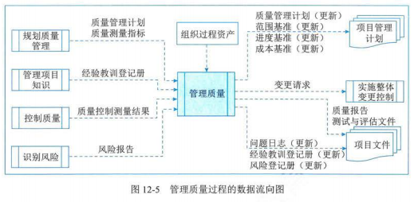
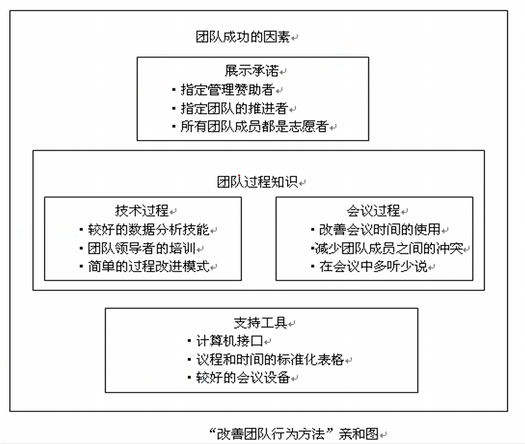

## 1 管理基础

### 质量与项目质量

- 质量
  - 定义
    - 国际标准化组织（ISO）：反映实体满足主体明确和隐含需求的能力的特性总和
    - 国家标准 GB/T 19000：一组固有特性满足要求的程度
    - 通常定义：指产品的质量，广义上的质量还包括工作质量
  - 质量与等级的区别
    - 质量：作为实现的性能或成果，是“一系列内在特性满足要求的程度（ISO 90000）”
    - 等级：是对用途相同但技术特性不同的可交付成果
    - 例如：
      - 一个低等级（功能有限）、高质量（无明显缺陷，用户手册易读）的软件产品，适合一般情况下使用，也可以被认可
      - 一个高等级（功能繁多）、低质量（有许多缺陷，用户手册杂乱无章）的软件产品，该产品的功能会因质量低劣而无效和/或抵消，不会被使用者接受
  - 预防胜于检查
    - 最好将质量设计到可交付成果中，而不是在检查时发现质量问题，预防错误的成本通常远低于在检查或使用中发现并纠正错误的成本
  - 术语
    - 预防：保证过程中不出现错误
    - 检查：保证错误不落到客户手中
    - 公差：结果的可接受范围
    - 控制界限：统计意义上稳定的过程或过程绩效的普通偏差的边界
- 项目质量
  - 是顺应客户的要求进行的，不同的客户有着不同的质量要求，其意图已反映在项目合同中。因此，项目合同通常是进行项目质量管理的主要依据

### 质量管理

- 质量管理：是指确定质量方针、目标和职责，并通过质量体系中的质量规划、质量保证、质量控制以及质量改进来使其实现所有管理职能的全部活动
- 质量方针与质量目标
  - 方针：是由组织的最高管理者正式发布的该组织总的质量宗旨和方向
  - 目标：指“在质量方面追求的目的”，是落实质量方针的具体要求，用属于质量方针
- 按有效性递增的五种质量管理水平
  1. 代价最大的方法是让客户发现缺陷
  2. 先检查和纠正缺陷，再将可交付成果发送给客户
  3. 通过质量保证检查并纠正过程本身
  4. 将质量融入项目和产品的规划和设计中
  5. 在整个组织内创建一种关注并致力于实现过程和产品质量的文化

### 质量管理标准体系

- 全面质量管理（TQM）
  - 定义：是一种全员、全过程、全组织的品质管理
  - 4 个核心特征
    - 全员参加的
    - 全过程的
    - 全面方法的
    - 全面结果的

## 2 项目质量管理过程

- 过程概述
  - 规划质量管理：关注工作需要达到的质量
  - 管理质量：关注管理整个项目期间的质量
  - 控制质量：关注工作成果与质量要求的比较，确保结果可接受

| 过程         | 输入                                                                                                                 | 工具与技术                                                                                                             | 输出                                                                                                                   |
| ------------ | -------------------------------------------------------------------------------------------------------------------- | ---------------------------------------------------------------------------------------------------------------------- | ---------------------------------------------------------------------------------------------------------------------- |
| 规划质量管理 | 项目章程 项目管理计划 项目文件 事业环境因素 组织过程资产                                         | 专家判断 数据收集 数据分析 决策技术 数据表现 测试与检查的规划 会议                       | 质量管理计划 质量测量指标 项目管理计划（更新） 项目文件（更新）                                         |
| 管理质量     | 项目管理计划 项目文件 组织过程资产                                                                         | 数据收集 数据分析 决策技术 数据表现 审计 面相 X 的设计（DfX） 问题解决 质量改进方法 | 质量报告 测试与评估文件 变更请求 项目管理计划（变更） 项目文件（更新）                             |
| 控制质量     | 项目管理计划 项目文件 可交付成果 工作绩效数据 批准的变更请求 事业环境因素 组织过程资产 | 数据收集 数据分析 检查 测试/产品评估 数据表现 会议                                            | 工作绩效信息 质量控制测量结果 核实的可交付成果 变更请求 项目管理计划（更新） 项目文件（更新） |

## 3 规划质量管理

- 定义：是识别项目及其可交付成果的质量要求、标准，并书面描述项目将如何证明符合质量要求、标准的过程
- 主要作用：为整个项目期间如何管理和核实质量提供指南和方向

### 输入

- 项目章程
- 项目管理计划
- 项目文件
- 事业环境因素
- 组织过程资产

### 工具与技术

- 专家判断
- 数据收集

  - 标杆对照
  - 头脑风暴
  - 访谈
- 数据分析

  - 成本效益分析：用来估算备选方案优势和劣势的财务分析工具，以确定可以创造最佳效益的备选方案
  - 质量成本

    - 预防成本
    - 评估成本
    - 失败成本（内部/外部）

      
- 决策技术
- 数据表现

  - 流程图（过程图）：用来显示将一个或多个输入转化成一个或多个输出的过程，所需步骤顺序和可能分支

    
  - 逻辑数据模型

    - 把组织数据可视化，用业务语言加以描述，不依赖特定的技术
    - 可用于识别会出现数据完整性或其他问题的地方
  - 矩阵图

    - 在行列交叉的位置展示因素、原因和目标之间的强弱关系
    - 有助于识别对项目成功至关重要的质量测量指标
  - 思维导图

    - 用于可视化组织信息的绘图法
    - 有助于快速收集项目质量要求、制约因素、依赖关系和联系
- 测试与检查的规划

  - 在规划阶段，项目经理和团队决定如何测试或检查产品、可交付成果或服务，以满足干系人的需求和期望，以及如何满足产品的绩效和可靠性目标
- 会议

### 输出

- 质量管理计划
  - 定义：是项目管理计划的组成部分，描述如何实施适用的政策、程序和指南以实现质量目标
  - 特征：可以是正式或非正式的，非常详细或高度概括的
  - 美容
    - 项目采用的质量标准
    - 项目的质量目标
    - 质量角色与职责
    - 需要质量审查的项目可交付成果和过程
    - 为项目规划的质量控制和质量管理活动
    - 项目使用的质量工具
    - 与项目有关的主要程序
- 质量测量指标
  - 定义：专用于描述项目或产品属性，以及控制质量过程将如何验证符合程度
  - 例子：按时完成的任务的百分比、以 CIP 测量的成本绩效、故障率、识别的日缺陷数量、每月总停机事件、每个代码行的错误、客户满意度分数，以及测试计划所涵盖的需求百分比（即测试覆盖度）
- 项目管理计划（更新）
- 项目文件（更新）

## 4 管理质量

- 定义：是把组织的质量政策用于项目，并将质量管理计划转化为可执行的质量活动的过程
- 主要作用
  - 提高实现质量目标的可能性
  - 识别无效过程和导致质量低劣的原因
  - 使用控制质量过程的数据和结果项干系人展示项目的总体质量状态
- 开展频率：整个项目期间开展
- 与质量保证的区别
  - 有时被称为“质量保证”，但“管理质量”的定义比“质量保证”更广，因其可用于非项目工作
  - 质量保证：着眼于项目使用的过程，旨在高效的执行项目过程，包括遵守和满足标准，向干系人保证最终产品可以满足他们的需求、期望和要求
  - 管理质量：包括所有质量保证活动，还与产品设计和过程改进有关
- 做好管理质量的好处
  - 通过执行有关产品特定方面的设计准则，设计出最优的成熟产品
  - 建立信心，相信通过质量保证工具和技术（如质量审计和故障分析）可以使未来输出在完工时满足特定的需求和期望
  - 确保使用质量过程并确保其使用能满足项目的质量目标
  - 提高过程和活动的效率与效果，获得更好的成果和绩效并提高干系人的满意度
- 质量保证部门（QA）：项目经理和项目团队可以通过组织的质量保证部门，或其他组织职能执行某些管理质量活动，例如故障分析、实现设计和质量改进
- 人人有责：质量管理是所有人的共同职责，包括项目经理、项目团队、项目发起人、执行组织的管理层，甚至是客户

### 输入

- 项目管理计划
- 项目文件
  - 经验教训登记册
  - 质量控制测量结果
  - 质量测量指标
  - 风险报告
- 组织过程资产

### 工具与技术

- 数据收集

  - 核对单

    
- 数据分析

  - 备选方案分析
  - 文件分析
  - 过程分析
  - 根本原因分析（RCA）
- 决策技术
- 数据表现

  - 亲和图：对潜在缺陷成因进行分类，展示最应关注的领域

    
  - 因果图（鱼骨图、why-why 分析图、石川图）：将问题成熟的原因分解为离散的分支，有助于识别问题的主要原因或根本原因

    
  - 流程图：引发缺陷的一系列步骤
  - 直方图
  - 矩阵图
  - 散点图：两个变量之间关系
- 审计

  - 定义：是用于确定项目活动是否遵循了组织和项目的政策、过程与程序的一种结构化且独立的过程
  - 执行组织：通常由项目外部的团队开展，如：组织内部审计部门、项目管理办公室（PMO）或组织外部的审计师
  - 目标
    - 识别全部正在实施的良好及最佳实践
    - 识别所有违规做法、差距及不足
    - 分享所有组织和/行业中类似项目的良好实践
    - 积极、主动的提供协助，以改进过程的执行，从而帮助团队提高生产效率
    - 强调每次审计都应对组织经验教训和知识库的积累做出贡献等
  - 可以事先安排，也可随机进行；可由内部或外部审计师进行
- 面相 X 的设计（DfX）

  - 定义：是产品设计期间可采用的一系列技术指南，旨在优化设计的也定方面，可以控制或提高产品最终特性
  - 针对方面：DfX 中的 X 可以是产品开发的不同方面，如：可靠性、调配、装配、制造、成本、服务、可用性、安全性和质量
  - 可以降低成本，改进质量、提高绩效和客户满意度
- 问题解决
- 质量改进方法

### 输出

- 质量报告：可能是图形、数据或定性文件，其中包含的信息可帮助其他过程和部门采取纠正措施，以实现项目质量期望
- 测试与评估文件：可基于业务需求和组织目标创建测试与评估文件
- 变更请求
- 项目管理计划（变更）
- 项目文件（更新）

## 5 控制质量

- 定义：为了评估绩效，确保项目输出完整、正确且满足客户期望，而监督和记录质量管理活动执行结果的过程
- 主要作用：
  - 核实项目可交付成果和工作已经达到主要干系人的质量要求，可供最终验收
  - 确定项目输出是否达到预期目的，这些输出需要满足所有适用标准、要求、法规和规范
- 开展频率：整个项目期间开展
- 目的：在用户验收和最终交付之前测量产品或服务的完整性、合规性和适用性

### 输入

- 项目管理计划
- 项目文件
- 可交付成果
- 工作绩效数据
- 批准的变更请求：实施需核实，并需要确认完整性、正确性以及是否需要重新测试
- 事业环境因素
- 组织过程资产

### 工具与技术

- 数据收集

  - 核对单
  - 核查表（计数表）：用于合理排列各种事项，以便有效的收集关于潜在质量问题的有用数据

    
  - 统计抽样
  - 问卷调查

    - 用于在部署产品或服务之后收集关于客户满意度的数据
    - 在问卷调查中识别的缺陷相关成本可被视为 COQ 模型中的外部失败成本，给组织带来的影响会超出成本本身
- 数据分析

  - 绩效审查
  - 根本原因分析（RAC）
- 检查
- 测试/产品评估

  - 定义：是一种有组织的，结构化的调查，旨在根据项目需求提供有关被测产品或服务质量的客观信息
  - 目的：找出产品或服务中存在的错误、缺陷、漏洞或其他不合规的问题
  - 类型
    - 单元测试
    - 集成测试
    - 黑盒测试
    - 白盒测试
    - 接口测试
    - 回归测试
    - α 测试等
- 数据表现

  - 因果图：用于识别质量缺陷和错误可能造成的结果
  - 控制图

    - 用于确定一个过程是否稳定，或是否具有可预测的绩效
    - 规格上限和下限是根据要求制定的，反映了可允许的最大值和最小值

      
  - 直方图：按来源或组成部分展示缺陷数量
  - 散点图
- 会议

### 输出

- 工作绩效信息
- 质量控制测量结果
- 核实的可交付成果
- 变更请求
- 项目管理计划（更新）
- 项目文件（更新）
