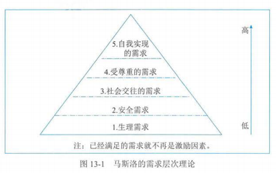
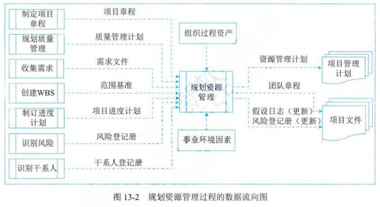
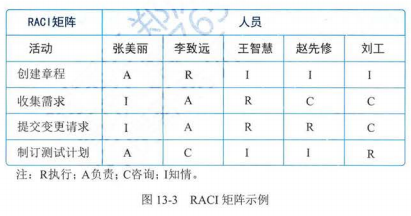
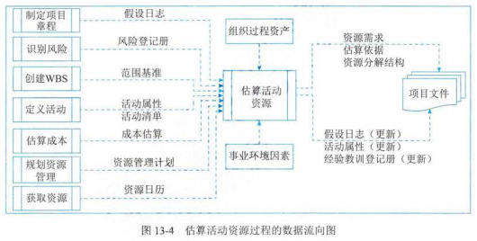
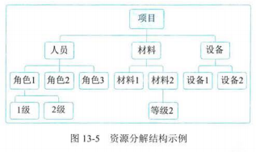
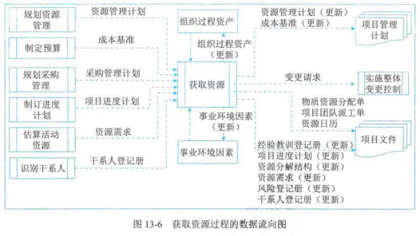
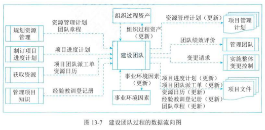
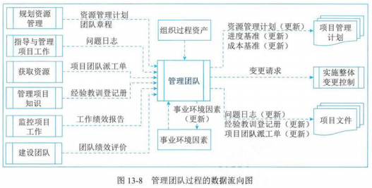
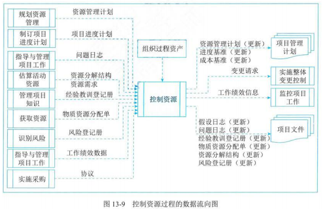

# 13. 项目资源管理

## 1 管理基础

### 相关术语和定义

- 项目团队

  - 定义：执行项目工作，以实现项目目标的一组人员，由为了完成项目而承担不同角色与职责的人员组成
  - 特点：成员可能具备不同的技能，可能是全职或兼职的，可能随着项目进行而增加或减少
  - 团队参与时间：在规划阶段就参与进来，既可使他们对项目规划工作贡献专业技能，又可以增强他们对项目的责任感
- 项目管理团队
- 项目经理：领导者、管理者
- 领导和管理

  - 领导者
    - 确定方向
    - 统一思想
    - 激励和鼓舞
  - 管理者
    - 被组织赋予职位和权利，负责某件事情的管理或实现某个目标
  - 领导力
    - 定义：让一个群体为了一个共同目标而努力的能力
    - 领导力的关键要素：尊重和信任，而非畏惧和顺从
  - 双重身份
    - 项目经理具由领导者和管理者的双重身份。对项目经理而言，管理能力和领导能力二者均不可或缺。对于大型复杂项目，领导能力尤为重要
- 权利

  - 项目经理的权利来源
    - 职位权利
    - 惩罚权利
    - 奖励权利
    - 专家权利
    - 参照权利
  - 来源
    - 职位权利、惩罚权利、奖励权利来自于组织的授权
    - 专家权利和参照权利来自于管理者自身
  - 权利的使用
    - 在项目环境中，有人直接向项目经理汇报，有人间接向项目经理汇报，还有人既要向项目经理汇报，又要向职能经理汇报
    - 对于双重汇报关系和非直接汇报关系人员的管理，项目经理更注重运用奖励权利、专家权利和参照权利，尽量避免使用惩罚权利
- 冲突和竞争

  - 冲突
    - 双面性：冲突并不一定是有害的，“一团和气”的集体不一定是一个高效率的集体
    - 如：发现人员流动率过低，缺乏新思想、缺乏竞争意识、对改革进行阻挠等情况时，管理人员就要挑起冲突（鲶鱼效应）
  - 竞争
  - 冲突与竞争的处理方式：项目经理对于有害的冲突要设法加以解决和减少；对有益的冲突要加以利用，要鼓励团队成员良性竞争
- 团队发展阶段

  - 5 个阶段
    - 形成阶段
    - 震荡阶段
    - 规范阶段
    - 发挥阶段
    - 解散阶段
  - 退回/跳过：上述阶段通常按顺序进行，然而，团队停止在某个阶段或退回到较早阶段的情况也非常看见。如果团队成员曾经共事过，项目团队建设也可跳过某些阶段
- 激励理论

  - 马斯洛需求层次理论

    - 生理需求
      - 激励：员工宿舍、工作餐、工作服、班车、工资、补贴、奖金等
    - 安全需求
      - 激励：养老保险、医疗保险、长期劳动合同、意外保险、失业保险等
    - 社交需求
      - 激励：定期员工活动、聚会、比赛、俱乐部等
    - 受尊重需求
      - 激励：荣誉性的奖励、形象、地位的提升、颁发奖章、作为导师培训别人等
    - 自我实现的需求
      - 激励：给他更多的空间，让他负责、让他成为智囊团、参与决策、参与组织的管理会议等

    
  - 赫茨伯格的双因素理论

    - 保健因素
      - 与工作环境或条件有关，能防止人们产生不满意感的一类因素，包括工作环境、工资薪水、组织政策、个人生活、管理监督、人际关系等
      - 不健全时，人们会对工作产生不满意感，但即使其很好时，也仅可消除工作中的不满意，却无法增加人们对工作的满意感，所以这些因素无法起到激励作用
    - 激励因素
      - 与员工的工作本身或工作内容有关的，能促使人们产生工作满意感的一类因素，是高层次的需要，包括成就、承认、工作本身、责任、发展机会等
      - 其缺乏时，人们会缺乏进取心，对工作无所谓，但一旦具备了激励因素，员工则会感觉到强大的激励力量从而产生对工作的满意感，所以只有这类因素才能真正激励员工
    - 实施思路
      - 注意区别保健因素和激励因素，前者的满足可以消除不满，后者的满足可以产生满意感
      - 也没有必要过分的改善保健因素，这样做只能消除员工对工作的不满情绪，而不能直接提高工作积极性和工作效率
  - 麦格雷戈的 X 理论和 Y 理论

    - X 理论
      - 人天性好逸恶劳，只要有可能就会逃避工作
      - 人生来就以自我为中心，漠视组织的要求
      - 缺乏进取心，逃避责任，甘愿听从指挥，安于现状，没有创造性
      - 人们通常容易受骗，易受人煽动
      - 人们天生反对改革
      - 人的工作动机就是为了获得经济报酬
    - Y 理论
      - 人天生不是好逸恶劳，他们热爱工作，从工作得到满足和成就感
      - 外来的控制和处罚对人们实现组织的目标不是一个有效的办法，下属能够自我确定目标、自我指挥和自我控制
      - 在适当条件下，人们愿意主动承担责任
      - 大多数人具有一定的想象力和创造力
      - 在现代社会中，人们的智慧和潜能只是部分的得到了发挥，如果给予机会，人们喜欢工作，并渴望发挥其才能
    - X 理论与 Y 理论应用
      - 在项目团队的开始阶段：大家相互还不是很熟悉，对项目不是很了解或还有某种抵触等，这时候需要项目经理运用 X 理论去指导和管理
      - 当项目团队进入执行阶段：成员对项目的目标已经了解，都愿意努力完成项目，这时候可以运用 Y 理论授权团队完成所负责的工作，并提供支持和相应的环境
  - 期望理论

    - 目标效价：实现该目标对个人有多大价值的主观判断
    - 期望值：个人对实现目标可能性大小的主观估计
    - 激发力量 = 目标效价值 \* 期望值
    - 实践中的基本原则
      - 期望概率既不是越大越好，也不是越小越好，关键要适量
      - 当一个期望概率远高于实际概率时，可能产生挫折；期望概率太小时，会减少某一目标的激发力量
      - 实际概率最好大于平均的个人期望概率，使大多数人受益

## 2 项目资源管理过程

| 过程         | 输入                                                                                               | 工具和技术                                                                                                           | 输出                                                                                                                                                               |
| ------------ | -------------------------------------------------------------------------------------------------- | -------------------------------------------------------------------------------------------------------------------- | ------------------------------------------------------------------------------------------------------------------------------------------------------------------ |
| 规划资源管理 | 项目章程 项目管理计划 项目文件 事业环境因素 组织过程资产                       | 专家判断 数据表现 组织理论 会议                                                                       | 资源管理计划 团队章程 项目文件（更新）                                                                                                                   |
| 估算活动资源 | 项目管理计划 项目文件 事业环境因素 组织过程资产                                     | 专家判断 自下而上估算 类比估算 参数估算 数据分析 项目管理信息系统 会议                 | 资源需求 估算依据 资源分解结构 项目文件（更新）                                                                                                     |
| 获取资源     | 项目管理计划 项目文件 事业环境因素 组织过程资产                                     | 决策 人际关系与团队技能 预分派 虚拟团队                                                               | 物质资源分配单 项目团队派工单 资源日历 变更请求 项目管理计划（更新） 项目文件（更新） 事业环境因素（更新） 组织过程资产（更新） |
| 建设团队     | 项目管理计划 项目文件 事业环境因素 组织过程资产                                     | 集中办公 虚拟团队 沟通技术 人际关系与团队技能 认可与奖励 培训 个人和团队评估 会议 | 团队绩效评价 变更请求 项目管理计划（更新） 项目文件（更新） 事业环境因素（更新） 组织过程资产（更新）                                     |
| 管理团队     | 项目管理计划 项目文件 工作绩效报告 团队绩效评价 事业环境因素 组织过程资产 | 人际关系与团队技能 项目管理信息系统                                                                             | 变更请求 项目管理计划（更新） 项目文件（更新） 事业环境因素（更新）                                                                                 |
| 控制资源     | 项目管理计划 项目文件 工作绩效数据 协议 组织过程资产                           | 数据分析 问题解决 人际关系与团队技能 项目管理信息系统                                                 | 工作绩效信息 变更请求 项目管理计划（更新） 项目文件（更新）                                                                                         |

## 3 规划资源管理

- 定义：定义如何估算、获取、管理和利用团队以及实物资源的过程
- 主要作用：根据项目类型和复杂程度确定适用于项目资源的管理方法和管理程度
- 开展频率：仅开展一次或仅在项目的预定义点开展

### 输入

- 项目章程
- 项目管理计划
- 项目文件
- 事业环境因素
- 组织过程资产

### 工具与技术

- 专家判断
- 数据表现

  - 层级型

    - 工作分解结构（WBS）
    - 组织分解结构（OBS）
    - 资源分解结构（RBS）
  - 矩阵型

    - 职责分配矩阵

      - 责任分配矩阵（RAM）

        - RACI（执行、负责、咨询、知情）矩阵

        
  - 文本型
- 组织理论：阐述个人、团队和组织部门的行为方式
- 会议

### 输出

- 资源管理计划
  - 定义：项目管理计划的一部分，提供了关于如何分类、分配、管理和释放项目资源的指南
  - 分为
    - 团队管理计划
    - 实物资源管理计划
  - 主要内容
    - 识别资源
    - 获取资源
    - 角色与职责
    - 项目组织图
      - 以图形的方式展示项目团队成员及其报告关系
      - 可以是正式或非正式的，非常详细或高度概括的
    - 项目团队资源管理
    - 培训
    - 团队建设
    - 资源控制
    - 认可计划
- 团队章程
  - 是为团队创建团队价值观、共识和工作指南的文件
  - 包括
    - 团队价值观
    - 沟通指南
    - 决策标准和过程
    - 冲突管理过程
    - 会议指南
    - 团队共识
- 项目文件（更新）

## 4 估算活动资源

- 定义：估算执行项目所需的团队资源，以及材料、设备和用品的类型和数量的过程
- 主要作用：明确完成项目所需的资源种类、数量和特征
- 开展频率：在整个项目期间定期开展

### 输入

- 项目管理计划
- 项目文件
- 事业环境因素
- 组织过程资产

### 工具与技术

- 专家判断
- 自下而上估算
- 类比估算
- 参数估算
- 数据分析
- 项目管理信息系统
- 会议

### 输出

- 资源需求：识别了各个工作包或工作包中每项活动所需的资源类型和数量，可以汇总这些需求，以估算每个工作包、每个 WBS 分支及整个项目所需的资源
- 估算依据
- 资源分解结构：是资源依类别和类型的层级展现

  
- 项目文件（更新）

## 5 获取资源

- 定义：获取资源是获取项目所需的团队成员、设施、设备、材料、用品和其他资源的过程
- 主要作用：
  - 概述和指导资源的选择
  - 将选择的资源分配给相应的活动
- 开展频率：根据需要再整个项目期间定期开展
- 资源来源
  - 内部资源：由职能经理或资源经理负责获取（分配）
  - 外部资源：通过采购过程获得
- 控制权：因为集体劳资协议、分包商人员使用、矩阵型项目环境、内外部报告关系或其他原因，项目管理团队有可能没有对资源选择的直接控制权

### 输入

- 项目管理计划
- 项目文件
- 事业环境因素
- 组织过程资产

### 工具与技术

- 决策
- 人际关系与团队技能
- 预分派
  - 定义：事先确定项目的实物或团队资源
  - 在如下情况时可采用预分派
    - 在竞标过程中承诺分派特定人员进行项目工作
    - 项目取决于特定人员的专有技能
    - 在完成资源管理计划的前期工作之前，制定项目章程过程或其他过程已经指定了某些团队成员的工作
- 虚拟团队
  - 定义：可定义为具有共同目标，在完成角色人物的过程中很少或没有时间面对面工作的一群人
  - 优点
    - 在组织内部地处不同地理位置的员工之间组建团队
    - 为项目团队增加特殊技能，即使相应的专家不在同一地理区域
    - 将在家办公的员工纳入团队
    - 将行动不便或者残疾人纳入团队
    - 执行那些原本会因为差率费用过高而被搁置或取消的项目
    - 节省员工所需的办公室和所有实物设备的开支等
  - 缺点
    - 不利于经验知识分享交流
    - 沟通成本高
    - 成员之间容易孤立
  - 沟通规则：在其环境中，沟通规则变得日益重要

### 输出

- 物质资源分配单：记录了项目将使用的材料、设备、用品、地点和其他实物资源
- 项目团队派工单：记录了团队成员及其在项目中的角色和职责，可包括项目团队名录，还需要吧人员姓名插入项目管理计划的其他部分，如项目组织图和进度计划
- 资源日历：识别了每种具体资源可用时的工作日、班次、正常营业的上下班时间、周末和公共假期
- 变更请求
- 项目管理计划（更新）
- 项目文件（更新）

## 6 建设团队

- 定义：是提高工作能力，促进团队成员互动，改善团队整体氛围，以提高项目绩效的过程
- 主要作用：改进团队协作、增强人际关系技能、激励员工、减少摩擦以及提升整体项目绩效
- 开展频率：需要在整个项目期间开展
- 目标
  - 提高团队成员的知识和技能
  - 提高团队成员之间的信任和认同感
  - 创建富有生气、凝聚力和协作性的团队文化
  - 提高团队参与决策的能力

### 输入

- 项目管理计划
- 项目文件
- 事业环境因素
- 组织过程资产

### 工具与技术

- 集中办公
- 虚拟团队
- 沟通技术
- 人际关系与团队技能
  - 冲突管理
  - 影响力
  - 激励
  - 谈判
  - 团队建设
- 认可与奖励
  - 通常，金钱奖励是制度中的有形奖励，然而也存在各种同样有效，甚至更加有效的无形奖励
  - 项目经理应该在整个项目生命周期中，尽可能的给予表彰，而不是等到项目完成时才给予
- 培训
- 个人与团队评估：个人和团队评估工具能让项目经理和团队洞察成员的优势和劣势
- 会议

### 输出

- 团队绩效评价
  - 随着项目团队建设工作（如培训、团队建设、集中办公等）的开展，项目管理团队应该对项目团队的有效性，进行正式或非正式的评价
  - 评价有效性的指标
    - 个人技能的改进，使成员更有效的完成工作任务
    - 团队能力的改进，使团队成员更好的开展工作
    - 团队成员离职率的降低
    - 团队凝聚力的加强，从而使团队成员公开分享信息和经验，并互相帮助来提高项目绩效
- 变更请求
- 项目管理计划（更新）
- 项目文件（更新）
- 事业环境因素（更新）
- 组织过程资产（更新）

## 7 管理团队

- 定义：是跟踪团队成员工作表现、提供反馈、解决问题并管理团队变更以优化项目绩效的过程
- 主要作用：影响团队行为、管理冲突、解决问题
- 开展频率：在整个项目期间开展

### 输入

- 项目管理计划
- 项目文件
- 工作绩效报告
- 团队绩效评价
- 事业环境因素
- 组织过程资产

### 工具与技术

- 人际关系与团队技能
  - 冲突管理
    - 撤退/回避
    - 缓和/包容：单方面
    - 妥协/调解：多方面，有时导致双输
    - 强迫/命令
      - 以牺牲其他方为代价，推行某一方观点；只提供“赢-输”局面
      - 通常是利用权力强行解决紧急问题
    - 合作/解决问题：可以带来双赢局面
  - 制定决策
  - 情商：指识别、评估和管理个人情绪、他人情绪及团队情绪的能力
  - 影响
  - 领导力
- 项目管理信息系统

### 输出

- 变更请求
- 项目管理计划（更新）
- 项目文件（更新）
- 事业环境因素（更新）

## 8 控制资源

- 定义：确保按计划为项目分配实物资源，根据资源使用计划监督资源实际使用情况，并采取必要纠正措施的过程
- 主要作用：
  - 确保所分配的资源适时、适地可用于项目
  - 资源在不再需要时被释放
- 开展频率：整个项目期间开展
- 关注
  - 监督资源支出
  - 及时识别和处理资源缺乏/剩余情况
  - 确保根据计划、项目需求使用并释放资源
  - 出现资源相关问题时，通知相应干系人
  - 影响可以导致资源使用变更的因素
  - 在变更实际发生时对其进行管理等

### 输入

- 项目管理计划
- 项目文件
- 工作绩效数据
- 协议
- 组织过程资产

### 工具与技术

- 数据分析
  - 备选方案分析
  - 成本效益分析
  - 绩效审查
  - 趋势分析
- 问题解决
  - 可能会用到一系列工具，有助于项目经理解决控制资源过程中出现的问题
  - 步骤
    1. 识别问题：明确问题
    2. 定义问题：将问题分解为可管理的小问题
    3. 调查：收集数据
    4. 分析：找出问题的根本原因
    5. 解决：从众多解决方案中选择最合适的一个
    6. 检查解决方案：确定是否已解决问题
- 人际关系与团队技能
- 项目管理信息系统

### 输出

- 工作绩效信息
- 变更请求
- 项目管理计划（更新）
- 项目文件（更新）
