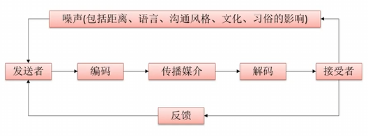
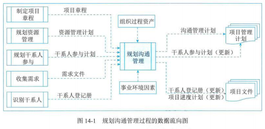
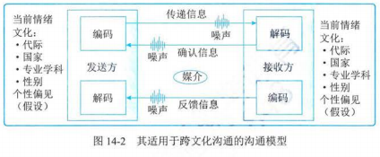
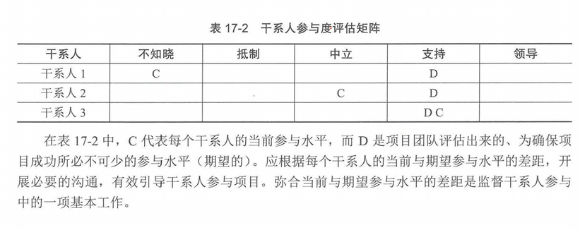
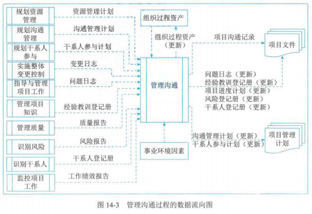
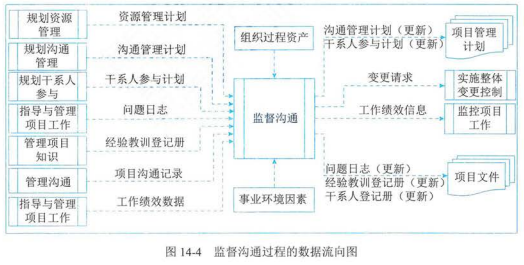

## 1 管理基础

### 沟通模型

- 关键要素

  - 编码
  - 信息和反馈信息
  - 媒介
  - 噪声
  - 解码

  
- 5 种状态

  - 已发送
  - 已接收
  - 已理解
  - 已认可
  - 已转化为积极的行动

### 沟通分类

- 内部沟通
- 外部沟通
- 正式沟通
- 非正式沟通
- 层级沟通
  - 向上（针对高层）
  - 向下（针对团队成员）
  - 横向（针对同级项目经理或其他人员）
- 官方沟通：年报、报告等
- 非官方沟通
- 书面与口头沟通

### 沟通技巧

- 有效的沟通活动的特征
  - 沟通目的明确
  - 尽量了解沟通接收方，满足其需求及偏好
  - 监督并衡量沟通的效果
- 书面沟通的 5C 原则
  - 正确的语法和拼写（Correctness）
  - 简洁的表述（Concise）
  - 清晰的目的和表述（Clarity）
  - 连贯的思维逻辑（Coherent）
  - 善用控制语句和承接（Controlling）
- 其他沟通技巧
  - 积极倾听
  - 理解文化和个人差异
  - 识别、设定并管理干系人期望
  - 强化技能

## 2 项目沟通管理过程

| 过程 | 输入 | 工具与技术 | 输出 |
| ---- | ---- | ---------- | ---- |
|      |      |            |      |
|      |      |            |      |
|      |      |            |      |

## 3 规划沟通管理

- 定义：基于每个干系人或干系人群体的信息需求、可用的组织资产，以及具体项目的需求，为项目沟通活动制定恰当的方法和计划的过程
- 主要作用：
  - 及时向干系人提供相关信息
  - 引导干系人有效参与项目
  - 编制书面沟通计划
- 开展频率
  - 需要再整个项目期间定期开展
  - 需要在项目生命周期早期，针对干系人多样性的信息需求，制定有效的沟通管理计划、应该在整个项目期间，定期审查本过程的成果并做必要修改，以确保其持续适用

### 输入

- 项目章程
- 项目管理计划
- 项目文件
- 事业环境因素
- 组织过程资产

### 工具与技术

- 专家判断
- 沟通需求分析

  - 分析沟通需求，确定项目干系人的信息需求，包括所需信息的类型和格式，以及信息对干系人的价值
- 沟通技术

  - 包括对话、会议、书面文件、数据库、社交媒体、网站
- 沟通模型

  
- 沟通方法

  - 互动沟通
    - 定义：在两方或多方之间进行的实时多向的信息交换
    - 例如：会议、电话、即时信息、社交媒体、视频会议等
  - 推式沟通
    - 定义：向需要接受信息的特定接收方发送或发布信息。这种方法可以确保信息的送达，但不能确保信息送达牧宝受众或目标受众理解
    - 例如：信件、备忘录、报告、电子邮件、传真、语音邮件、博客、新闻稿
  - 拉式沟通
    - 定义：适用于大量复杂信息或大量受众的情况。它要求接收方在遵守有关信息安全规定的前提下自行访问相关内容
    - 例如：门户网站、组织内网、电子在线课程、经验教训数据库、知识库
- 人际关系与团队技能

  - 沟通风格评估
  - 政策意识
  - 文化意识
- 数据表现

  - 干系人参与度评估矩阵：显示了个体干系人当前和期望参与度之间的距离

    
- 会议

### 输出

- 沟通管理计划
  - 定义：是项目管理计划的组成部分，描述将如何规划、结构化、执行与监督项目沟通，以提高沟通的有效性
  - 主要内容
    - 干系人的沟通需求
    - 沟通的信息，包括语言、形式、内容、详细程度
    - 上报步骤
    - 发布信息的原因
    - 发布所需信息、确认已收到或做出回应（若适用）的时限和频率
    - 负责沟通相关信息的人员
    - 负责授权保密信息发布的人员
    - 接收信息的人员或群体，包括他们的需要、需求和期望
    - 用于传递信息的方法或技术，如备忘录、电子邮件、新闻稿、社交媒体
    - 为沟通活动分配的资源，包括时间和预算
    - 随着项目进展（如项目不同阶段干系人社区的变化）而更新于优化沟通管理计划的方法
    - 通用术语表
    - 项目信息流向图、工作流程（可能包含审批程序）、报告清单和会议计划等
    - 来自法律、技术、组织政策等的制约因素等
- 项目管理计划（更新）
- 项目文件（更新）
  - 干系人登记册
  - 项目进度计划

## 4 管理沟通

- 定义：确保项目信息及时且恰当的收集、生成、发布、存储、检索、管理、监督和最终处置的过程
- 主要作用：促成项目团队与干系人之间的有效信息流动
- 开展频率：在整个项目期间开展

### 输入

- 项目管理计划
- 项目文件
  - 变更日志
  - 问题日志
  - 经验教训登记册
  - 质检报告
  - 风险报告
  - 干系人登记册
- 工作绩效报告
- 事业环境因素
- 组织过程资产

### 工具与技术

- 沟通技术
- 沟通方法
- 沟通技能
  - 沟通胜任力
  - 反馈
  - 非口头技能：通过示意、语调和面部表情等适当的肢体语言来表达意思
  - 演示
- 项目管理信息系统
- 项目报告
  - 定义：是收集和发布项目信息的行为
  - 发送对象：项目信息应发送给众多干系人群体
  - 详细程度：应针对每种干系人来调整项目信息发布的适当层次、形式和细节。从简单的沟通到详尽的定制报告和演示，报告的形式各不相同
  - 可以定期或临时编制
- 人际关系与团队技能
  - 积极倾听
  - 冲突管理
  - 文化意识
  - 会议管理
    - 定义：采取步骤确保会议有效并高效的达到预期目标
    - 规划会议的步骤
      - 准备并发布会议议程（其中包括会议目标）
      - 确保会议在规定的时间开始和结束
      - 确保适当参与者受邀请并出席
      - 切题
      - 处理会议中的期望、问题和冲突
      - 记录所有行动以及所分配的行动责任人
  - 人际交往
  - 政策意识
- 会议

### 输出

- 项目沟通记录
  - 包括：绩效报告、可交付成果状态、进度进展、产生的成本、演示、干系人需要的其他信息
- 项目管理计划（更新）

## 5 监督沟通

- 定义：确保满足项目及其干系人的信息需求的过程
- 主要作用：按沟通管理计划和干系人参与计划的要求优化信息传递流程
- 开展频率：在整个项目期间开展

### 输入

- 项目管理计划
- 项目文件
- 工作绩效数据
- 事业环境因素
- 组织过程资产

### 工具与技术

- 专家判断
- 项目管理信息系统
- 数据表现
  - 干系人参与评估矩阵
- 人际关系与团队技能
- 会议

### 输出

- 工作绩效信息
- 变更请求
- 项目管理计划（更新）
- 项目文件（更新）

## 补充

- 潜在沟通渠道总数，n 代表干系人数量
  $$
  C_n^2 = \frac{n * (n - 1)}{{2}}
  $$
