## 前言

- 项目风险
  - 定义：是一种不确定的事件或条件，一旦发生，会对项目目标产生某种正面或负面的影响
  - 机会/威胁：项目风险既包括对项目目标的威胁，也包括促进项目目标的机会
  - 已知风险：对其进行规划，寻找应对方案是可行的
  - 未知风险：无法管理的
  - 不确定性
    - 风险会随着项目的进展而变化，不确定性也会随着项目进展而逐渐减少
    - 最大的不确定性存在于项目的早期
    - 为减少损失需要在早期阶段主动付出必要的代价
  - 目的：在于降低风险不利影响，提高项目成功的可能性

## 1 管理基础

### 项目风险概述

- 每个项目都在两个层面上存在风险

  - 每个项目都有会影响项目达成目标的单个风险
  - 由单个风险和不确定性的其他来源联合导致的整体项目风险

### 风险的属性

- 风险事件的随机性：风险事件的发生及其后果都具有偶然性
- 风险的相对性

  - 定义：风险总是相对项目活动主体而言的，同样的风险对于不同的主体有不同的影响
  - 影响人们风险承受能力的因素
    - 收益大小
    - 投入大小
    - 项目活动主体的地位和拥有的资源
- 风险的可变性

  - 性质的变化
  - 后果的变化
  - 出现新风险

### 风险的分类

- 按后果

  - 划分
    - 纯粹风险
    - 投机风险
  - 相互转化
    - 在一定条件下可以相互转化
    - 项目管理人员必须避免投机风险转化为纯粹风险
  - 不是零和游戏，很多情况下，涉及风险的各个方面都要蒙受损失，无一幸免
- 按来源

  - 自然风险
  - 人为风险
- 按是否可管理

  - 划分

    - 可管理风险
    - 不可管理风险
  - 转化：有些不可管理的风险可以变为可管理的风险
- 按影响范围

  - 局部风险
  - 总体风险
- 按后果的承担者

  - 项目业主风险
  - 政府风险
  - 承包商风险
  - 投资方风险
  - 设计单位风险
  - 建立单位风险
  - 供应商风险
  - 担保方风险
  - 保险公司风险
- 按可预测性

  - 已知风险

    - 定义：在认真、严格的分析项目及其计划之后就能明确的那些经常发生的，而且其后果亦可预见的
    - 例子：项目目标不明确、过分乐观的进度计划、设计或施工变更和材料价格波动等
  - 可预测风险

    - 定义：根据经验，可以预见其发生，但不可预见其后果的
    - 例子：业主不能及时审查批准，分包商不能及时交工，施工机械出现故障，不可预见的地质等
  - 不可预测风险（未知风险、未识别风险）

    - 定义：指有可能发生，但其发生的可能性即使最有经验的亦不能预见的风险
    - 例子：地震、百年不遇的暴雨、通货膨胀、政策变化等

### 风险成本及其负担

- 风险成本：造成的损失或减少的收益以及防止风险发生采取预防措施而支付的费用
- 风险损失的有型成本

  - 直接损失
  - 间接损失
- 风险损失的无形成本

  - 减少了机会
  - 阻碍了生产率的提高
  - 造成资源分配不当

## 2 项目风险管理过程

| 过程             | 输入                                                                                   | 工具与技术                                                                                                                                             | 输出                                                                                                 |
| ---------------- | -------------------------------------------------------------------------------------- | ------------------------------------------------------------------------------------------------------------------------------------------------------ | ---------------------------------------------------------------------------------------------------- |
| 规划风险管理     | 项目章程 项目管理计划 项目文件 事业环境因素 组织过程资产           | 专家判断 数据分析 会议                                                                                                                       | 风险管理计划                                                                                         |
| 识别风险         | 项目管理计划 项目文件 采购文档 协议 事业环境因素 组织过程资产 | 专家判断 数据收集 数据分析 人际关系与团队技能 提示清单 会议                                                                   | 风险登记册 风险报告 项目文件（更新）                                                       |
| 实施定性风险分析 | 项目管理计划 项目文件 事业环境因素 组织过程资产                         | 专家判断 数据收集 数据分析 人际关系与团队技能 风险分类 数据表现 会议                                                     | 项目文件（更新）                                                                                     |
| 实施定量风险分析 | 项目管理计划 项目文件 事业环境因素 组织过程资产                         | 专家判断 数据收集 人际关系与团队技能 不确定性表现方式 数据分析                                                                     | 项目文件（更新）                                                                                     |
| 规划风险应对     | 项目管理计划 项目文件 事业环境因素 组织过程资产                         | 专家判断 数据收集 人际关系与团队技能 威胁应对策略 机会应对策略 应急应对策略 整体项目风险应对策略 数据分析 决策 | 变更请求 项目管理计划（更新） 项目文件（更新）                                             |
| 实施风险应对     | 项目管理计划 项目文件 组织过程资产                                           | 专家判断 人际关系与团队技能 项目管理信息系统                                                                                                 | 变更请求 项目文件（更新）                                                                       |
| 监督风险         | 项目管理计划 项目文件 工作绩效数据 工作绩效报告                         | 数据分析 审计 会议                                                                                                                           | 工作绩效信息 变更请求 项目管理计划（更新） 项目文件（更新） 组织过程资产（更新） |

## 3 规划风险管理

- 定义：定义如何实施项目风险管理活动的过程
- 主要作用：确保风险管理的水平、方法和可见度与项目风险程度相匹配，与对组织和其他干系人的重要程度相匹配
- 开展频率：在项目立项阶段就开始，应在项目早期完成。在项目生命周期的后期，可能有必要重新开展本过程

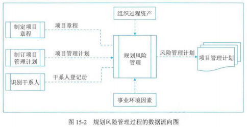

### 输入

- 项目章程
- 项目管理计划
- 项目文件
- 事业环境因素
- 组织过程资产

### 工具与技术

- 专家判断
- 数据分析
  - 干系人分析法：通过干系人分析确定项目干系人的风险偏好
- 会议

### 输出

- 风险管理计划

  - 定义：是项目管理计划的组成部分，描述如何安排与实施风险管理活动
  - 主要内容：

    - 风险管理策略
    - 方法论
    - 角色与职责
    - 资金
    - 时间安排
    - 风险类别

      - 风险分解结构（RBS）：有助于项目团队考虑单个项目风险的全部可能来源，对识别风险或归类已识别风险特别有用

      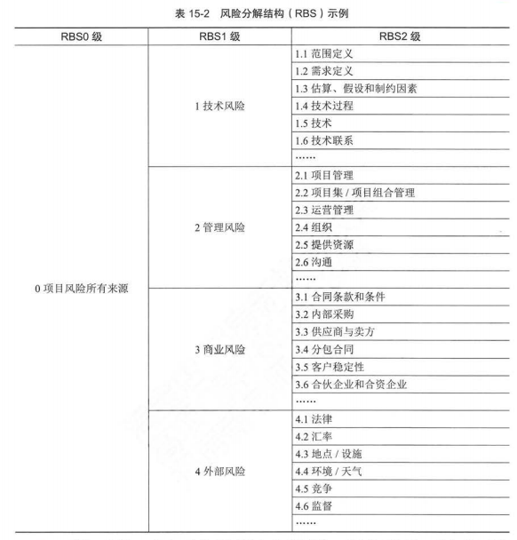
    - 干系人风险偏好
    - 风险概率和影响

      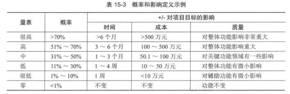
    - 概率和影响矩阵

      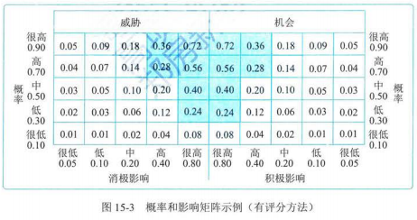
    - 报告格式
    - 跟踪

## 4 识别风险

- 定义：识别单个项目风险以及整体项目风险的来源，并记录风险特征的过程
- 主要作用：
  - 记录现有的单个项目风险，以及整体项目风险的来源
  - 汇总相关信息，以便项目团队能够恰当的应对已识别的风险
- 开展频率：整个项目期间开展
- 参与者
  - 项目经理、团队成员、项目风险专家（若已制定）、客户、项目团队外部的主题专家、最终用户、其他项目经理、运营经理、干系人和组织内的风险管理专家
  - 应鼓励所有项目干系人参与项目风险的识别工作
- 统一格式：应采取统一的风险描述格式来描述和记录项目风险，以确保每一项目风险都被清楚、明确的理解，从而为有效的分析和风险应对措施制定提供支持
- 迭代过程：识别风险是一个迭代的过程

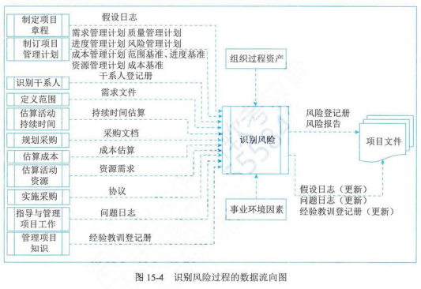

### 输入

- 项目管理计划
- 项目文件
- 采购文档
- 协议
- 事业环境因素
- 组织过程资产

### 工具与技术

- 专家判断
- 数据收集
  - 头脑风暴
  - 核查单：包括需要考虑的项目、行动、要点的清单
  - 访谈
- 数据分析
  - 根本原因分析
  - 假设条件和制约因素分析
  - SWOT 分析：对项目的优势、劣势、机会、威胁进行逐个检查
  - 文件分析：通过对项目文件的结构化审查，可以识别出一些风险
- 人际关系与团队技能
- 提示清单：关于可能引发项目风险来源的风险类别的预设清单
- 会议

### 输出

- 风险登记册
  - 定义：记录已识别项目风险的详细信息
  - 最初的包括内容
    - 已识别风险的清单
    - 潜在风险责任人
    - 潜在风险应对措施清单
- 风险报告
  - 定义：提供关于项目整体风险的信息，以及关于已识别的单个项目风险的概述信息
  - 主要内容：
    - 整体项目风险的来源
    - 关于已识别单个项目风险的概述内容
- 项目文件（更新）

## 5 实施定性风险分析

- 定义：通过评估单个项目风险发生的概率和影响及其他特征，对风险进行优先级排序，从而为后续分析或行动提供基础的过程
- 主要作用：重点关注高优先级的风险
- 开展频率：在整个项目期间开展
- 主观性：使用发生的频率、发生时对项目目标的影响及其他因素，来评估已识别单个项目风险的优先级。这种评估基于项目团队和其他干系人风险的感知程度，从而具有主观性

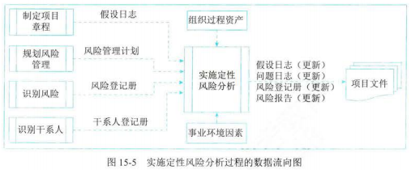

### 输入

- 项目管理计划
- 项目文件
- 事业环境因素
- 组织过程资产

### 工具与技术

- 专家判断
- 数据收集
- 数据分析

  - 风险数据质量评估：旨在评价关于单个项目风险的数据的准确性和可靠性
  - 风险概率和影响评估

    - 概率评估：考虑的是特定风险发生的可能性
    - 影响评估：考虑的是风险对一项或多项项目目标的潜在影响，如进度、成本、质量、绩效
  - 其他风险参数评估

    - 紧迫性：为有效应对风险而必须采取应对措施的时间段
    - 临近性：在多长时间后会有影响
    - 潜伏期：发生到影响显现之间可能的时间段
    - 可管理性：风险责任人（或组织）管理风险发生或影响的容易程度
    - 可控性：风险责任人（或组织）能够控制风险后果的程度
    - 可监测性：对风险发生或即将发生进行监测的容易程度
    - 连续性：风险与其他单个项目风险存在关联的程度大小
    - 战略影响力：对组织战略目标潜在的正/负面影响力
    - 密切度：被一名或多名干系人认为要紧的程度
- 人际关系与团队技能
- 风险分类：进行分类，有助于把注意力和精力集中到风险可能发生的最大的领域，或针对一组相关的风险制定通用的风险应对措施，从而有利于更有效的开展风险应对
- 数据表现

  - 概率和影响矩阵
  - 层级图

    - 定义：如果使用了两个以上的参数对风险进行分类，那就不能使用概率和影响矩阵，而需要使用其他图形
    - 例如：气泡图

      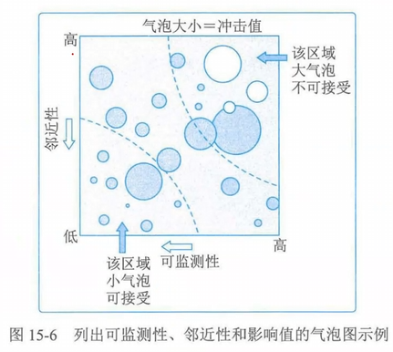
- 会议

### 输出

- 项目文件（更新）
  - 风险登记册

## 6 实施定量风险分析

- 定义：就已识别的单个项目风险和不确定性的其他来源对整体项目目标的影响进行定量分析的过程
- 主要作用：
  - 量化整体风险最大可能性
  - 提供额外的定量风险信息，以及风险应对规划
- 开展频率：并非每个项目必须，如果采用则在整个项目期间持续开展

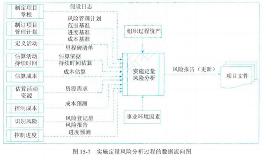

### 输入

- 项目管理计划
- 项目文件
- 事业环境因素
- 组织过程资产

### 工具与技术

- 专家判断
- 数据收集

  - 访谈
- 人际关系与团队技能

  - 引导
- 不确定性表现方式

  - 概率分布
    - 定义：如果活动的持续时间、成本、资源需求是不确定的，就可以在模型中用概率分布来表示其数值的可能区间
    - 常用：三角分布、正态分布、对数正态分布、贝塔分布、均匀分布、离散分布
- 数据分析

  - 模拟

    - 定义：使用模型来模拟单个项目风险和其他不确定性来源的总和影响，以评估它们对项目目标的潜在影响
    - 蒙特卡洛分析

      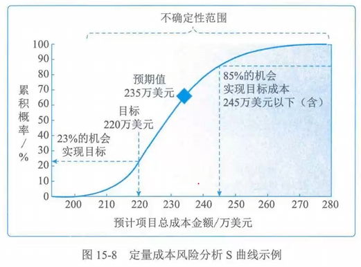
  - 敏感性分析

    - 有助于确定哪些单个项目风险或不确定性来源对项目结果具有最大的潜在影响
    - 龙卷风

      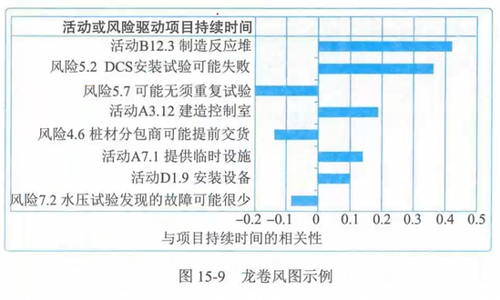
  - 决策树分析：用决策树在若干备选行动方案中选择一个最佳方案

    - 如 EMV（预期货币价值分析）

      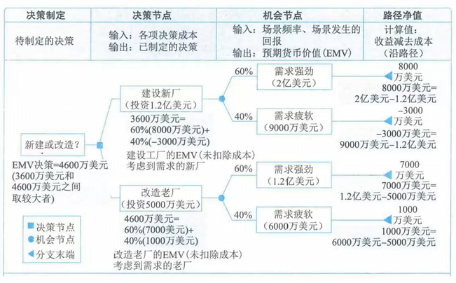
  - 影响图：不确定条件下进行决策的图形辅助工具。它将一个项目或项目中的一种情境表现为一系列实体、结果和影响，以及他们之间的关系和相互影响

### 输出

- 项目文件（更新）
  - 可作为实施定量风险分析过程输出的项目文件时风险报告
  - 风险报告更新内容
    - 对整体项目风险最大可能性的评估结果
    - 项目详细概率分析的结果
    - 单个项目风险的优先级清单
    - 定量风险分析结果的趋势
    - 风险应对建议

## 7 规划风险应对

- 定义：为了应对项目风险，制定可选方案、选择应对策略并商定应对行动的过程
- 主要作用：
  - 制定应对整体项目风险和单个项目风险的适当方法
  - 分配资源，并根据需要将相关活动添加进项目文件和项目管理计划中
- 开展频率：在整个项目期间开展
- 匹配：应对方案应该与风险的重要性相匹配，并且能够经济有效的应对挑战，同时在当前项目背景下现实可行，获得全体干系人的同意，并由一名负责人具体负责

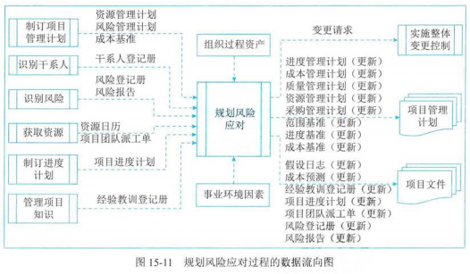

### 输入

- 项目管理计划
- 项目文件
- 事业环境因素
- 组织过程资产

### 工具与技术

- 专家判断
- 数据收集

  - 访谈
- 人际关系与团队技能

  - 引导
- 威胁应对策略

  - 上报

    - 定义：若项目团队或项目发起人认为某威胁不在项目范围内，或提议的应对措施超出了项目经理的权限，就应该采用上报的策略
    - 参考：威胁一旦上报，就不再由项目团队做进一步监督，虽然仍可能出现在登记册中供参考
  - 规避

    - 适用：发生频率高，且具有严重负面影响的高优先级威胁
    - 规避措施：
      - 消除威胁的原因、延长进度计划、改变项目策略、缩小范围
      - 有些风险可能通过澄清需求、获取信息、改善沟通或取得专有技能来加以规避
  - 转移

    - 定义：转移给第三方
    - 转移行动：
      - 购买保险、使用履约保函、使用担保书、使用保证书等
      - 通过签订协议，把具体风险的归属和责任转移给第三方
  - 减轻

    - 减轻措施：
      - 采用简单流程、进行更多次测试、选用更可靠的卖方
      - 还可能涉及原型开发，以降低从试验台模型放大到实际工艺或产品中的风险
    - 冗余：在一个系统中加入冗余部件，可减轻原始部件故障所造成的影响
  - 接受

    - 适用：低优先级威胁，也可用于无法以任何其他方式经济有效的应对的威胁
    - 接受策略：
      - 主动：建立应急储备，包括预留时间、资金、资源以应对出现的威胁
      - 被动：不会主动采取行动，只是定期对威胁进行审查，确保其并未发生重大变化
- 机会应对策略

  - 上报
  - 开拓
    - 定义
      - 如果组织想确保把握住高优先级的机会，就可以选择开拓策略
      - 此策略将特定机会的出现概率提升到 100%，确保其肯定出现，从而获得与其相关的收益
    - 措施：把组织中最有能力的资源分配给项目来缩短完工时间，或采用全新技术或技术升级来节约项目成本并缩短项目持续时间
  - 分享
    - 定义：转移给第三方
    - 措施：建立合伙关系、合作团队、特殊公司、合资企业分享机会
  - 提高
    - 定义：提高机会出现的概率和影响
    - 措施：为早日完成活动而增加资源
  - 接受
    - 适用：低优先级机会，也可以用于无法以任何方法经济有效的应对的机会
    - 策略
      - 主动接受：建立应急储备，包括预留时间、资金、资源，以便在机会出现时加以利用
      - 被动接受：不主动采取行动，而只是定期对机会进行审查，确保其并未发生重大改变
- 应急应对策略

  - 定义：可设计一些仅在特定事件发生时才采取的应对措施
  - 应急计划：包括已识别的，用于启动计划的触发事件
- 整体项目风险应对策略

  - 规避
  - 开拓
  - 转移或分享
  - 减轻或提高
  - 接受
- 数据分析

  - 备选方案分析
  - 成本收益分析
- 决策

  - 多维决策分析

### 输出

- 变更请求
- 项目管理计划（更新）
- 项目文件（更新）

  - 假设日志
  - 成本预测
  - 经验教训登记册
  - 项目进度计划
  - 项目团队派工单
  - 风险登记册

    - 需要更新以记录选择和商定的风险应对措施
    - 商定的应对策略
    - 实施所选应对策略所需要的具体行动
    - 风险发生触发条件、征兆和预警信号
    - 实施所选应对策略所需要的预算和进度活动
    - 应急计划及启动该计划所需的风险触发条件
    - 回退计划，供风险发生且主要应对措施不足以应对时使用
    - 采取预定应对措施之后仍存在的残余风险，以及被有意接受的风险
    - 由实施风险应对措施而直接导致的次生风险
  - 风险报告

## 8 实施风险应对

- 定义：是执行商定的风险应对计划的过程
- 主要作用：
  - 确保按计划执行商定的风险应对措施
  - 管理整体项目风险入口、最小化单个项目威胁，以及最大化单个项目机会
- 开展频率：在整个项目期间开展

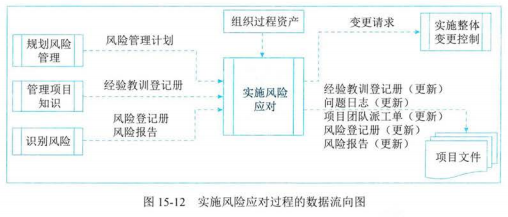

### 输入

- 项目管理计划
- 项目文件
- 组织过程资产

### 工具与技术

- 专家判断
- 人际关系与团队技能
- 项目管理信息系统

### 输出

- 变更请求
- 项目文件（更新）

## 9 监督风险

- 定义：是整个项目期间，监督风险应对计划的实施，并跟踪已识别风险、识别和分析新风险，以及评估风险管理有效性的过程
- 主要作用：保证项目决策是在整体项目风险和单个项目风险当前信息的基础上进行
- 开展频率：在整个项目期间开展
- 监督活动：
  - 实施的风险应对是否有效
  - 整体项目风险级别是否已改变
  - 已识别单个项目风险的状态是否已改变
  - 是否出现新的单个项目风险
  - 风险管理方法是否依然适用
  - 项目假设条件是否依然成立
  - 风险管理政策和程序是否已得到遵守
  - 成本或进度应急储备是否需要修改
  - 项目策略是否仍然有效等

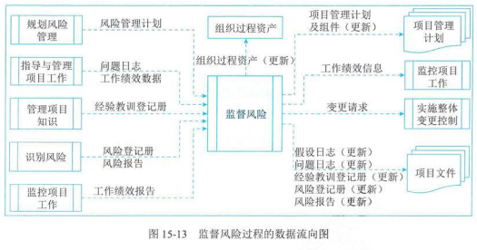

### 输入

- 项目管理计划
- 项目文件
- 工作绩效数据
- 工作绩效报告

### 工具与技术

- 数据分析
  - 技术绩效分析
  - 储备分析
- 审计
  - 风险审计：一种审计类型，可用于评估风险管理过程的有效性
- 会议

### 输出

- 工作绩效信息
- 变更请求
- 项目管理计划（更新）
- 项目文件（更新）
- 组织过程资产（更新）

## 10 风险管理示例

- 主要风险清单

  - 一个主要的风险管理工具。指明了项目面临的风险列表，可以使项目经理的头脑中保持着风险管理的意识

  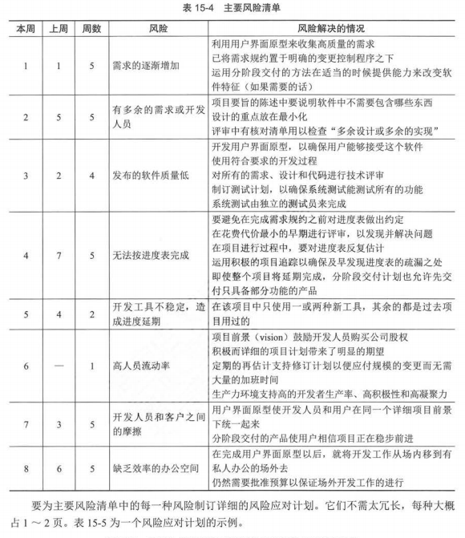
- 风险应对计划

  - 要为主要风险清单中的每一种风险制定详细的风险应对计划

  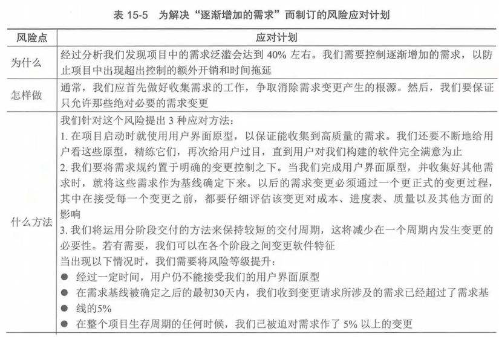
