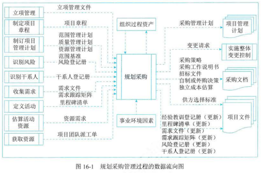
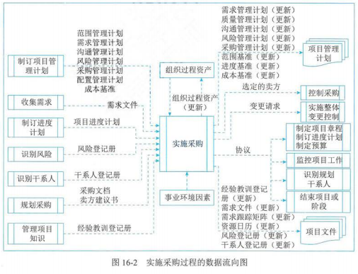
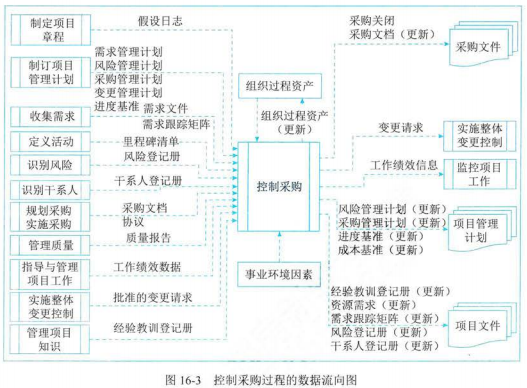
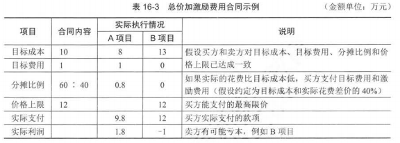
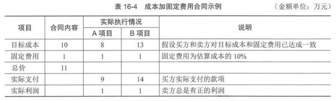
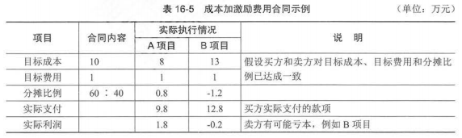

# 十六、项目采购管理

## 1 管理基础

## 2 项目采购管理过程

| 过程         | 输入                                                                                                                         | 工具与技术                                                                                                     | 输出                                                                                                                                                                               |
| ------------ | ---------------------------------------------------------------------------------------------------------------------------- | -------------------------------------------------------------------------------------------------------------- | ---------------------------------------------------------------------------------------------------------------------------------------------------------------------------------- |
| 规划采购管理 | 立项管理文件 项目章程 项目管理计划 项目文件 事业环境因素 组织过程资产                               | 专家判断 数据收集 数据分析 供方选择分析 会议                                               | 采购管理计划 采购策略 采购工作说明书 招标文件 自制或外购决策 独立成本估算 供方选择标准 变更请求 项目文件（更新） 组织过程资产（更新） |
| 实施采购     | 项目管理计划 项目文件 采购文档 卖方建议书 事业环境因素 组织过程资产                                 | 专家判断 广告 投标人会议（承包商会议、供应商会议、投标前会议） 数据分析 人际关系与团队技能 | 选定的卖方 协议 变更请求 项目管理计划（更新） 项目文件（更新） 组织过程资产（更新）                                                                       |
| 控制采购     | 项目管理计划 项目文件 采购文档 协议 工作绩效数据 批准的变更请求 事业环境因素 组织过程资产 | 专家判断 索赔管理 数据分析 检查 审计                                                       | 采购关闭 采购文档（更新） 工作绩效信息 变更请求 项目管理计划（更新） 项目文件（更新） 组织过程资产（更新）                                           |

## 3 规划采购管理

- 定义：是记录项目采购决策、明确采购方法、识别潜在卖方的过程
- 主要作用：确定是否从项目外部获取货物和服务，如果是，则还要确定将在什么时间、以什么方式获取什么货物和服务
- 开展频率：仅开展一次或仅在项目的预定义点开展
- 采购步骤：
  1. 准备采购工作说明书（SOW）或工作大纲（TOR）
  2. 准备高层级的成本估算，制定预算
  3. 发布招标广告
  4. 确定合格卖方名单
  5. 准备并发布招标文件
  6. 由卖方准备并提交建议书
  7. 对建议书开展技术（包括质量）评估
  8. 对建议书开展成本评估
  9. 准备最终的总和评估报告（包括质量、成本），选出中标建议书
  10. 结束谈判，买方和卖方签署合同
- 与进度计划相互影响：进度计划对规划采购管理过程中的采购策略制定有重要影响，在制定采购管理计划时做出的决定也会影响项目进度计划

### 输入

- 立项管理文件
- 项目章程
- 项目管理计划
- 项目文件
- 事业环境因素
- 组织过程资产
  - 合同协议类型：会影响规划管理过程中的决策

### 工具与技术

- 专家判断
- 数据收集
  - 市场调研
- 数据分析
  - 自制或外购分析：用于确定某项工作或可交付成果最好是由项目团队自行完成，还是应该从外部采购
- 供方选择分析
  - 最低成本
  - 仅凭资质
  - 基于质量或技术方案得分
  - 基于质量和成本
  - 唯一来源
  - 固定预算
- 会议

### 输出

- 采购管理计划
  - 定义：包含要在采购过程中开展的各项活动
  - 内容：
    - 如何协调采购与项目其他工作，例如项目进度计划制定和控制
    - 开展重要采购活动的时间表
    - 用于管理合同的采购测量指标
    - 与采购有关的干系人角色和职责，如果执行组织有采购部，项目团队拥有的职权和受到的限制
    - 可能会影响采购工作的制约因素和假设条件
    - 司法管辖权和付款货币
    - 是否需要编制独立估算，是否应将其作为评价标准
    - 风险管理事项，包括对履约保函或保险合同的要求，以减轻某些项目风险
    - 拟使用的预审合格的卖方（若有）等
  - 特征：可以是正式或非正式的，也可以是非常详细或高度概括的
- 采购策略
  - 定义：一旦完成自制或外购分析，并决定从项目外部渠道采购，就应制定一套采购策略
  - 包含：
    - 交付方法
      - 专业服务项目的交付方法
      - 工业或商业施工项目的交付方法
    - 合同支付类型：与项目支付方法无关，需要与采购组织的内部财务系统相协调
    - 采购阶段
- 采购工作说明书
  - 定义：
    - 依据项目范围基准，为每次采购编制工作说明书（SOW），仅对将要包含在相关合同中的那一部分项目范围进行定义
    - 工作说明书会充分详细的描述拟采购的产品、服务或成果、以便潜在卖方确定是否有能力提供此类产品、服务或成果
  - 内容：
    - 规格
    - 所需数量
    - 质量水平
    - 绩效数据
    - 履约时间
    - 工作地点
    - 其他要求
  - 修订：在采购过程中，应根据需要对工作说明书进行修订，直到其成为所签署协议的一部分
  - 工作大纲（TOR）
    - 承包商需要执行的任务，所需协调的工作
    - 承包商必须达到的适用标准
    - 需要提交批准的数据
    - 买方提供给承包商的，适用时，将用于合同履行的全部数据和服务的详细清单
    - 关于初始成果提交和审查（或审批）的进度计划
- 招标文件
  - 定义：用于向潜在卖方征求建议书
  - 包括：
    - 信息邀请书：需卖方提供拟采购获取和服务的更多信息
    - 报价邀请书：需供应商提供关于将如何满足需求和（或）将需要多少成本的更多信息
    - 建议邀请书：出现问题且解决方法难以确定
- 自制或外购决策
- 独立成本估算
- 供方选择标准：确定评估标准时，买方要努力确保选出的建议书提供最佳质量的所需服务
- 变更请求
- 项目文件（更新）
- 组织过程资产（更新）

## 4 实施采购

- 定义：获取卖方应答、选择卖方并授予合同的过程
- 主要作用：选定合格卖方并签署关于货物或服务交付的法律协议
- 开展频率：在整个项目期间开展
- 最后成果：签订协议，包括正式合同

### 输入

- 项目管理计划
- 项目文件
- 采购文档
- 卖方建议书
- 事业环境因素
- 组织过程资产

### 工具与技术

- 专家判断
- 广告
- 投标人会议（承包商会议、供应商会议、投标前会议）：在卖方提交建议书之前，在买方和潜在卖方之间召开的会议，其目的是确保所有潜在投标人对采购要求都有清楚且一致的理解，并确保没有任何投标人会得到特别的优待
- 数据分析
  - 建议书评估
- 人际关系与团队技能
  - 谈判

### 输出

- 选定的卖方
- 协议
- 变更请求
- 项目管理计划（更新）
- 项目文件（更新）
- 组织过程资产（更新）

## 5 控制采购

- 定义：管理采购关系、监督合同绩效、实施必要的变更和纠偏，以及关闭合同的过程
- 主要作用：确保买卖双方履行法律协议，满足项目需求
- 开展频率：在整个项目期间开展
- 买卖双方都需要开展：买方和卖方都处于相似的目的来管理采购合同，每方都必须确保双方履行合同义务，确保各自的合法权利得到保护
- 财务管理：在控制采购过程中，需要开展财务管理工作，包括监督向卖方付款

### 输入

- 项目管理计划
- 项目文件
- 采购文档
- 协议
- 工作绩效数据
- 批准的变更请求
  - 可能包括对合同条款和条件的修改
  - 如：修改采购工作说明书、定价、对产品、服务或成果的描述
- 事业环境因素
- 组织过程资产

### 工具与技术

- 专家判断
- 索赔管理
  - 定义：若买卖双方不能就变更补偿达成一致意见，或对变更是否发生存在分歧，那么被请求的变更就成为有争议的变更或潜在的推定变更
  - 首选方法：谈判
- 数据分析
  - 绩效审查
  - 挣值分析
  - 趋势分析
- 检查：指对承包商正在执行的工作进行结构化审查，可能涉及对可交付成果的简单审查或对工作本身的实地审查
- 审计：对采购过程的结构化审查。应该在合同中明确规定与审计有关的权利和义务。买卖双方的项目经理都应关注审计结果，以便对项目进行必要的调整

### 输出

- 采购关闭：买方通常通过授权的采购管理员，向卖方发出合同已经完成的正式书面通知
- 采购文档（更新）
- 工作绩效信息
- 变更请求
- 项目管理计划（更新）
- 项目文件（更新）
- 组织过程资产（更新）

## 6 项目合同管理

### 合同的类型

- 按项目范围划分

  - 项目总承包合同
    - 定义：买方将项目的全过程作为一个整体发包给同一个卖方的合同
    - 注意事项：总承包合同要求与同一个卖方订立承包合同，但并不意味着只订立一个总合同
    - 适用范围：经验丰富、技术实力雄厚且组织管理协调能力强的卖方，这样有利于发挥卖方的专业优势，保证项目的质量和进度，提高投资效益
    - 优势：买方只需要与一个卖方沟通，容易管理与协调
  - 项目单项承包合同
    - 定义：一个卖方只承包项目中的某一项或某几项的内容，买方分别与不同的卖方订立项目单项承包合同
    - 优势：有利于吸引更多的卖方参与投标竞争，使买方可以选择在某一单项上实力强的卖方，同时也有利于卖方专注于自身经验丰富且技术实力雄厚的部分建设
    - 要求：对买方组织协调能力提出了较高要求
  - 项目分包合同
    - 定义：经过合同约定和买方认可，卖方将其承包项目的某一部分或某几部分（非项目的主体结构）再发包给具有相应资质条件的分包方
    - 分包满足条件：
      - 买方认可
      - 分包的部分必须是项目的非主体工作
      - 只能分包部分项目，而不能转包整个项目
      - 分包方必须具备相应的资质条件
      - 分包方不能再次分包
    - 涉及两种合同关系：
      - 买方与卖方的承包合同关系
      - 卖方与分包方的分包合同关系
    - 连带责任：
      - 卖方在原承包合同范围内向买方负责，而分包方与卖方在分包合同范围内向买方承担连带责任
      - 如果分包的项目出现问题，买方既可以要求卖方承担责任，也可以直接要求分包方承担责任
- 按项目付款方式划分

  - 总价合同

    - 定义：为既定产品或服务的采购设定一个总价
    - 要求：买方必须准确定义要采购的产品或服务
    - 细分：

      - 固定总价合同

        - 采购的价格在一开始就被确定，且不允许改变（除非工作范围发生变更）
        - 因合同履行不好而导致的任何成本增加都由卖方承担
      - 总价加激励费用合同

        - 为买方和卖方都提供了一定的灵活性，允许有一定的绩效偏差，并对实现既定目标给予财务奖励

        
      - 总价加经济价格调整合同

        - 如果卖方履约需要跨越相当长的周数（数年）
        - 是一种特殊的总价合同，允许根据条件变化（如通货膨胀、某些特殊商品的成本增加或降低等），以事先确定的方式对合同价格进行最终调整
      - 订购单（单边合同）

        - 非大量采购标准化产品时，通常可由买方直接填写卖方提供的订购单，卖方照此供货
        - 通常不需要谈判
  - 成本补偿合同(Cost-Reimbursable Contract)

    - 定义：向卖方支付为完成工作而发生的全部合法实际成本（可报销成本），外加一笔费用作为卖方利润
    - 风险承担：买方的成本风险最大
    - 适用范围：买方仅知道要一个什么产品但不知道具体工作范围的情况，也就是工作范围很不清楚的项目
    - 细分：

      - 成本加固定费用合同

        - 为卖方报销履行合同工作所发生的一切合法成本（即成本实报实销），并向卖方支付一笔固定费用作为利润，该费用以项目初始估算成本（目标成本）的某一百分比计算

        
      - 成本加激励费用合同

        - 为卖方报销履行合同工作所发生的一切合法成本（即成本实报实销），并在卖方达到合同规定的绩效目标时，向卖方支付预先确定的奖励费用
        - 卖方可以得到的付款总和：
          - 实际成本大于目标成本：目标成本 + 目标费用 + 卖方应担负的成本超支
          - 实际成本小于目标费用：目标成本 + 目标费用 - 买方应享有的成本节约

        
      - 成本加奖励费用合同

        - 为卖方报销履行合同工作所发生的一切合法成本（即成本实报实销），买方再凭自己的主观感觉给卖方支付一笔利润，完全由买方根据自己对卖方绩效的主观判断来决定奖励费用，且卖方通常无权申诉
  - 工料合同

    - 定义：按项目工作所花费的实际工时数和材料数，按事先确定的单位工时费用标准和单位材料费用标准进行付款
    - 适用范围：
      - 工种性质清楚、工作范围比较明显，但具体的工作量无法确定的项目
      - 工料合同在金额小、工期短、不复杂的项目上可以有效使用，但在金额大、工期长的复杂项目上不实用
    - 双方承担风险：
      - 买方承担中等程度的成本风险，即承担工作量变动的风险
      - 卖方承担单价风险
    - 混合型合同：是兼具成本补偿合同和总价合同的某些特点的混合型合同
- 合同类型的选择

  - 工作范围很明确，项目设计具备详细细节，总价合同
  - 工作性质清楚，范围不是很清楚，工作不复杂，需要快速签订合同，工料合同
  - 工作范围尚不清楚，成本补偿合同
  - 双方承担风险，工料合同；买方承担风险，成本补偿合同；卖方承担风险，总价合同
  - 购买标准产品，且数量不大，单边合同

### 合同的内容

- 项目名称
- 标的内容和范围
- 项目的质量要求
- 项目的计划、进度、地点、地域、方式
- 项目建设过程中的各种期限
- 技术情报和资料的保密
- 风险责任的承担
- 技术成果的归属
- 验收的标准和方法
- 价款、报酬（或使用费）及其支付方式
- 违约金或损失赔偿的计算方法
- 解决争议的方法
- 名词术语解释

### 合同管理过程

- 合同的签订管理
- 合同的履行管理
  - 解决争议的办法
    - 两种解决方法
      - 替代争议解决方法（调解、仲裁等）：由双方同时聘请的第三方提出解决方案
      - 诉讼：向执法机关提出控告、申诉，要求评判曲直是非
    - 相互排斥：这两种方式通常是相互排斥的，即如果约定了仲裁且约定了仲裁裁决的终局性，就不能向法院诉讼
    - 优先级：谈判（协商）、调解、仲裁、诉讼
- 合同的变更管理
  - 变更流程：
    1. 一方要求修改合同时，应首先向另一方用书面的形式提出
    2. 另一方当事人接到有关变更项目合同的申请后，应及时作出书面答复
    3. 如果同意变更，即表明合同的变更发生法律效力
- 合同的档案管理
  - 重要性：是整个合同管理的基础
  - 合同文件格式：为了限制执行人员随意修改合同，一般要求采用计算机打印文本，手写的旁注和修改等不具有法律效力
- 合同的违约索赔管理
  - 索赔的概念与分类

    - 索赔：卖方向买方
    - 反索赔：买方向卖方
    - 分配分类
      - 按目的
        - 工期索赔
        - 费用索赔
      - 按依据
        - 合同规定的
        - 非合同规定的
      - 按业务性质
        - 工程索赔
        - 商务索赔
      - 按处理方式
        - 单项索赔
        - 总索赔
  - 索赔的起因和原则

    - 起因：
      - 凡属于客观原因造成的延期、属于买方也无法预见的情况，如：特殊反常天气达到合同中特殊反常天气的约定条件，卖方可得到延长工期，但得不到费用补偿
      - 属于买方原因造成拖延工期，不仅应给卖方延长工期，还应给予费用补偿
    - 原则：
      - 索赔必须以合同为依据
      - 必须注意资料的积累
      - 及时、合理的处理索赔
      - 加强索赔的前瞻性
  - 合同索赔流程

    - 索赔顺序：
      1. 项目发生索赔事件后，一般先由监理工程师调解
      2. 若调解不成，由政府建设主管机构进行调解
      3. 若调解不成，由经济合同仲裁委员会进行调解或仲裁
    - 索赔具体流程
      1. 提出索赔要求：索赔方以书面索赔通知书的形式，在索赔事项发生后28天内，向监理工程师正式提出索赔意向和通知
      2. 报送索赔资料：索赔通知书发出后28天内，向监理工程师提出延长工期和（或）补偿经济损失的索赔报告及有关资料
      3. 监理工程师答复：监理工程师在收到送交的索赔报告有关资料后，于28天内给予答复，或要求索赔方进一步补充索赔理由和证据
      4. 监理工程师逾期答复后果：28天未予答复或进一步要求的，视为该项索赔已认可
      5. 持续索赔：当索赔事件持续进行时，索赔方应当阶段性按监理工程师发出索赔意向，在索赔事件终了28天内，向监理工程师送交索赔的有关资料和最终索赔报告，监理工程师应在28天内给予答复或要求索赔方进一步补充索赔理由和证据。逾期未答复，视为该项索赔成立
      6. 仲裁与诉讼：监理工程师对索赔的答复，索赔方或发起人不能接受，即进入仲裁后诉讼程序
  - 合同解释原则

    - 主导语言原则：若同时存在两种语言，需约定哪一种是主导语言
    - 适用法律原则：应规定以哪个国家的法律作为合同的适用法律，合同的解释必须根据适用法律进行
    - 整体解释原则
      - 合同是一个整体，不能割断其中的内在联系
      - 特殊条件优先于一般条件
      - 具体规定优先于笼统规定
      - 手写条文优先于印刷条文
      - 单价优先于总价
      - 价格的文字表达优先于阿拉伯数字表达
      - 技术规范优先于图纸
    - 公平诚信原则
      - 解释合同时应公平合理，兼顾双方利益
      - 若解释后仍含糊不清，则按不利于合同起草一方（一般为买方）的原则进行解释
