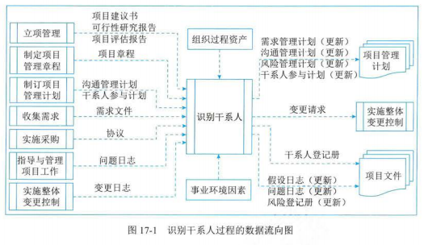
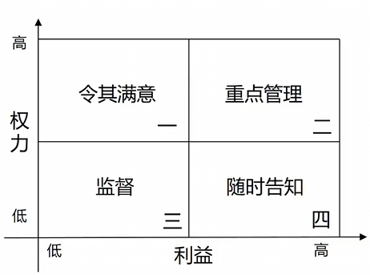
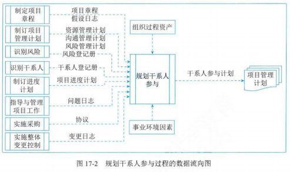
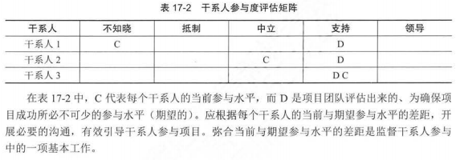
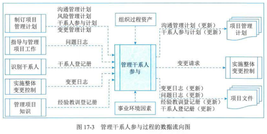
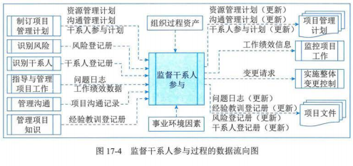

# 17. 项目干系人管理

## 1 管理基础

## 2 项目干系人管理过程

| 过程           | 输入                                                                                                     | 工具与技术                                                                       | 输出                                                                       |
| -------------- | -------------------------------------------------------------------------------------------------------- | -------------------------------------------------------------------------------- | -------------------------------------------------------------------------- |
| 识别干系人     | 立项管理文件 项目章程 项目管理计划 项目文件 协议 事业环境因素 组织过程资产 | 专家判断 数据收集 数据分析 数据表现 会议                     | 干系人登记册 变更请求 项目管理计划（更新） 项目文件（更新） |
| 规划干系人参与 | 项目章程 项目管理计划 项目文件 协议 事业环境因素 组织过程资产                   | 专家判断 数据收集 数据分析 决策 数据表现 会议           | 干系人参与计划                                                             |
| 管理干系人参与 | 项目管理计划 项目文件 事业环境因素 组织过程资产                                           | 专家判断 沟通技能 人际关系与团队技能 基本规则 会议           | 变更请求 项目管理计划（更新） 项目文件（更新）                   |
| 监督干系人参与 | 项目管理计划 项目文件 工作绩效数据 事业环境因素 组织过程资产                         | 数据分析 决策 数据表现 沟通技能 人际关系与团队技能 会议 | 工作绩效信息 变更请求 项目管理计划（更新） 项目文件（更新） |

## 3 识别干系人

- 定义：是定期识别项目干系人，分析和记录他们的利益、参与度、相互依赖性、影响力、对项目成功的潜在影响的过程
- 主要作用：使项目团队能够建立对每个干系人或干系人群体的适度关注
- 开展频率：在整个项目期间定期开展

### 输入

- 立项管理文件
- 项目章程
- 项目管理计划
- 项目文件
- 协议
- 事业环境因素
- 组织过程资产

### 工具与技术

- 专家判断
- 数据收集

  - 文件和调查
  - 头脑风暴
- 数据分析

  - 干系人分析：
    - 会产生干系人清单、关于干系人的各种信息
    - 例如：在组织内的岗位、在项目中的角色、与项目的利害管理、期望、态度（如对项目的支持程度）、对项目信息的兴趣
  - 文件分析
- 数据表现

  - 干系人映射分析和表现

    - 是一种利用不同方法对干系人进行分类的方法
    - 分类方法

      - 权力利益方格、权力影响方格、影响作用方格

        
      - 干系人立方体
      - 凸显模型：通过评估干系人的权力（职权级别或对项目成果的影响能力）、紧迫性（因时间约束或干系人对项目成果有重大利益诉求而导致需立即加以关注）、合法性（参与的适当性）对干系人进行分类
      - 影响方向

        - 定义：可根据干系人对项目工作或项目团队本身的影响方向，对干系人进行分类
        - 具体方向：
          - 向上：执行组织或客户组织、发起人和指导委员会的高级管理层
          - 向下：临时贡献知识或技能的团队专家
          - 向外：项目团队外的干系人群体及其代表，如供应商、政府机构、工种、最终用户、监管部门
          - 横向：项目经理的同级人员，如：其他项目经理或中层管理人员，他们与项目经理竞争稀缺项目资源或者合作共享资源或信息
      - 优先级排序：如果项目有大量干系人、干系人群体的成员频繁变化、干系人和项目团队之间或干系人群体内部关系复杂，则有必要对干系人进行优先级排序
- 会议

### 输出

- 干系人登记册
  - 定义：记录已识别干系人的信息
  - 包括：
    - 身份信息：姓名、组织职位、地点、联系方式、在项目中扮演的角色
    - 评估信息：主要需求、期望、影响项目成果的潜力、干系人最能影响或冲击的项目生命周期阶段
    - 干系人分类：用内部或外部，作用、影响、权力或利益，上级、下级、外围或横向，或项目经理选择的其他模型进行分类的结果等
- 变更请求
- 项目管理计划（更新）
- 项目文件（更新）

## 4 规划干系人参与

- 定义：根据干系人的需求、期望、利益、对项目的潜在影响，制定项目干系人参与项目的方法的过程
- 主要作用：提供干系人进行有效互动的可行计划
- 开展频率：
  - 在整个项目期间开展
  - 为满足项目干系人的多样性信息需求，应在项目生命周期的早期制定一份有效的计划；然后随着干系人群体的变化，定期审查和更新该计划
  - 会触发计划更新的情况：
    - 项目新阶段开始
    - 组织结构或行业内部发生变化
    - 新的个人或群体成为干系人，现有干系人不再是干系人群体的成员，或特定干系人对项目成功的重要性发生变化
    - 当其他项目过程（如变更管理、风险管理、问题管理）的输出导致需要重新审查干系人参与策略等

### 输入

- 项目章程
- 项目管理计划
- 项目文件
- 协议
- 事业环境因素
- 组织过程资产

### 工具与技术

- 专家判断
- 数据收集
- 数据分析

  - 假设条件和制约因素分析
  - 根本原因分析
- 决策
- 数据表现

  - 思维导图
  - 干系人参与度评估矩阵

    - 定义：用于将干系人当前参与水平与期望参与水平进行比较
    - 干系人参与水平：

      - 不了解型
      - 抵制型
      - 中立型
      - 支持型
      - 领导型：了解项目及其潜在影响，而且积极参与以确保项目取得成功

      
- 会议

### 输出

- 干系人参与计划
  - 定义：是项目管理计划的组成部分。其制定了干系人有效参与和执行项目决策的策略和行动
  - 特征：可以是正式或非正式的，非常详细或高度概括的

## 5 管理干系人参与

- 定义：通过与干系人进行沟通协作，以满足其需求与期望、处理问题，并促进干系人合理参与的过程
- 主要作用：尽可能提高干系人的支持度，并降低干系人的抵制程度
- 开展频率：在整个项目期间开展
- 包括活动：
  - 在适当的项目阶段引导干系人参与，以便获取、确认或维持他们对项目成功的持续承诺
  - 通过谈判和沟通的方式管理干系人期望
  - 处理与干系人管理有关的任何风险或潜在关注点，预测干系人可能在未来引发的问题
  - 澄清和解决已识别的问题等

### 输入

- 项目管理计划
- 项目文件
- 事业环境因素
- 组织过程资产

### 工具与技术

- 专家判断
- 沟通技能
- 人际关系与团队技能
  - 冲突管理
  - 文化意识
  - 谈判
  - 观察和交谈
  - 政策意识
- 基本规则：根据团队章程中定义的基本规则，明确项目团队成员和其他干系人引导干系人参与的行为
- 会议

### 输出

- 变更请求
- 项目管理计划（更新）
- 项目文件（更新）

## 6 监督干系人参与

- 定义：监督项目干系人的关系，并通过修订参与策略和计划来引导干系人合理参与项目的过程
- 主要作用：随着项目进展和环境变化，维持或提升干系人参与活动的效率和效果
- 开展频率：在整个项目期间开展

### 输入

- 项目管理计划
- 项目文件
- 工作绩效数据
- 事业环境因素
- 组织过程资产

### 工具与技术

- 数据分析
  - 备选方案分析
  - 根本原因分析
  - 干系人分析
- 决策
  - 多标准决策分析
  - 投票
- 数据表现
  - 干系人参与度评估矩阵
- 沟通技能
  - 反馈
  - 演示
- 人际关系与团队技能
  - 积极倾听
  - 文化意识
  - 领导力
  - 人际交往
  - 政策意识
- 会议

### 输出

- 工作绩效信息
- 变更请求
- 项目管理计划（更新）
- 项目文件（更新）
