# 十八、项目绩效域

## 定义

- 绩效域：在整个生命周期过程中，项目团队管理者需要密切关注干系人、团队、开发方法和生命周期、规划、项目工作、交付、测量、不确定性这 8 个与绩效密切相关的因素

## 1 干系人绩效域

- 定义：涉及与干系人相关的活动和职能
- 预期目标：
  - 与干系人建立高效的工作关系
  - 干系人认同项目目标
  - 支持项目的干系人提高了满意度，并从中收益
  - 反对项目的干系人没有对项目产生负面影响

### 绩效要点

- 促进干系人参与 - 开展工作的具体步骤
  1. 识别：在组建项目团队之前，可以先识别高层级的干系人，再逐步逐层识别详细干系人
  2. 理解和分析：一旦识别了干系人，项目经理和团队就要尽力去了解干系人的感受、情绪、信念、价值观，分析每个干系人对项目的立场和持有观点
  3. 优先级排序：项目会涉及很多干系人，有些干系人可能无法全部直接或有效的参与，项目经理和团队需要对干系人进行优先级排序，将管理焦点聚焦于权利和利益大的干系人
  4. 参与：项目执行过程中，项目经理和团队需要促进干系人参与到项目中，以启发他们的需求，并和干系人一起管理需求、进行谈判、解决问题、做出决策
  5. 监督：在整个项目期间，随着项目的进展，一些新的干系人会被识别，也有一些其他干系人会退出，干系人以及干系人的态度或权利将发生变化

### 与其他绩效域的相互作用

- 干系人主要参与的项目工作
  - 为项目团队定义需求和范围，并对其进行优先级排序
  - 参与制定规划
  - 确定项目可交付物和项目成果的验收和质量标准
  - 客户、高层管理人员、项目管理办公室领导或项目集经理等干系人将重点关注项目及其可交付物绩效的测量

### 执行效果检查

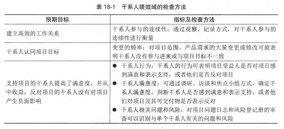

## 2 团队绩效域

- 定义：涉及项目团队人员有关活动和职能
- 预期目标：
  - 共享责任
  - 建立高效绩效团队
  - 所有团队成员都展现出相应的领导力和人际关系技能

### 绩效要点

- 项目团队文化

  - 可以通过制定项目团队规范这种方式有意识的形成，也可以通过项目团队成员的行为非正式的形成
  - 具体方法：
    - 透明
    - 诚信
    - 尊重
    - 积极的讨论
    - 支持
    - 勇气
    - 庆祝成功
- 高绩效项目团队

  - 打造方式
    - 开诚布公的沟通
    - 共识
    - 共享责任
    - 信任
    - 协作
    - 适应性
    - 韧性
    - 赋能
    - 认可
- 领导力技能

  - 建立和维护愿景：项目愿景简明扼要的总结了项目的目的，描述了项目未来的预期成果
  - 批判性思维：是训练有素、合乎理性、遵从逻辑、基于证据的思维，包括概念想象力、洞察力、直觉、反思性思维、元认知（“思考之上的思考”和“认知之上的认知”）它需要项目团队成员具备开放思维和客观分析问题的能力
  - 激励

    - 涉及两个方面
      - 了解哪些因素可以激励项目团队成员实现出色绩效
      - 与项目团队成员合作，致力于开展项目活动并取得预期成果
    - 可以是内在的，也可以是外在的
      - 内在激励：源自个人内心，与工作本身中寻找乐趣有关，而不是只关注奖励本身
      - 外在激励：源自外部奖励（如奖金）
  - 人际关系技能

    - 情商

      - 情商层次

        - 自我意识：进行现实的自我评估的能力，包括了解自己的情绪、目标、动机、优势、劣势
        - 自我管理（自我调节）：是控制破坏性感受和冲动，并使它们改变方向的能力，它是采取行动之前进行思考以及暂缓仓促判断和冲动决策的能力
        - 社交意识：涉及体现同理心以及理解并考虑他人的感受的能力，包括读懂非语言暗示、肢体语言的能力
        - 社交技能：是情商的高阶境界，涉及管理项目团队、建立社交网络、寻找与干系人的共同基础、建立融洽的关系

        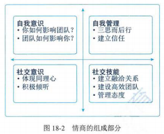
    - 决策

      - 单方面决策：速度快、易出错，也会因为未考虑决策影响的人的感受而降低他们的积极性
      - 群体决策：具有包容性的特点，包容性可增加对决策的承诺，可以利用群体广泛的知识、让人们参与决策，使他们对成果更加认同
    - 冲突管理

      - 解决冲突的方法
        - 尊重、开诚布公的进行沟通
        - 聚焦于问题
        - 聚焦于当前和未来
        - 共同寻找备选方案

### 与其他绩效域的相互作用

### 执行效果检查

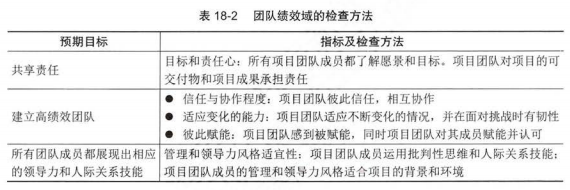

## 3 开发方法和生命周期绩效域

- 定义：涉及与项目的开发方法、节奏和生命周期相关的活动和职能
- 预期目标：
  - 开发方法与项目可交付物相结合
  - 将项目交付与干系人价值紧密关联
  - 项目生命周期由促进交付节奏的项目阶段和产生项目交付物所需的开发方法组成

### 绩效要点

- 交付节奏

  - 定义：指项目可交付物的时间安排和频率
  - 交付方式
    - 一次性交付
    - 多次交付：组件在项目期间不同时间交付
    - 定期交付：按固定的交付计划进行
    - 持续交付：将项目特性增量交付给客户，通常通过使用小批量工作和自动化技术完成
- 开发方法

  - 定义：在项目生命周期内创建产品、服务或结果的方法。不同的行业可能会使用不同的术语来定义开发方法
  - 开发方法：

    - 预测型方法
    - 混合型方法
    - 适应型方法

    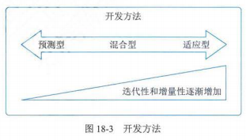
- 开发方法的选择

  - 影响选择的因素
    - 产品、服务或成果
      - 创新程度
      - 需求确定性
      - 范围稳定型
      - 变更的难易程度
        - 交付物性质使得管理和变更等变更较为困难，则采用预测型
      - 交付物的性质
        - 性质及能否以组件形式交付
      - 风险
        - 高风险需要大量的前期规划和严格流程来降低风险，可适当采用预测型方法
      - 安全需求
        - 由严格安全需求的产品通常采用预测型，需进行大量的预先规划，确保安全需求都得到识别、规划、创建、整合、测试
      - 法规
        - 由重大监管监督的环境可能更适合预测型
    - 项目
      - 干系人：适应型方法需要干系人大量参与
      - 进度制约因素：需要尽早交付，即使不是成品，迭代型或适应型
      - 资金可用情况：资金不确定，适应型、迭代型
    - 组织
      - 组织结构
        - 多层级、严格汇报结构，预测型
        - 扁平结构，适应型
      - 文化
        - 有指导文化的组织，预测型
        - 项目团队自管理的组织，适应型
      - 组织能力
        - 从预测型过渡到适应型，再过度到敏捷型，不仅需要组织具有敏捷性，也需要整个组织的高层管理者转变思维模式
      - 项目团队的规模和所处位置
        - 处于同一物理空间，团队规模不大（7+-2 人），适应型（尤其是敏捷型）
        - 大型团队和主要通过虚拟方式工作的项目团队，预测型
- 协调交付节奏和开发方法

### 与其他绩效域的相互作用

### 执行效果检查

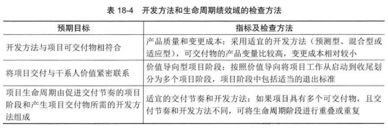

## 4 规划绩效域

- 定义：涉及整个项目期间组织与协调相关的活动与职能，这些活动和职能是最终交付项目和成果所必须的
- 预期目标：
  - 项目以有条理、协调一致的方式推进
  - 应用系统的方法交付项目成果
  - 对演变情况进行详细说明
  - 规划投入的时间成本是适当的
  - 规划的内容对管理干系人的需求而言是充分的
  - 可根据新出现的和不断变化的需求进行调整

### 绩效要点

- 规划的影响因素
  - 定义：每个项目都是独特的，不同项目规划的数量、时间安排和频率也各不相同
  - 具体因素：
    - 开发方法
    - 项目可交付物
    - 组织需求
    - 市场调节
    - 法律或法规限制
- 项目估算
  - 定义：规划时需要对工作投入、持续时间、成本、人员、实物资源进行估算，估算是对某一变量（如项目成本、资源、人力投入、持续时间）的可能数值或结果的定量评估
  - 影响估算的因素
    - 区间
    - 准确度
    - 精确度
    - 信心
  - 估算方法
    - 确定估算和概率估算
    - 绝对估算和相对估算
    - 基于工作流的估算
    - 对不确定性的调整估算
- 项目团队组成和结构规划
- 沟通规划
- 实物资源规划
- 采购规划
- 变更规划
- 度量指标和一致性
  - 度量指标：项目进行过程中，规划、交付、度量工作之间存在的自然联系
  - 一致性：在整个项目生命周期过程中，要保证规划和实际的一致性

### 与其他绩效域的相互作用

### 执行效果检查

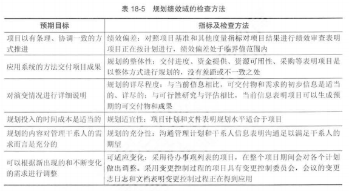

## 5 项目工作绩效域

- 定义：涉及项目工作相关的活动和职能
- 预期目标：
  - 高效且有效的项目绩效
  - 适合项目和环境的项目过程
  - 干系人适当的沟通和参与
  - 对实物资源进行了有效管理
  - 对采购进行了有效管理
  - 有效处理了变更
  - 通过持续学习和过程改进提高了团队能力

### 绩效要点

- 项目过程
  - 优化过程方法
    - 精益生产法
    - 召开回顾会议
    - 价值导向审查
- 项目制约因素
- 专注于工作过程和能力
- 管理沟通和参与
- 管理实物资源
- 处理采购事宜
- 监督新工作和变更
- 学习和持续改进

### 与其他绩效域的相互作用

- 与项目的其他绩效域相互作用，且对其他绩效域具有促进作用
- 具体体现：
  - 可促进并支持有效率且有效果的规划、交付和度量
  - 可为项目团队互动和干系人参与提供有效的环境
  - 可为驾驭不确定性、模糊性和复杂性提供支持，平衡其他项目制约因素

### 执行效果检查

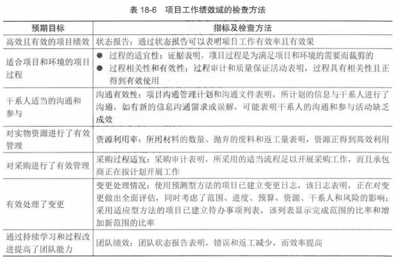

## 6 交付绩效域

- 定义：涉及与交付项目相关的活动和职能。在项目整个生命周期过程中，有效执行本绩效域可以实现预期目标
- 预期目标：
  - 项目有助于实现业务目标和战略
  - 项目实现了预期成果
  - 在预定时间内实现了项目收益
  - 项目团队对需求有清晰的理解
  - 干系人接受项目可交付物和成果，并对其满意

### 绩效要点

- 价值的交付
- 可交付物
- 质量

### 与其他绩效域的相互作用

- 是在规划绩效域中所执行所有工作的终点

### 执行效果检查

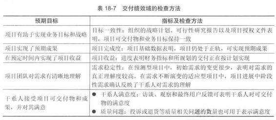

## 7 度量绩效域

- 定义：涉及评估项目绩效和采取相应措施相关的活动和职能
- 预期目标：
  - 对项目状况充分理解
  - 数据充分，可支持决策
  - 及时采取行动，确保项目最佳绩效
  - 能够基于预测和评估做出决策，实现目标并产生价值

### 绩效要点

- 制定有效的度量指标

  - 关键绩效指标
    - 提前指标：用于预测项目的变化趋势，如果变化趋势不利，项目团队将评估根本原因，并采取行动扭转不利趋势，它可以降低项目的绩效风险。提前指标可以量化，例如项目规模或待办事项列表中正在进展的事项的数量
    - 滞后指标：用于测量可交付物或重大项目事件（event），它们在事后提供信息，滞后指标反映的是过去的绩效或状况
  - 有效度量指标
    - SMART 特性
      - Specific： 具体的
      - Measurable：有意义的
      - Attainable：可实现的
      - Relevant：具有相关性
      - Time-bount：具有及时性
- 度量内容及相应指标

  - 可交付物的度量指标
  - 交付的度量指标
  - 基准绩效的度量指标
  - 资源的度量指标
  - 价值的度量指标
  - 干系人的度量指标
  - 预测型度量指标
- 展示度量信息和结果

  - 常用的图标类型

    - 仪表盘

      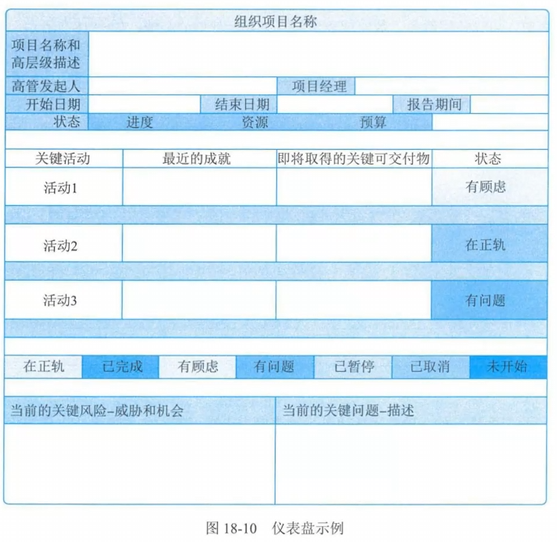
    - 大型可见图表（信息发射源）

      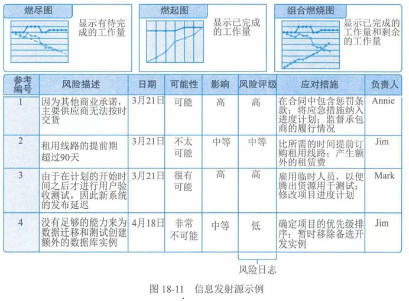
    - 任务板

      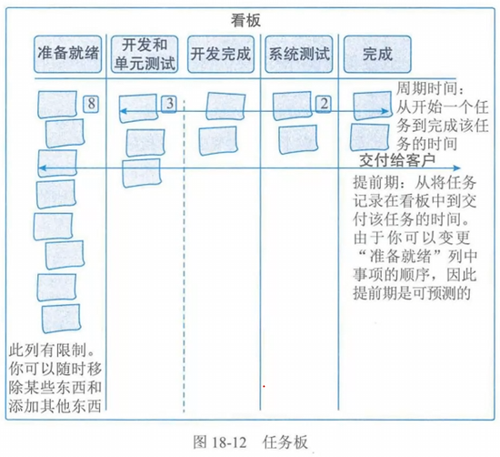
    - 燃烧图

      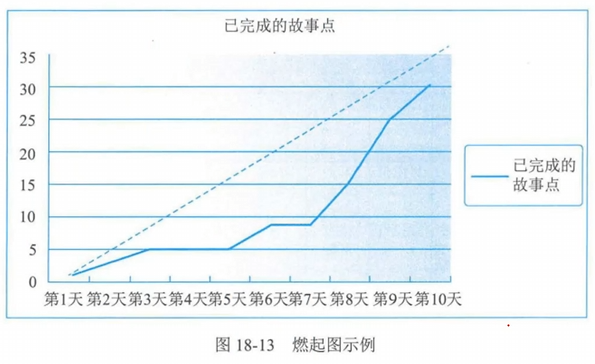
- 度量陷阱

  - 霍桑效应
    - 对某一事物进行度量时，会对其行为产生影响，因此需谨慎制定度量指标
    - 如：仅度量项目团队可交付物的输出，会鼓励项目团队专注于创建更多数量的可交付物，而不是仅专注于度量客户更满意的那些可交付物
  - 虚荣指标：对决策没有帮助的指标
  - 士气低落：如果设定了无法实现的度量指标和目标，团队的时期可能会下降，因此需要设定拓展性目标和激励人心的度量指标
  - 误用度量指标：尽量避免度量指标的误用
  - 确认偏见：度量过程中应尽量摆脱偏见
  - 相关性与因果关系混淆：将两个变量之间的相关性与一个变量导致了另一个变量的因果性混淆
- 基于度量进行诊断

  - 可针对各种度量指标（如进度、预算、速度、项目特有的其他度量指标）制定临界值，偏差成都将取决于干系人的风险承受能力
- 持续改进

  - 度量、展示度量信息和度量结果的目的是为了持续改进，为了优化项目绩效和效率

### 与其他绩效域的相互作用

- 与规划绩效域、项目工作绩效域、交付绩效域相互作用

### 执行效果检查

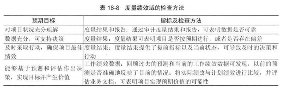

## 8 不确定性绩效域

- 定义：
  - 广义的不确定性是一种不可知或不可预测的状态
  - 包括
    - 风险：与不可知未来事件相关的风险
    - 模糊性：与不了解当前或未来状况相关的模糊性
    - 复杂性：与具有不可预测结果的动态系统相关的复杂性
- 预期目标：
  - 了解项目的运行环境，包括技术、社会、政治、市场、经济环境等
  - 积极的识别、分析、应对不确定性
  - 了解项目中多个因素之间的互相依赖关系
  - 能够对威胁和机会进行预测，了解问题的后果
  - 最小化不确定性对项目交付的负面影响
  - 能够利用机会改进项目的绩效和成果
  - 有效利用成本和进度储备，与项目目标保持一致等

### 绩效要点

- 风险：是不确定性的一个方面，消极的风险称为威胁，积极风险称为机会
- 模糊性
  - 分类
    - 概念模糊性：缺乏有效的理解
    - 情境模糊性：可能出现多个结果时
  - 解决方法
    - 渐进明细
    - 试验
    - 原型法
- 复杂性
  - 处理方法
    - 基于系统的复杂性
      - 解耦
      - 模拟
    - 重新构建的复杂性
      - 多样性
      - 平衡
    - 基于过程的复杂性
      - 迭代
      - 参与
      - 故障保护
- 不确定性的应对方法
  - 收集信息：发现更多信息（如进行研究、争取专家参与、市场分析）来减少不确定性
  - 为多种结果做好准备
  - 集合设计：探索各种选项，来权衡包括时间与成本、质量与成本、风险与进度、进度与质量等多种因素，在整个过程中国，舍弃无效或次优的替代方案，以便项目团队能从各种备选方案中选择最佳方案
  - 增加韧性：韧性是对意外变化快速适应和应对的能力，韧性既适用于项目团队成员，也适用于组织过程。如果对产品设计的初始方法或原型无效，则项目团队和组织需要能够快速学习、适应和应对变化

### 与其他绩效域的相互作用

### 执行效果检查

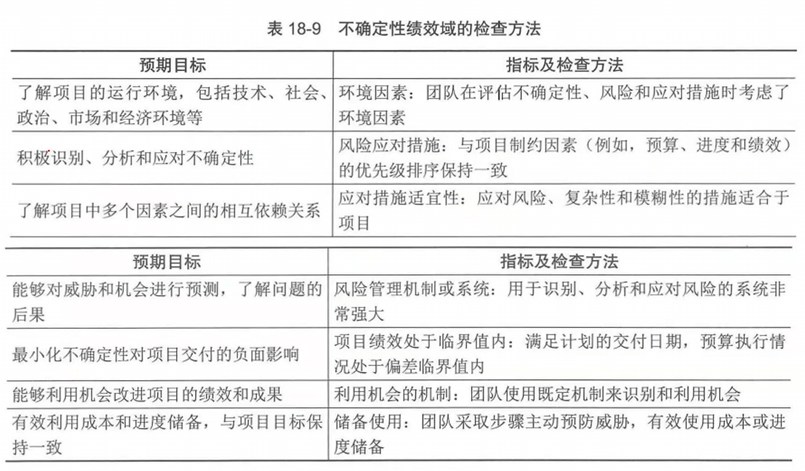
