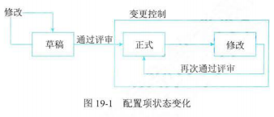
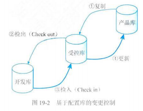
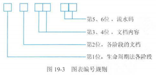

# 19. 配置与变更管理

## 1 配置管理

### 配置管理

- 为了系统的控制配置变更，在信息系统项目的整个生命周期中维持配置的完整性和可追踪性，而标识信息系统建设在不同时间点上配置的学科

### 管理基础

- 配置项（Configuration Item，CI）

  - 典型的配置项：项目计划书、技术解决方案、需求文档、设计文档、源代码、可执行代码、测试用例、运行软件所需的各种数据、设备型号及其关键部件等
  - 分类
    - 基线配置项：包括所有的设计文档和源程序等
    - 非基线配置项：包括项目的各类计划和报告等
  - 权限
    - 所有配置项的操作权限应由配置管理员严格管理
    - 基本原则：
      - 基线配置项向开发人员开放读取的权限
      - 非基线配置项向项目经理、CCB 及相关人员开放
- 配置项状态

  - 草稿：配置项刚建立时
  - 正式：配置项通过评审后
  - 修改：
    - 变更正式的配置项
    - 当配置项修改完毕并重新通过后，又变为“正式”

  
- 配置项版本号

  - 草稿：0.YZ
  - 正式：X.Y
  - 修改：X.YZ
  - 正式版本号的迭代过程
    - 第一次成为正式时，版本号为 1.0
    - 若升级幅度较小，可将变动部分制作成配置项的附件，附件版本依次为：1.0、1.1……
    - 当附件的变动积累到一定程度时，配置项的 Y 值适当增加
    - Y 增加到一定程度时，X 值适当增加
    - 当配置项升级幅度较大时，才允许直接增大 X
- 配置项版本管理

  - 原则：由于我们不能保证新版本一定比旧版本“好”，所以不能抛弃旧版本
  - 目的：按照一定的规律保存配置项的所有版本，避免发生版本丢失或混淆等现象，且可以快速准确的查找到配置项的任何版本
- 配置基线

  - 定义：
    - 配置基线由一组配置项组成，这些配置项构成一个相对稳定的逻辑实体
    - 配置基线也是指一个产品或系统在某一特定时刻的配置状况
  - 冻结：基线中的配置项被“冻结”了，不能再被任何人随意修改，对基线的变更必须遵循正式的变更控制程序
  - 例子：
    - 一组拥有唯一标识号的需求、设计、源代码文档以及相应的可执行代码、构造文档和用户文档构成一条基线
    - 产品的一个测试版本（可能包括需求分析说明书、概要设计说明书、详细设计说明书、已编译的可执行代码、测试大纲、测试用例、使用手册等）
  - 项目中的基线：对应项目中的里程碑，一个项目可以有多个基线，也可以只有一个基线
  - 基线分类
    - 发行基线（Release）
    - 构造基线（Build）
  - 基线的内容：
    - 建立基线的事件
    - 受控的配置项
    - 建立和变更基线的程序
    - 批准变更基线所需的权限
  - 建立基线的价值：
    - 为项目工作提供了一个定点和快照
    - 新项目可以在基线提供的定点上建立。新项目作为一个单独分支，将与随后对原始项目（在主要分支上）所进行的变更进行隔离
    - 当认为更新不稳定或不可信时，基线为团队提供一种取消变更的方法
    - 可以利用基线重新建立基于某个特定发布版本的配置，以重现已报告的错误
- 配置管理数据库
- 配置库

  - 类型
    - 开发库（动态库、程序员库、工作库）
    - 受控库（主库）
    - 产品库（静态库、发行库、软件仓库）
  - 配置库的建库模式
    - 按配置项的类型分类建库：适用于通用软件开发组织
    - 按开发任务建立相应的配置库：适用于专业软件的开发组织

### 角色与职责

- 配置管理负责人
- 配置管理员（CMO）
  - 负责在整个项目生命周期中进行配置管理的主要实施活动
  - 具体负责
    - 建立和维护配置管理系统
    - 建立和维护配置库或配置管理数据库
    - 配置项识别
    - 建立和管理基线
    - 版本管理和配置控制
    - 配置状态报告
    - 配置审计
    - 发布管理和交付
- 配置项负责人

### 目标与方针

- 管理目标：用以定义并控制信息系统的组件，维护准确的配置信息
- 管理方针：为了实现配置管理目标，组织应定义配置管理过程，制定配置管理相关制度

### 管理活动

- 制定配置管理计划

  - 审批人：CCB（配置控制委员会）负责审批该计划
- 配置项识别

  - 定义：识别所有信息系统组件的关键配置，以及各配置项间的关系和配置文档等结构识别
- 配置项控制

  - 包括：

    - 变更申请
    - 变更评估

      - 评估组织：CCB
      - 评估内容：
        - 变更对项目的影响
        - 变更的内容是否有必要
        - 变更的范围是否考虑周全
        - 变更的实施方案是否可行
        - 变更工作量估计是否合理
    - 通告评估结果
    - 变更实施：项目经理组织修改相关的配置项，并记录变更信息
    - 变更验证与确认
    - 变更的发布
    - 基于配置库的变更控制

      
- 配置状态报告（配置状态统计）

  - 定义：有效的记录和报告管理配置所需要的信息，目的是及时、准确的给出配置项的当前状况，供相关人员链接，以加强配置管理工作
  - 内容：
    - 每个受控配置项的标识和状态、一旦配置项被置于配置控制下，就应该记录和保存它的每个后续进展的版本和状态
    - 每个变更申请的状态和已批准的修改的实施状态
    - 每个基线的当前和过去版本的状态以及各版本的比较
    - 其他配置管理过程活动的记录
- 配置审计（配置审核、配置评价）

  - 定义：包括功能配置审计和物理配置审计，分别用以验证当前配置项的一致性和完整性
  - 作用：
    - 防止向用户提交不适合的产品，如交付了用户手册的不正确版本
    - 发现不完善的实现，如开发出不符合初始规格说明或未按变更请求实施变更
    - 找出各配置项间不匹配或不相容的现象
    - 确认配置项已在所要求的质量控制审核之后纳入基线并入库保存
    - 确认记录和文档保持着可追溯性等
  - 分类
    - 功能配置审计
      - 审计配置项的一致性（实际功效是否与其需求一致）
      - 具体验证
        - 配置项的开发已圆满完成
        - 配置项已达到配置标识中规定的性能和功能特性
        - 配置项的操作和支持文档已完成并且是符合要求的等
    - 物理配置审计
      - 审计配置项的完整性（物理存在是否与预期一致）
      - 具体验证
        - 要交付的配置项是否存在
        - 配置项中是否包含了所有必须的项目等
- 配置管理回顾与改进

  - 定期回顾配置管理活动的实施情况，发现在配置管理执行过程中有无问题，找到改进点，继而优化配置管理过程

## 2 变更管理

### 管理基础

- 变更管理的实质：是根据项目推进过程中越来越丰富的项目人质，不断调整项目努力方向和资源配置，最大程度的满足项目需求，提升项目价值
- 变更产生的原因：

  - 产品范围（成果）定义的过失或疏忽
  - 项目范围（工作）定义的过失或疏忽
  - 增值变更
  - 应对风险的应急计划或回避计划
  - 项目执行过程与基准要求不一致带来的被动调整
  - 外部事件等
- 变更的分类

  - 根据变更性质：
    - 重大变更
    - 重要变更
    - 一般变更
    - 通过不同审批权限进行控制
  - 根据变更的迫切性
    - 紧急变更
    - 非紧急变更
    - 通过不同流程控制
  - 根据行业特点分类：如产品（工作）范围变更、环境变革、涉及变更、实施变更、技术标准变更
- 项目变更的含义：为使项目基准与项目实际执行情况相一致，应对项目变化的一套管理方法

### 管理原则

- 变更管理原则：项目基准化、变更管理过程流程化
- 主要内容：

  - 基准管理
  - 变更控制流程化
  - 明确组织分工
  - 评估变更的可能影响
  - 妥善保存变更产生的相关文档

### 角色与职责

- 项目经理在变更中的作用
  - 响应变更提出者的需求
  - 评估变更对项目的影响及解决方案
  - 将需求由技术要求转化为资源需求，供授权人决策
  - 根据评审结果实施（即调整基准），确保项目基准反映项目实施情况
- 变更管理负责人（变更经理）：通常是变更管理过程解决方案的负责人
- 变更请求者：负责记录与提交变更请求单
- 变更实施者
- 变更顾问委员会：负责对重大变更行使审批，提供专业意见和辅助审批

### 工作程序

- 1.变更申请

  - 应当及时以正式方式进行，并留下书面记录
  - 书面形式：变更的提出可以是各种形式，但在评估前应以书面形式提出
  - 提出人：项目的干系人都可以提出
- 2.对变更的初审

  - 目的：
    - 对变更提出方施加影响，确认变更的必要性，确保变更是有价值的
    - 格式校验，完整性校验，确保评估所需信息准备充分
    - 在干系人间就提出供评估的变更信息达成共识等
  - 常见方式
    - 变更申请文档的审核流转
- 3.变更方案论证

  - 定义：变更方案的主要作用，首先是对变更请求是否可实现进行论证，如果可以实现，则将变更请求由技术要求转化为资源要求，以供 CCB 决策
  - 常见方案：
    - 技术评估
    - 经济与社会效益评估
  - 大型的变更：可召开相关的变更方案论证会议，通常需要有变更顾问委员会（相关技术和经济方面的专家组成）进行相关论证，并将相关专家意见作为项目变更方案的一部分，报项目 CCB 作为决策参考
- 4.变更审查

  - 定义
    - 是项目所有者根据变更申请及评估方案，决定是否变更项目基准
    - 常包括客户、相关领域的专业人士等。审查通常采用文档、会签形式，重大的变更审查可以采用正式会议形式
    - 审查过程应注意分工，项目投资人虽有最终的决策权，但通常技术上并不专业，所以应当在评审过程中将专业评审、经济评审分开，对涉及项目目标和交付成果的变更，客户的意见应该放在核心位置
- 5.发出通知并实施

  - 定义：变更评审通过后，意味着基准的调整，同时确保变更方案中的资源需求及时到位
  - 需要强调的是：
    - 变更通知不只是包括项目实施基准的调整，更要明确项目的交付日期、成果对相关干系人的影响
    - 如果变更造成交付期调整，应在变更确认时发布，而非在交付前发布
- 6.实施监控

  - 定义：除了调整基准中涉及变更的内容外，还应当对项目的整体基准是否反映项目实施情况负责
  - 负责人：
    - 变更实施的过程监控，通常由项目经理负责基准的监控
    - CCB 监控变更明确的主要成果、进度里程碑等，也可以通过监理单位完成监控
- 7.效果评估

  - 关注内容：
    - 项目的基准是评估的依据
    - 结合变更的目标，评估变更所要达到的目的是否已达成
    - 评估变更方案中的技术论证、经济论证内容与实施过程的差距，并促使解决
- 8.变更收尾

  - 判断发生变更后项目是否已纳入正常轨道

### 变更控制

- 变更申请控制
  - 在项目整体压力较大的情况下，更需强调变更的提出和处理应当规范化，可使用分批处理、分优先级等方式提高效率
  - 项目规模小、与其他项目的关联度小时，先更的提出与处理过程可在操作上力求简便、高效。但小项目的变更仍应注意对变更产生的因素施加影响（如防止不必要的变更，减少无所谓的评估，提高必要变更的通过效率等），对变更的确认应当正式化，变更的操作过程应当规范化
- 变更过程控制
  - 对进度变更的控制
  - 对成本变更的控制
  - 对合同变更的控制

### 版本发布和回退计划

- 版本发布前的准备工作
  - 进行相关的回退分析
  - 备份版本发布所涉及的存储过程、函数等其他数据的存储及回退管理
  - 备份配置数据，包括数据备份的方式
  - 备份在线生产平台接口、应用、工作流等版本
  - 启动回退机制的触发条件
  - 对变更回退的机制职责的说明，如通知相关部门，确定需要回退的关联系统和回退的时间点等
- 回退步骤
  - 通知相关用户系统开始回退
  - 通知各关联系统进行版本回退
  - 回退存储过程等数据对象
  - 配置数据回退
  - 应用程序、接口程序、工作量等版本回退
  - 回退完成通知各周边关联系统
  - 回退后进行相关测试，保证回退系统能够正常运行
  - 通知用户回退完成等

## 3 项目文档管理

### 管理基础

- 文档类型
  - 开发文档
    - 描述开发过程本身
    - 如：可行性研究报告和项目任务书、需求规格说明、功能规格说明、设计规格说明（包括程序和数据规格说明、开发计划、软件集成和测试计划、质量保证计划、安全和测试信息等）
  - 产品文档
    - 描述开发过程的产物
    - 如：培训手册、参考手册和用户指南、软件支持手册、产品手册和信息广告
  - 管理文档
    - 记录项目管理信息
    - 如：开发过程的每个阶段的进度变更的记录、软件变更情况的记录、开发团队的职责定义、项目计划、项目阶段报告、配置管理计划
- 文档质量
  - 最低限度文档（1 级文档）：适合开发工作量低于 1 人月的开发者自用程序。该文档应包括程序清单、开发记录、测试数据和程序简介
  - 内部文档（2 级文档）：可用于没有与其他用户共享资源的专用程序。除 1 级文档内容外，还包括程序清单内足够的注释以帮助用户安装和使用程序
  - 工作文档（3 级文档）：适用于由同一单位内若干人联合开发的程序，或可能被其他单位使用的程序
  - 正式文档（4 级文档）：适合那些要正式发行普遍使用的软件产品，关键性程序或具有重复管理应用性质（如工资计算）的程序

### 规则和方法

- 文档的规范化管理
  - 文档书写规范

    - 无论是那种类型的文档都应遵循统一的书写规范，包括符号的使用、图标的含义、程序中注释行的使用、注明文档书写人及书写日期等
    - 如：在程序的开始要用同一的格式包含程序名称、程序功能、调用和被调用的程序、程序设计人等
  - 图表编号规则

    - 对图标进行有规则的编号

    
  - 文档目录编写规范

    - 为了存档及未来适用的方便，应编写文档目录。管理信息系统的文档目录中应包含文档编号、文档名称、格式或载体、份数、每份页数或件数、存储地点、存档时间、保管人等。文档编号一般为分类结构，可采用同图表编号类似的编号规则
  - 文档管理制度

    - 需根据组织实体的具体情况而定，主要包括监理文档的相关规范、文档借阅记录的登记制度、文档使用权限控制规则等
