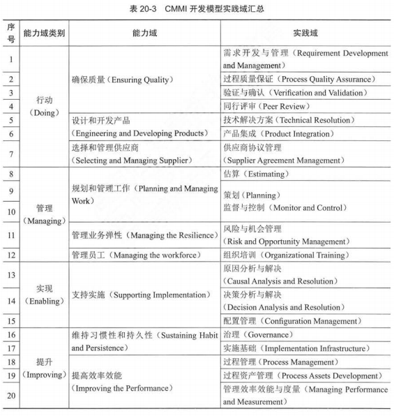

## 1 项目集管理

### 项目集管理标准

### 项目集管理角色和职责

- 项目集发起人
- 项目集指导委员会
  - 应使项目集得到适当治理，由该委员会负责定义和实践适当的治理实践
  - 典型职责
    - 为项目集提供治理支持，包括监督、控制、整合、决策等
    - 提供有能力的治理资源，监督与效益交付相关的项目集的不确定性和复杂性
    - 确保项目集目标和规划的效益符合组织战略和运营目标
    - 举行计划会议，确认项目集，并对项目集进行优先级排序和提供资金
    - 支持或批准项目集的建议和变更
    - 解决并补救上报的项目集问题和风险
    - 提供监督，使项目集效益得以规划、衡量并最终达成
    - 管理决策的制定、施行、执行、沟通
    - 定义要传达给干系人的关键信息，并确保其一致、透明
    - 审查预期的效益和效益交付
    - 批准项目集收尾和终止
- 项目集经理
- 其他影响项目集的干系人

### 项目集管理绩效域

- 项目集战略一致性：与组织的目标和目的保持一致
- 项目集效益管理
  - 定义：是定义、创建、最大化和交付项目集所提供效益的绩效域
  - 主要活动：
    - 效益识别：识别和审核项目集干系人预期实现的效益
    - 效益分析和规划：制定项目集效益管理计划，制定项目集组件及其相互依赖关系、明确优先级，制定和沟通共识项目集绩效基准，并持续更新
    - 效益交付：确保项目集按照效益管理计划中的定义交付预期的效益，并向项目集指导委员会、项目集发起人、其他项目集干系人进行报告，以评估项目集的整体健康状况
    - 效益移交：确保项目集效益移交至运营领域，并能在移交后持续维持。效益移交的活动包括制定向运营移交的计划，验证项目集及其组件的整合、移交、收尾是否满足了项目集目标和交付效益实现标准
    - 效益维持：当项目集结束后，由接收组织持续进行维护工作，以确保维持生成项目集所交付的改进和成果
- 项目集干系人参与
- 项目集治理
- 项目集生命周期管理
  - 定义：为了确保实现效益，项目集各组件要与组织战略目的和目标保持一致性
  - 3 个阶段：
    - 项目集定义阶段：为达成预期成果构建和批准项目集，制定项目集线路图，制定项目评估和项目集章程
    - 项目集交付阶段
      - 为产生项目集管理计划各组件的预期成果而进行的项目集活动
      - 子阶段：
        - 组件授权与规划
        - 组件监督与整合
        - 组件移交与收尾
    - 项目集收尾阶段：将项目集效益移交给维护组织，并以可控的方式正式结束项目集活动

## 2 项目组合管理

### 项目组合管理标准

### 项目组合管理角色和职责

- 项目组合管理经理
- 项目组合管理中的其他角色

### 项目组合管理绩效域

- 项目组合生命周期
  - 4 个阶段
    - 启动阶段
      - 启动阶段拉开了项目组合的序幕
      - 主要活动：验证业务和运营战略，识别项目组合组件，为项目组合及其组件定义长期路线图，包括财务目标、绩效标准、沟通、治理、干系人的定义与角色，以及持续管理计划
    - 规划阶段
      - 制定并评审项目组合管理计划并就主要内容与干系人达成共识
      - 主要活动
        - 项目组合组件范围和管理
        - 执行组件所需的预算
        - 项目组合及组件间的依赖关系识别
        - 风险和问题的识别与应对计划
        - 资源需求
        - 项目组合组件的优先排列顺序
        - 治理机构、发起人和干系人责任的确认
        - 用来衡量成功的项目组合标准
        - 产或服务的需求与规范
    - 执行阶段
      - 通过其各个组件和运营来实施的，包括对项目组合的执行情况，以及各组件的绩效标准进行评审和汇报；对提出的变更基于持续的组织需要来进行评审，组织环境的变更可能迫使组件优先排序要重新排列或引入新组件
      - 主要活动：
        - 项目组合内所有组件的交付
        - 管理和解决项目组合及其组件之间的风险与问题
        - 引导项目组合和组件的沟通汇报
        - 根据需要重新排序和变更子项目组合
        - 以组件交付为基础监督收益实现的潜能
        - 管理给项目组合的有限资产和资源
    - 优化阶段
      - 通过最大化可用的条件、制约因素、资源，使项目组合尽可能高效的过程
      - 组织通常会安排定期的优化，但在增加或关闭组件时，也会触发此活动
- 项目组合战略管理
- 项目组合治理
- 项目组合产能与能力管理：最大化资源应用并最小化资源冲突
- 项目组合干系人参与
- 项目组合价值管理
- 项目组合风险管理

## 3 组织级项目管理

### 组织级项目管理（OPM）

- 是通过整合项目组合、项目集、项目管理，连接其与组织驱动因素和组织流程来提升组织能力，从而实现战略目标

### 组织级项目管理标准

### 业务价值与业务评估

### OPM 框架要素

- OPM 方法论
  - 是针对在特定组织内从事项目管理人员的实践、技术、程序、规则所构成的体系
  - 组织通过建立和整合被认为最有可能提供预期收益的项目组合、项目集、项目方法论的要素来开发、改进 OPM 方法论
- 知识管理：在 OPM 框架内，知识管理通常侧重于实现绩效改进、创新、经验教训分享、记录最佳实践、流程整合和组织持续改进的组织目标
- 人才管理
  - 大多数组织都有评估和提供个人绩效反馈的流程，由集中化的职能部门执行
  - 在 OPM 框架下的人才管理，这个职能部门跟踪项目管理群体的职业化发展，晋升评审流程与已定义的工作角色和工作级别的要求保持同步，与项目组合、项目集、项目经理的职业化发展保持一致
- OPM 治理
  - OPM 治理使组织能够持续管理项目并最大化项目成果的价值，通过审查和决策机构的行动来实现，负责在权限范围内签署或批准有关 OPM 要素
  - 包括：
    - 高管治理实体
    - OPM 治理实体
    - 项目组合和项目整治实体
    - 项目管理治理实体

### OPM 成熟度模型

- OPM 成熟度级别
  - 级别 1：初始或临时的 OPM
  - 级别 2：项目层级采用 OPM
  - 级别 3：组织定义的 OPM
  - 级别 4：量化管理的 OPM
  - 级别 5：持续优化的 OPM

## 4 量化项目管理

### 量化管理（Quantitative Management）

- 指以数据为基础用统计或其他量化的方法来分析和研究事物的运行状态和性能，对关键的决策点及操作流程进行管理监控，以求对事物存在和发展的规模、程度等作出精确的数字描述和科学控制，实施标准化操作的管理模式

### 量化管理理论及应用

- 量化管理理论
  - 五大原则
    - 工时定额化
    - 分工合理化
    - 程序标准化
    - 薪酬差额化
    - 管理职能化
- 统计过程控制（Statistical Process Control，SPC）
  - 定义：是指应用统计技术对工作过程中的各个阶段进行分析、监控、评估，建立并保持工作过程处于可接受的并稳定的水平，从而确保产品与服务符合规格要求的一种管理技术
  - 3 个层面
    - 描述和分析组织或项目的特征（现状、结构、因素之间的关系等）
    - 分析组织或项目的运行规律与发展趋势（动态数据）
    - 对组织或项目的未来状态进行预测（建立预测模型）
- 量化管理应用
  - 六西格玛
    - DMAIC 模式
      - 六西格玛认为业务流程改进遵循 5 步循环改进法
    - 5 步法
      - 定义（Define）：识别过程，确定所需资源
      - 度量（Measure）：建立改进目标
      - 分析（Analyze）：确定变量
      - 改进（Improve）：优化并确定满足目标
      - 控制（Control）：建立有效控制阶段
    - 特点
      - 5 步实施流程并不是单一的，而是各个管理流程实施改进时相互关联的统一体
      - 是一种基于数据统计分析的管理方法，强调用数据来可观体现管理流程的能力
      - 代表特征是管理流程、管理指标量化
  - CMMI

### 组织级量化管理

- 定义组织量化过程性能目标
- 识别关键过程
- 建立度量体系及数据收集
- 建立过程性能基线
- 建立过程性能模型
  - 识别建模因子
    - 当 $ 0.8 \leq |r| \leq 1 $，认为因子与目标结果存在强相关关系
    - 当 $ 0.5 \leq |r| \leq 0.8 $，认为因子与目标结果存在中度相关关系
    - 当 $ 0.3 \leq |r| \leq 0.5 $，认为因子与目标结果存在弱相关关系
    - 当 $ 0 \leq |r| \leq 0.3 $，认为因子与目标结果基本不相关
  - 建立过程性能模型
  - 验证过程性能模型
    - $ P < 0.05 $，认为因子与模型结果显著相关，可以保留
    - $ P > 0.05 $，需进行进一步分析因子可用性
    - $ R^2 $（即 R-sq 值）越趋近于 1，模型可靠性越高
    - R-sq < 0.7，认为模型可靠性弱，需要重新选择因子
    - R-sq > 0.7，认为模型基本可靠
  - 评审和发布过程性能模型

### 项目级量化模型

- 项目过程性能目标定义
- 过程优化组合
- 过程性能监控
- 项目性能预测

## 5 项目管理实践模型

### CMMI 模型

- 定义：用于指导组织项目管理过程的改进，以及进行项目管理能力成熟度的评估，当前版本为 CMMI2.0
- CMMI 模型实践

  - 4 大能力领域
    - 行动：用于生产和提供优秀解决方案的能力域
    - 管理：用于策划和管理解决方案实施的能力域
    - 使能：用于支持解决方案实施和交付的能力域
    - 提高：用于维持和提高效能的能力域
  - 4 大能力域供包含了 9 个能力域。CMMI 模型将共 196 条实践分组，形成 20 个实践域，并将 20 个实践域分别归属于 9 个能力域

  
- CMMI 级别与表示方法

  - 第 1 级：初始级
  - 第 2 级：管理级
  - 第 3 级：定义级
  - 第 4 级：量化管理级
  - 第 5 级：优化级
- 基于 CMMI 的过程改进

### PRINCE2 模型
