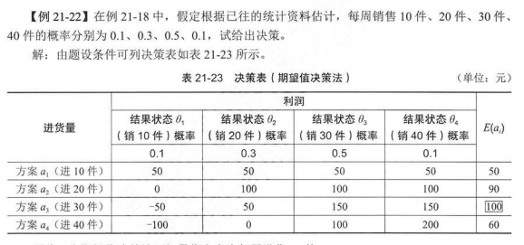
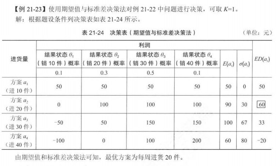
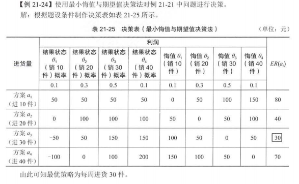

## 不确定型决策

- 乐观主义准则
  - 大中取大：所有方案中的最大值的最大值
- 悲观主义准则
  - 小中取大：所有方案中的最小值的最大值
- 后悔值准则
  - 后悔值矩阵：各个方案，在不同场景中当前值与相同条件下方案最大值的差
  - 取所有方案的差的最大值中，值最小的方案

### 匈牙利法

- 求每行的值与当前行最小值的差值，形成新表
- 在上述结果的条件下，求每列当前值与最小值的差值

### 伏格尔法

- 求每行、列的极差
- 取最大的极差中，最小值的项，投入资源
- 清除上方对的行/列
- 循环步骤

## 1 工程经济学

### 资金的时间价值与等值计算

- 资金的时间价值指不同时间发生的等额资金在价值上的区别
- 利息、利率及计算
  - 单利法
    - $ 本金 + 年数 _ （本金 _ 利率） $
  - 复利法
    - $ 本金 + （1 + 利率） ^ 年数 $

### 项目经济评价

- 根据是否考虑资金时间价值，分为：静态评价、动态评价
  - 静态评估方法
    - 静态回收期法
    - 投资收益率法
      - $ 总投资收益率（ROI） = EBIT（达产年年息税前利润） / TI（总投资） \* 100%$
  - 动态评价方法
    - 净现值法（NPV）
      - 到目标年份的现值之和
    - 净现值率（NPVR）
      - $ NPVR = NPV / K_p（项目总投资现值） $
      - 越大越好
    - 费用现值法
      - 各年带折现率的费用之和
      - 越低越好
    - 动态投资回收期()
      - $ P_p = (累计折现值开始出现正值或零的年份 - 1) + (上年累计折现值的绝对值 / 当年折现值) $
    - 内部收益率

### 2 运筹学

### 线性规划建模

### 图解法求解

### 运输问题

### 指派问题

### 动态规划

- 最短路径问题
- 资源分配问题

### 博弈论

### 决策分析

- 不确定型决策
- 风险型决策

  - 期望型决策法：把每个方案的期望值求出，然后根据期望值的大小确定最优策略

    
  - 期望值与标准差的决策方法

    
  - 最小悔值与期望值决策法

    
