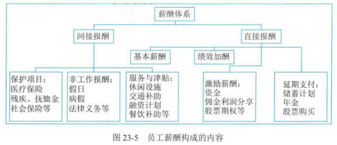
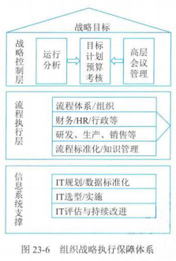

## 1 人力资源管理

### 人力资源管理基础

- 人力资源管理目标
  - 建立员工招聘、选择体系，获得员工
  - 挖掘员工潜能，使其服务于组织发展目标，也满足员工事业发展需求
  - 留住通过自己工作绩效助力组织实现项目目标的员工，同时淘汰无法满足组织发展需要的员工
  - 确保遵守人力资源方面的法律、法规、政策、标注等
- 人力资源管理活动
  - 规划
  - 招聘
  - 维护
  - 提升
  - 评价

### 工作分析与岗位设计

- 工作分析
  - 定义：明确所要完成任务及完成这些任务所需要的人员能力特征
  - 作用
    - 招聘、选择员工
    - 发展、评价员工
    - 薪酬政策
    - 组织与岗位设计
  - 过程
    1. 明确工作分析范围
    2. 确保工作分析方法
    3. 工作信息收集和分析
    4. 评价工作分析方法
  - 工作分析方法
    - 定性：工作实践法、直接观察法、面谈法、问卷法、典型事例法
    - 定量：职位分析问卷法、管理岗位描述问卷法、功能性工作分析法等
- 岗位设计
  - 定义：明确某类或某组织工作的内容和方法，明确能够满足技术上和组织上要求的工作员工的社会和个人方面所要求的工作之间的关系
  - 内容：
    - 工作内容设计：
      - 工作的广度
      - 工作的深度
      - 工作的完整性
      - 工作的自主性
      - 工作的反馈性
    - 工作职责设计：包括工作的责任、权利、方法、工作中的相互沟通等方面
    - 工作关系设计：表现为岗位之间的协作关系、监督关系等各个方面
  - 方法：
    - 科学管理方法
    - 人际关系方法
    - 工作特征模型
    - 高绩效工作系统等

### 人力资源战略与计划

- 定义：是确立人力资源管理的规划方向，明确组织人力资源管理的战略定位
- 人力资源战略
  - 战略性人力资源
  - 人力资源战略模式
- 人力资源预测
  - 人力资源需求预测
  - 人力资源供给预测
- 人力资源计划控制与评价

### 人员招聘与录用

- 招聘过程
  - 人员的招聘活动
    - 招聘计划制定
    - 招聘信息发布
    - 应聘者申请
    - 人员甄选与录用
    - 招聘评估与反馈
- 招聘渠道
- 录用方法
  - 背景调查
  - 录用测试
  - 工作申请表
- 招聘面试
  - 面试的程序
    1. 面试前的准备
    2. 实施面试
    3. 评估面试结果
  - 面试的类型
    - 非结构化面试
    - 半结构化面试
    - 结构化面试
- 招聘效果评估
  - 评估方面：
    - 招聘周期
    - 用人部门满意度
    - 招聘成果率：实际上岗人数 / 面试人数
    - 招聘达成率：实际上岗人数 / 计划招聘人数
    - 招聘成本

### 人员培训

- 培训程序与培训类型

  - 员工培训的 4 个步骤：

    1. 评估组织开展员工培训的需求
    2. 设定员工培训的目标
    3. 设计培训项目
    4. 培训的实施和评估
- 培训内容与需求评估

  - 培训内容
  - 需求评估
- 培训效果评估与迁移

  - 培训效果评估
  - 培训转移：组织通过培训让员工获得的新知识、技能、经验、态度等

### 组织薪酬管理

- 薪酬体系

  
- 工作评价
- 薪酬等级
- 薪酬激励
- 薪酬调整

### 人员执业规划与管理

## 2 流程管理

### 流程基础

- 流程要素与生命周期

  - 流程管理基本要素

    - 流程的输入资源
    - 流程中的若干活动
    - 活动的相互作用
    - 输出结果
    - 客户
    - 最终流程创造的价值
  - 流程特点

    - 目标性
    - 内在性
    - 整体性
    - 层次性
  - 组织战略执行保障体系

    - 第一层：战略控制层
      - 以会议管理、运行分析、预警考核为基础建立组织发展计划，形成以执行和控制为目标的战略控制层
    - 第二层：流程控制层
      - 以业务流程、岗位描述、绩效评价为基础架构，对研发、采购、生产与交付、销售、客服等各职能领域构建稳定的流程执行层
    - 第三层：系统支撑层
      - 以 ERP（组织资源规划）、CRM（客户关系管理）、PDM（产品数据管理）等大量的信息技术应用为基础的系统职称层

    
- 流程管理价值原则

  - 具备可管理价值的流程应符合管理大跨度原则、管理多元参与原则、管理高频度使用原则等
- 流程导向管理特性

  - 流程导向的管理模式具有以战略为导向、以流程为主线、强化流程的管理等特性

### 流程规划

- 端到端的流程：指从获取业务对象需求开始，到业务对象满意结束，也就是要以终为始，目标向导
- 组织流程框架
- 流程规划方法
  - 基于岗位职责的
  - 基于业务模型的
- 流程分类分级
  - 战略流程：是面向未来的，为组织提供发展方向和整体管理，包括组织长/中/短期战略目标的规划、战略目标的分解、制定战略目标实现策略、确定所采用的竞争策略与商业模式和战略过程的控制与调整等
  - 运行流程：是直接为业务对象创造价值的流程，能够被内外部业务对象看到或感觉到，运行流程从业务对象提出需求开始，到满足业务对象需求结束
  - 支持流程：为运行流程提供支持与服务，通常包括决策支持、后勤支持与风险控制 3 类

### 流程执行

### 流程评价

- 定义：是流程管理最重要的环节，它承上启下，对上促进流程设计的优化，确保设计更加符合战略要求，如流程运行线路精简，不增值活动比率低等
- 流程检查方法：
  - 常见的流程检查方法：
    - 流程稽查
    - 流程绩效评估
    - 满意度评估
    - 流程审计
- 流程评价应用：
  - 流程优化
  - 绩效考核
  - 过程控制
  - 纠正措施
  - 战略调整

### 流程持续改进

## 3 知识管理

### 知识管理基础

- 知识管理的特征：
  - 知识管理是优化的流程
  - 知识管理是管理
  - 知识管理依赖于知识
- 知识管理可以达成的目标
  - 实现组织可持续发展
  - 提高员工素质及工作效率
  - 增强服务对象满意度
  - 提升组织的运作绩效
- 实施知识管理遵循的原则
  - 领导作用
  - 战略向导
  - 业务驱动
  - 文化融合
  - 技术保障
  - 知识创新
  - 知识保护
  - 持续改进

### 知识价值链

- 知识价值链过程
  1. 知识创造
  2. 知识分类
  3. 知识审计
  4. 知识储存
  5. 知识分享
  6. 知识更新

### 显性知识与隐性知识

- 显性知识
  - 定义：是在一定条件下，即一定的时间里具有特定能力的人，通过文字、公式、图形等表述或通过语言、行为表述并体现于纸、光盘、磁带、磁盘等客观存在的载体介质上的知识
  - 4 个主要特征：
    - 客观存在性
    - 静态存在性
    - 可共享性
    - 认知元能性
- 隐性知识
  - 定义：是难以编码的知识，主要基于个人经验
  - 6 个主要特征：
    - 非陈述性
    - 个体性
    - 实践性
    - 情境性
    - 交互性
    - 非编码性

### 知识管理过程

- 遵循 3 条原则：
  - 积累原则：知识积累是实施知识的管理基础
  - 共享原则：知识共享是指一个组织内部的信息和知识要尽可能公开，使每一个员工都能接触和使用组织的知识和信息
  - 交流原则：知识管理的核心就是要在组织内部建立一个有利于交流的组织结构和文化气氛，使人员之间的交流毫无障碍
- 知识管理过程：
  - 知识获取与收集
    - 知识获取：是对组织内部已经存在的知识进行整理积累或从外部获取知识的过程
    - 知识收集：是指通过适当的方法、途径、工具，将知识聚集在一起的过程
  - 知识组织与存储
    - 知识组织：是以知识为对象的如整理、加工、表示、控制等一系列组织过程及方法，其实质是以满足各类客观知识主观化需要为目的，针对客观知识的无序化状态所实施的一系列有序化组织活动
    - 知识存储：指在组织中建立知识库，将知识存储与组织内部，知识库中包括显性知识和隐性知识
    - 组织知识库建设的步骤：
      1. 分析构建目标
      2. 构建知识库框架
      3. 净化数据与知识去冗
      4. 知识整序
      5. 实施和联网
  - 知识交流与共享：指与知识载体进行知识的互动交流
  - 知识转移与应用：是由知识传输和知识吸收两个过程所共同组成的统一过程
  - 知识管理审计与评估
    - 是知识管理的重要组成部分，是组织实施知识管理战略的重要环节
    - 知识审计模型
    - 知识审计过程
    - 知识绩效评估

### 知识协同与创新

- 特征
  - 面向知识创新
  - 知识互补性
  - 共赢性
  - 知识协同平台支撑
  - “1+1>2”的效应涌现特性

### 知识传播与服务

- 知识传播
  - 定义：是在一定环境中，一部分人员借助特定的知识传播媒介，向另一部分人员传播特定的知识与信息的活动过程，同时期待达到最初期望的传播过程
  - 知识场模型
  - 知识势能流动模型
  - 知识转化模型
- 知识服务
  - 定义：是从大量隐形和显性信息资料中，依据需求将知识提炼出来，并有针对性的解决服务对象问题的过程，是以资源建设为基础的高级信息服务
  - 知识服务的建立过程
    - 知识获取
    - 知识分析和表示
    - 建立流程与知识的映射关系图
    - 知识服务封装

## 4 市场营销

### 营销基础

- 市场与客户：理解客户的需求以及从事经营活动的市场营销过程的第一步
- 市场营销战略：一旦充分理解了消费者和市场，营销管理就能够设计客户价值导向的战略
- 市场营销组合：组织的市场营销战略阐明了组织的目标客户，以及如何为这些客户创造价值
- 客户关系管理：组织在理解市场和客户需要、设计客户导向的市场营销战略以及构建市场营销组合工具都是为了建立有价值的客户关系

### 营销环境

- 微观环境：组织、供应商、销售中介、客户、竞争者、公众等
- 宏观环境：人口、经济、自然、技术、政治与社会、文化等

### 营销分析

- 管理市场营销信息
- 消费者市场与购买行为分析
- 组织市场与购买者行为分析

### 营销管控

- 营销活动管理
- 整合营销沟通
- 人员销售管理
