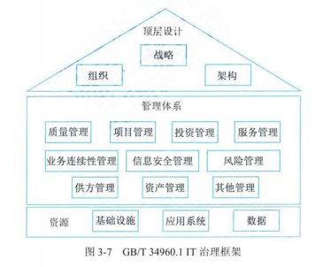

# 3. 信息系统治理

## 1 IT 治理

### IT 治理基础

- 目标价值

  - 与业务目标一致
  - 有效利用信息与数据资源
  - 风险管理
- 管理层次

  - 高等管理
    - 正式 IT 战略与业务战略是否一致
    - 正式通过明确的期望和衡量手段交付 IT 价值
    - 指导 IT 战略、平衡支持组织当前和未来发展的投资
    - 指导信息和数据资源的分配
  - 执行管理层
    - 指定 IT 目标
    - 分析新技术的机遇和风险
    - 建设关键过程与核心竞争力
    - 分配责任、定义规程，衡量业绩
    - 管理风险和活的可靠保证等
  - 业务与服务执行层
    - 信息和数据服务的提供和支持
    - IT 基础设施的建设和维护
    - IT 需求的提出和响应

### IT 治理体系

- IT 治理核心内容
  1. 组织职责
  2. 战略匹配
  3. 资源管理
  4. 价值交付
  5. 风险管理
  6. 绩效管理

### IT 治理任务

- 全局统筹
- 价值向导
- 机制保障
- 创新发展
- 文化助推

### IT 治理方法与标准

- 通用要求，GB/T 34960.1，内容：规定了 IT 治理的模型和框架，实施 IT 治理的原则，以及开展 IT 顶层设计、管理体系和资源的治理要求

  

## 2 IT 审计

### IT 审计基础

- 目的
  - 审计目的
    - 了解组织 IT 系统与 IT 活动的总体情况
    - 对组织是否实现 IT 目标进行审查和评价
    - 充分识别与评估相关 IT 风险
    - 提出和评价意见及改进建议，促进组织实现 IT 目标
  - 组织的 IT 目标
    - 组织的 IT 战略应与业务战略保持一致
    - 保护信息资产的安全及数据的完整、可靠、有效
    - 提高信息系统的安全性、可靠性及有效性
    - 合理保证信息系统及其运用符合有关法律、法规及标准等的要求
- 范围
  - 范围的确定
    - 总体范围：根据目的和投入的成本确定
    - 组织范围：明确审计涉及的组织机构、主要流程、活动及人员
    - 物理范围：具体的物理地点与边界
    - 逻辑范围：涉及的信息系统和逻辑边界
- 人员
  - 执业道德
  - 知识、技能、资格、经验
  - 专业胜任能力
  - 利用外部专家服务
- 风险
  - 固有风险：IT 活动不存在相关控制的情况下，易于导致重大错误的风险
    - 特点
      - 是 IT 活动本身具备的，审计人员只能评估，无法控制或影响它
      - 衡量是主观的、复杂的，不同的 IT 活动的固有风险不同
  - 控制风险：与 IT 活动相关的内部控制体系不能及时预防或检查出存在的重大错误的风险
    - 特点
      - 与内部控制制度执行的有效性有关，与审计无关，属于内部控制的范畴，审计人员只能评估其风险水平而不能对其实施控制和影响
      - 其风向水平的衡量由于需要艰苦传统内部控制的思想和计算机系统管理的知识，因而较为复杂且难以准确计算
  - 检查风险：通过预定的审计程序未能发现重大、单个或与其他错误相结合的风险
    - 影响因素：审计规范不完善、审计人员自身或者技术原因等造成影响审计测试正确性的各种因素
  - 总体审计风险：对单个控制目标锁产生的各类审计风险的总和

### 审计方法与基础

- 审计依据与准则-国际常用审计规则
  - 信息系统审计准则（SACA）
  - 《内部控制-整体框架》报告（COSO）
  - 《萨班斯法案》（SOX）
  - 信息及相关技术控制目标（COBIT）
- 审计技术
  - 风险评估技术（类似风险管理）
    - 风险识别技术
    - 风险分析技术
    - 风险评价技术
    - 风险应对技术
  - 审计抽样技术
  - 计算机辅助审计技术
  - 大数据审计技术
- 审计证据：由审计机构和人员获取，用于确定锁审计试题或数据是否遵循既定标准或目标，形成审计结论的证明材料
- IT 审计底稿-分类
  - 综合类工作底稿
  - 业务类工作底稿：实施阶段的
  - 备查类工作底稿

### 审计流程

- 准备阶段
- 实施阶段
- 终结阶段：出具结果报告
- 后续审计阶段：跟踪纠正

### 审计内容
