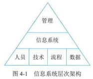
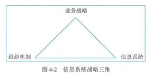

## 1 管理方法

### 管理基础

- 信息系统四要素
  - 人员
  - 技术
  - 流程
  - 数据

### 规划和组织

### 设计和实施

- 信息系统体系架构模式
  - 集中式架构（主机架构）：大型中央计算机系统处理系统的所有功能
  - 分布式架构（基于服务器的架构）：运行业务所需的计算能力分散在许多设备中
  - 面向服务的系统架构（SOA，基于 Web 的架构）：将较大的软件程序分解为相互链接的服务

### 运维和服务

### 优化和持续改进

- PDCA
  - Plan - 计划
  - Do - 执行
  - Check - 检查
  - Act - 处理
- 六西格玛五阶段法
  - DMAIC/DMADV
    - Define - 定义
    - Measure - 度量
    - Analysis -分析
    - Improve/Design - 改进/设计
    - Control/Nerify - 验证/控制

## 2 管理要点

### 数据管理

- DCMM 数据管理能力成熟度评估模型
  - 数据生存周期-四个能力项
    - 数据需求
    - 数据设计和开发
    - 数据运维
    - 数据退役
  - 5 个等级
    - 初始级：被动管理
    - 受管理级：初步管理
    - 稳健级：标准化管理流程，规范化
    - 量化管理级：可量化分析和监控
    - 优化级

### 运维管理

- 能力模型
  - IT 运维能力模型
    - 治理要求
    - 运行维护服务能力体系
    - 价值实现
  - 关键指标
    - 能力建设
    - 人员能力：指导 IT 运维团队根据岗位职责和管理要求“选人做事”
    - 资源能力：确保 IT 运维能“保障做事”
    - 技术能力：确保 IT 运维能“高效做事”
    - 过程：确保 IT 运维能“正确做事”
- 智能运维-智能特征
  - 能感知
  - 会描述
  - 自学习
  - 会诊断
  - 可决策
  - 自执行
  - 自适应

### 信息安全管理

- CIA 三要素
  - Confidentiality - 保密性
  - Integrity - 完整性
  - Availability - 可用性
- 网络安全等级保护
  - 安全保护等级划分
    - 第一级：遭到破坏后，对相关公民、法人和其他组织的合法权益造成损害，但不危害国家安全、社会秩序和公共利益
    - 第二级：对公民、法人和其他组织的合法权益产生严重损害或特别严重损害，或对社会秩序和公共利益造成危害，但不危害国家安全
    - 第三级：对社会秩序和公共利益造成严重危害，或对国家安全造成危害
    - 第四级：对社会秩序和公共利益造成特别严重危害，或对国家安全造成严重危害
    - 第五级：对国家安全造成特别严重危害
  - 安全保护能力等级划分
    - 第一级：防护个人、拥有很少资源的威胁源发起的攻击；能恢复部分功能
    - 第二级：防护小型组织、拥有少量资源的威胁源发起的攻击；一段时间内恢复部分功能
    - 第三级：防护外部有组织的团体、拥有较为丰富资源的威胁源发起的攻击；能快速恢复绝大部分功能
    - 第四级：能防护来自国家级别的、敌对组织的、拥有丰富资源的威胁源的攻击；能迅速恢复所有功能
    - 第五级：略
