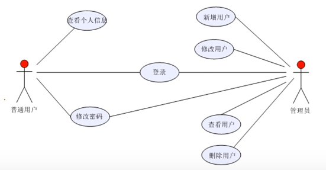
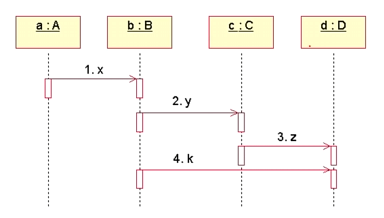
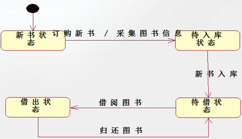
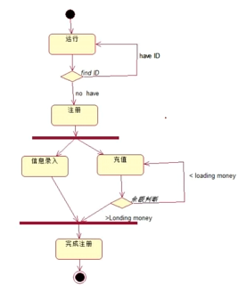
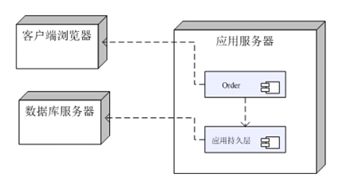
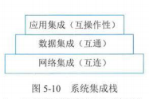
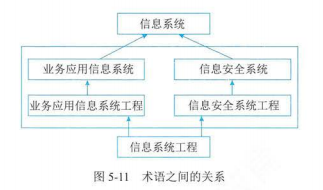
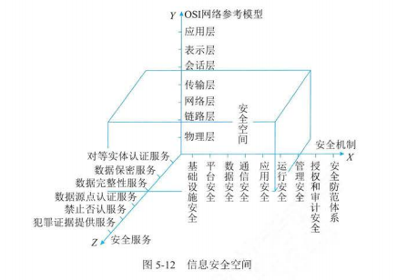

# 5. 信息系统工程

## 1 软件工程

### 架构设计

- 架构风格
  - 核心问题：能否达到架构级的软件复用
- 架构分类
  - 数据流风格：批处理序列、管道/过滤器
  - 调用/返回风格：主程序/子程序
  - 独立构件风格：进程通信、事件驱动
  - 虚拟机风格：解释器、基于规则的系统
  - 仓库风格：数据库系统、黑板系统、超文本系统

### 需求分析

- 需求层次

  - 业务需求
  - 用户需求
  - 系统需求
- 质量功能部署 - QFD

  - 常规需求：应该有
  - 期望需求：期望有
  - 意外需求
- 需求过程

  - 需求获取：用户访谈、问卷调查、采样、情节串联板、联合需求计划等
  - 需求分析
    - 结构化分析 （SA）- 数据字典三个层次的模型
      - 数据模型：实体关系图（E-R 图）
      - 功能模型：数据流图（DataFlow Diagram，DFD）
      - 行为模型（状态模型）：状态转换图（State Transform Diagram，STD）
    - 面相对象分析（OOA）
  - 需求规格说明书编制
    - 《软件需求规格说明书》（SRS）
    - 整个开发工作的基础
  - 需求验证与确认（验证过程，确认结果）
    - 需求评审：对 SRS 进行技术评审，是一项精益求精的技术，可以发现那些二义性、不确定的需求，为项目干系人提供在需求问题上达成共识的方法
- UML - 统一建模语言

  - 关系

    - 依赖：一个事物变化会影响另一个事物
    - 关联：关联描述一组对象之间链接的结构关系
    - 泛化：一般化和特殊化的关系，描述特殊元素的对象可替换一般元素的对象
    - 实现：类之间的寓意关系，其中一个类指定了由另一个类保证执行的契约
  - UML2.0 常见图

    - 用例图：参与者及它们之间的关系，静态视图

    

    - 顺序图：一组对象或参与者及它们之间可能发送的消息构成，关注系统动态视图，强调消息的时间次序

    

    - 状态图：由状态、转移、事件和活动组成，给出了对象的动态视图

    

    - 活动图：关注系统的动态视图，强调对象间的控制流程

    

    - 部署图：给出了架构的静态部署视图，通常一个节点包含一个或多个部署图

    
  - UNL 视图

    - 逻辑视图（设计视图）：表示了设计模型中在架构方面具有重要意义的部分，即类、子系统、包和用例实现的子集
    - 进程视图：是可执行线程和进程作为活动类的建模，它是逻辑视图的一次执行实例，描述了并发与同步结构
    - 实现视图：对组成基于系统的物理代码的文件和构件进行建模
    - 部署视图：把构件部署到一组物理节点上，表示软件到硬件的映射和分布结构
    - 用例视图：最基本的需求分析模型
- 面相对象分析 - OOA

  - OOA 的任务是“做什么”，OOD 的任务是“怎么做”
  - 用例模型 - 四个阶段
    - 识别参与者
    - 合并需求获得用例
    - 细化用例描述
    - 调整用例模型
  - 分析模型 - 类之间的主要关系
    - 关联
    - 依赖
    - 泛化
    - 共享聚集：生命周期可以不同
    - 组合聚集：生命周期相同
    - 实现

### 软件设计

- 结构化设计 - SD
  - 分为
    - 概要设计（总体结构设计）
    - 详细设计- 根据任务进行分类
      - 输入/输出设计
      - 处理流程设计
      - 数据存储设计
      - 用户界面设计
      - 安全性和可靠性设计
  - 遵循原则：高内聚，低耦合
- 面相对象设计 - OOD - 原则
  - 单职原则：功能单一，与高内聚原则一致
  - 开闭原则：对扩展开放，对修改封闭
  - 李氏替换原则：子类可替换父类
  - 依赖倒置原则：依赖于抽象，而不是具体实现；针对接口，不针对实现
  - 接口隔离原则：使用多个专门的接口，而不是单一总接口
  - 组合重用原则：尽量使用组合，而不是继承关系
  - 迪米特原则（最少知识法则）：一个对象应对其他对象尽可能少的了解，与低耦合原则一致
- 设计模式 - 根据处理范围不同分类
  - 类模式：在编译时被确定，静态关系
  - 对象模式：在运行时刻变化，动态性

### 软件实现

- 软件配置管理：[见专门章节](docs/19.配置与变更管理)
- 软件编码
- 软件测试
  - 静态测试：不运行代码
    - 对文档的静态测试
    - 对代码的静态测试：桌前检查（Desk Checking）、代码走查、代码审查
  - 动态测试
    - 白盒测试（结构测试）：主要用于单元测试
      - 把程序看成是一个透明的白盒，测试人员完全清楚程序的结构和处理算法，按程序内部逻辑结构设计测试用例，检查程序中主要执行通路是否都能按预定要求正确工作
      - 使用人工检查代码的方法来检查代码的逻辑问题，也属于白盒测试的范围
    - 黑盒测试（功能测试）：主要用于集成测试、确认测试、系统测试
      - 将程序看成一个不透明的黑盒，完全不考虑（或不了解）程序内部结构和处理算法，而只检查程序功能是否能按照 SRS 的要求正常使用，程序是否能适当的接收输入数据并产生正确的输出信息，程序运行过程中能否保持外部信息（如文件和数据库）的完整性等

### 部署交付

- 持续部署
  - 蓝绿部署：部署时准备新旧两个版本
  - 金丝雀部署：先让少量用户使用新版本

### 过程管理

- 成熟度模型 - CSMM
  - 4 个能力域
    - 治理
    - 开发和交付
    - 管理与支持
    - 组织管理
  - 成熟度等级
    - 1 级 - 初始级：有不确定性
    - 2 级 - 项目规范级：基本可按计划实现预期结果
    - 3 级 - 组织改进级：组织范围内能稳定的实现预期的项目目标
    - 4 级 - 量化提升级：组织范围内能量化的管理和实现
    - 5 级 - 创新引领级：引领行业发展

## 2 数据工程

### 数据建模

- 数据模型
  - 概念模型（信息模型）：把现实世界中的可观对象抽象为某种信息结构，这种信息结构不依赖于具体的计算机系统，也不对应某个具体的 DBMS，它是概念级别的模型
  - 逻辑模型：改概念模型的基础上，确定模型的数据结构
  - 物理模型：在逻辑数据模型的基础上，考虑具体技术实现因素，进行数据库体系结构设计，真正实现数据在数据库中存放
- 数据建模过程
  1. 数据需求分析
  2. 概念模型设计
  3. 逻辑模型设计
  4. 物理模型设计

### 数据标准化

- 数实现数据共享的基础
- 元数据标准化
  - 元数据：描述数据的数据
- 数据元标准化
  - 数据元：数据库、文件、数据交换的基本数据单元
  - 提取
    - 自上而下：新建系统的数据元提取
    - 自下而上：逆向工程，已建系统的数据元提取
- 数据标准化管理-阶段
  1. 确定数据需求
  2. 制定数据标准
  3. 批准数据标准
  4. 实施数据标准

### 数据运维

- 数据存储
  - 存储管理 - 主要内容
    - 资源调度管理
    - 存储资源管理
    - 负载均衡管理
    - 安全管理
- 数据备份
- 数据容灾
  - 数据容灾的基础：数据备份
  - 指标
    - 允许丢失的数据量
    - 恢复时间
- 数据质量评价与控制
- 数据清理
  - 步骤
    1. 数据分析
    2. 数据检测
    3. 数据修正

### 数据开发利用

- 数据集成
- 数据挖掘 - 流程
  1. 确定分析对象
  2. 数据准备
  3. 数据挖掘
  4. 结果评估
  5. 结果应用
- 数据服务

### 数据库安全

## 3 系统集成

### 集成基础

- 集成内容
  - 技术环境集成
  - 数据环境集成
  - 应用环境集成

### 网络集成

### 数据集成

### 软件集成

### 应用集成

- 系统集成栈
  - 网络集成
  - 数据集成
  - 应用集成

## 4 安全工程

### 工程概述

### 安全系统

- 信息安全空间
  - X 轴-安全机制：为提供某些安全服务，利用各种安全技术和技巧，所形成的一个较为完善的结构体系
  - Y 轴-OSI 网络参考模型
  - Z 轴-安全服务

- “安全空间”的五大属性
  - 认证
  - 权限
  - 完整
  - 加密
  - 不可否认

### 工程基础

### 工程体系架构

- 信息系统安全工程 - （Information Security System Engineering，ISSE）
- ISSE 将信息安全系统工程实施过程分解为
  - 工程过程：与其他工程活动意义，包括概念、设计、实现、测试、部署、运行、维护、退出的完整过程
  - 风险过程
    - ISSE 主要目标是降低系统运行风险
    - 有害事件：威胁、脆弱、影响
    - 可以减轻风险，但无法消除或根除
  - 保证过程：安全需求得到满足的可信度
- ISSE-CMM（信息安全系统工程能力成熟度模型） 能力维度/公共特性-成熟度等级定义
  - Level 1：非正规实施级
  - Level 2：规划和跟踪级
  - Level 3：充分定义级
  - Level 4：量化控制级
  - Level 5：持续改进级
