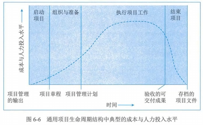

## 1 PMBOK 的发展

## 2 项目基本要素

### 项目基础

- 独特的产品、服务或成果
  - 可交付成果：在某一过程、阶段或完成时，形成的独特并可验证的产品、成果或服务；可能是有形的/无形的
  - 独特性：某些项目可交付成果和活动中可能存在相同的元素，但这并不改变项目本质上的独特性
  - 项目的组织形式：可以再组织的任何层面上开展（一个人、一组人，一个组织单元、多个组织单元）
- 临时性
  - 有明确的起点和终点
  - 其可交付成果可能在项目终止后可能依然存在

### 项目成功的标准

- 时间、成本、范围和质量等管理测量指标

### 项目、项目集、项目组合和运营管理之间的关系

- 概述

  - 四者关系
    
  - 从组织角度看

    - 项目和项目集管理，重点在“正确地做事”
    - 项目组合，重点在“做正确的事”
- 项目集管理

  - 应用知识、技能与原则来实现项目集的目标，获得分别管理项目集组成部分所无法实现的利益和控制
  - 互相关联的
- 项目组合管理

  - 为实现战略目标而组合在一起管理的项目、项目集、子项目组合和运营工作
  - 不一定存在彼此依赖或直接相关的关联关系
- 运营

  - 另外一个领域，不属于项目管理范围
- 组织级项目管理和战略

  - 项目、项目集、项目组合都需要符合组织战略，有组织战略驱动，并以不同的方式服务于战略目标的实现
  - 不同的方式
    - 组合：对工作进行优先级排序，并提供所需资源，与战略保持一致
    - 集：对依赖关系进行控制，从而实现既定收益
    - 项目：使组织目标得以实现

### 项目内外部运行环境

- 组织过程资产
- 组织内部的事业环境因素
- 组织外部的事业环境因素

### 组织系统

- 组织结构类型
  
- 项目管理办公室

  - 类型
    - 支持型：顾问，提供模板、最佳实践 ain/peixun、来自其他项目的信息和经验教训
    - 控制型：提供支持，且通过手段要求项目服从
    - 指令型：直接管理和控制项目，项目经理由 PMO 制定并向其报告
  - 主要职能
    - 对管辖的全部项目的共享资源进行管理
    - 识别和控制项目管理的方法、最佳实践和标准
    - 指导、辅导、培训和监督
    - 通过审计、监督项目对项目管理标准、政策、程序和模板的合规性
    - 制定和管理项目政策、程序、模板及其他共享的文件（组织过程资产）
    - 对跨项目的沟通进行协调

### 项目管理和产品管理

- 产品生命周期
  - 引入
  - 成长
  - 成熟
  - 下降/衰退

## 3 项目经理角色

### 项目经理的影响力范围

- 项目
  - 软技能：使用软技能（如人际关系技能、人员管理技能）来平衡项目干系人之间相互冲突和竞争的目标，以达成共识

### 项目经理能力

- 三种技能
  - 项目管理：与项目、项目集、项目组合管理特定领域相关的知识、技能和行为，可以帮助达成项目目标
  - 战略和商务：关于行业和组织的知识和专业技能，有助于提高绩效并取得更好的业务成果
  - 领导力：指导、激励和带领团队所需的知识、技能和行为，可以帮助组织达成业务目标
- 领导力技能
  - 政策和权利
    - 权利表现形式
      - 地位：正式的、权威的、合法的
      - 信息：对信息收集、分发控制
      - 参考
      - 情境：如危机情况下获得的权利
      - 个性或魅力
      - 关系
      - 专家
      - 奖励相关
      - 处罚或强制力
      - 迎合：如恭维或其他手段赢得青睐或合作
      - 施加压力
      - 引发愧疚
      - 说服力
      - 回避：如拒绝参与
    - 获取权利和职权：需在组织政策、协议和程序许可的范围内主动寻求所需的权利和职权，而不是坐等组织授权
- 领导力与管理
  - 双管齐下：为获得成功成功，需同时采用领导力和管理两种方法，针对不同的情况找到恰当的平衡点。
  - 领导力风格
    - 放任型：允许团队自主决策和设定目标
    - 交易型：根据目标、反馈和成就给予奖励
    - 服务型：做出服务承诺，处处先为他人着想；关注他人成长、学习、发展、自主性和福利；关注人际关系、团队与合作；服务优先于领导
    - 变革型：促进创新和创造，及个人关怀提高追随者能力
    - 魅力型：能激励他人；精神饱满、热情洋溢、充满自信；说服力强
    - 交互型：结合交易、变革、魅力型特点

## 4 价值驱动的项目管理知识体系

- 项目管理原则

  - 勤勉、尊重关心他人
  - 营造协作的项目管理团队环境
  - 促进干系人有效参与
  - 聚焦于价值：价值通过可交付物的预期成果来体现
  - 识别、评估和响应系统交互
  - 展现领导力行为
  - 根据环境进行裁剪
  - 将质量融入到过程和成果中
  - 驾驭复杂性：通常无法预见复杂性的出现，因为复杂性是风险、依赖性、事件或相互关系等许多因素交互形成的
  - 优化风险应对
  - 拥抱适应性和韧性
  - 为实现目标而驱动变革：有效的变革需要采取激励型政策，而不是强制型政策
- 项目生命周期和项目阶段

  - 生命周期结构

    - 启动
    - 组织与准备
    - 制定项目工作
    - 结束
  - 通用的生命周期结构特征

    - 成本与投入：开始低，中间高，快结束时回落
      
    - 风险与不确定性：开始时最大，逐步降低（干系人影响同）
    - 做出变更和纠正错误的成本：随着接近完成而显著增高
      
  - 项目生命周期类型

    - 分类
    - 预测型：范围变更少，干系人高度共识
    - 迭代型：通过一系列重复的循环活动来开发产品
    - 增量型：渐进的增加产品功能
    - 适应型（敏捷型、变更驱动型）：逐步细化
    - 混合型：预测型、适应性的组合
    - 应用
    - 特定项目的不同阶段往往采用不同的生命周期，需要确定项目集其不同阶段最适合的生命周期
    - 区别

| -              | 预测                               | 迭代与增量                       | 适应                           |
| -------------- | ---------------------------------- | -------------------------------- | ------------------------------ |
| 需求           | 开发前预先确认                     | 交付期间定期细化                 | 交付期间频繁细化               |
| 交付           | 在项目结束时一次性交付             | 分次交付整体项目或产品的各个子集 | 频繁交付对客户有价值的各个子集 |
| 变更           | 尽量限制                           | 定期融入项目                     | 在交付期间实时融入项目         |
| 关键干系人     | 在特定里程碑节点参与               | 定期参与                         | 持续参与                       |
| 控制风险和成本 | 通过对基本已知的情况编制详细的计划 | 通过用新信息逐渐细化计划         | 随着需求和制约因素的明显       |

- 项目管理过程组：逻辑分组

  - 五个管理过程组
    - 启动过程组
    - 规划过程组
    - 执行过程组
    - 监控过程组
    - 收尾过程组
      
- 项目管理知识领域

| 知识领域       | 启动过程组   | 规划过程组                                                                               | 执行过程组                           | 监控过程组                         | 收尾过程组     |
| -------------- | ------------ | ---------------------------------------------------------------------------------------- | ------------------------------------ | ---------------------------------- | -------------- |
| 项目整合管理   | 制定项目章程 | 制定项目管理计划                                                                         | 指导与管理项目工作 管理项目知识 | 监控项目工作 实施整体变更控制 | 结束项目或阶段 |
| 项目范围管理   |              | 规划需求管理 收集需求 定义范围 创建WBS                                    |                                      | 确定范围 控制范围             |                |
| 项目进度管理   |              | 规划进度管理 定义活动 排列活动顺序 估算活动持续时间 制定进度计划     |                                      | 控制进度                           |                |
| 项目成本管理   |              | 规划成本管理 估算成本 制定预算                                                 |                                      | 控制成本                           |                |
| 项目质量管理   |              | 规划质量管理                                                                             | 管理质量                             | 控制质量                           |                |
| 项目资源管理   |              | 规划资源管理 估算活动资源                                                           | 获取资源 建设团队 管理团队 | 控制资源                           |                |
| 项目沟通管理   |              | 规划沟通管理                                                                             | 管理沟通                             | 监督沟通                           |                |
| 项目风险管理   |              | 规划风险管理 识别风险 实施定性风险识别 实施定量风险识别 规划风险应对 | 实施风险应对                         | 监督风险                           |                |
| 项目采购管理   |              | 规划采购管理                                                                             | 实施采购                             | 控制采购                           |                |
| 项目干系人管理 | 识别干系人   | 规划干系人参与                                                                           | 管理干系人参与                       | 监督干系人参与                     |                |

- 项目绩效域：[见专门章节](docs/18.项目绩效域)
- 价值交付系统

  - 创造价值
  - 价值交付组件
  - 信息流
    
