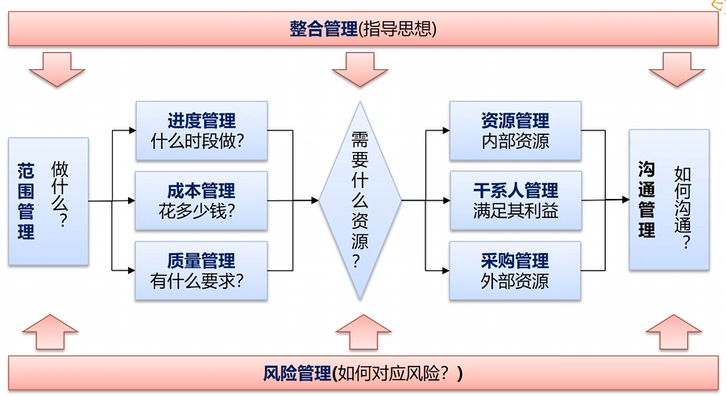
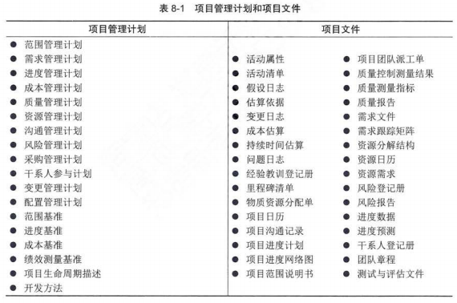
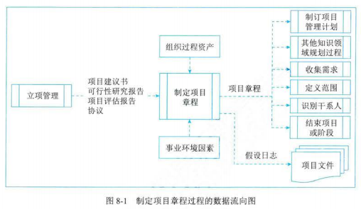
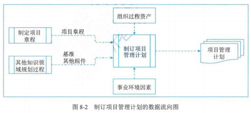
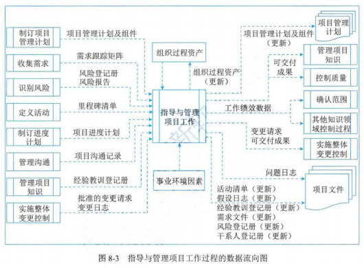
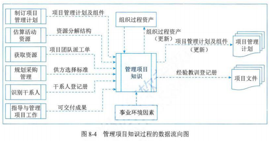
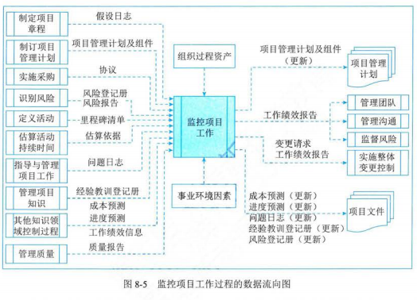
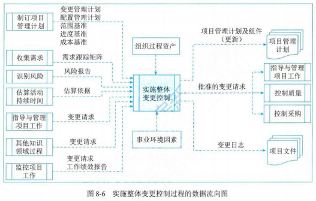
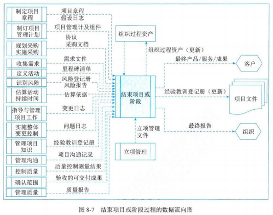

## 概念

- 目标
  - 资源分配
  - 平衡竞争性需求
  - 研究各种备选方案
  - 裁剪过程以及实现项目目标
  - 管理各个项目管理知识领域之间的依赖关系

## 1 管理基础

### 执行整合

- 负责人
  - 由项目经理负责，项目经理负责整合所有其他知识领域的成果，并掌握项目总体情况
  - 该责任不能被授权或转移，项目经理必须对整个项目承担最终责任

### 整合的复杂性

- 复杂性的含义
  - 包含多个部分
  - 不同部分之间存在一系列关联
  - 不同部分之间的动态交互作用
  - 这些交互作用所产生的行为远远大于各部分简单的相加（如突发性行为）

### 管理新实践

### 项目管理计划和项目文件

- 项目管理过程中，会使用并产生两大类文件：
  - 项目管理计划：子计划、基准、其他
  - 项目文件

## 2 项目整合管理过程

- 见后续内容中输入、工具与技术、输出

| 过程               | 输入                                                                                                                       | 工具与技术                                                   | 输出                                                                                                                               |
| ------------------ | -------------------------------------------------------------------------------------------------------------------------- | ------------------------------------------------------------ | ---------------------------------------------------------------------------------------------------------------------------------- |
| 制定项目章程       | 立项管理文件 协议 事业环境因素 组织过程资产                                                                 | 专家判断  数据收集 会议                            | 项目章程 假设日志                                                                                                             |
| 制定项目管理计划   | 项目章程 其他知识领域规划过程的输出  事业环境因素  组织过程资产                                             | 专家判断 数据收集 人际管理与团队技能 会议     | 项目管理计划                                                                                                                       |
| 指导与管理项目工作 | 项目管理计划 项目文件 批准的变更请求 事业环境因素 组织过程资产                                         | 专家判断 项目管理信息系统 会议                     | 可交付成果 工作绩效数据 问题日志 变更请求 项目管理计划（更新） 项目文件（更新） 组织过程资产（更新） |
| 管理项目知识       | 项目管理计划 项目文件 可交付成果 事业环境因素 组织过程资产                                             | 专家判断 知识管理 信息管理 人际关系与团队技能 | 经验教训登记册 项目管理计划（更新） 组织过程资产（更新）                                                                 |
| 监控项目工作       | 项目管理计划 项目文件 工作绩效信息 协议 事业环境因素 组织过程资产                                 | 专家判断 数据分析 决策 会议                   | 工作绩效报告 变更请求 项目管理计划（更新） 项目文件（更新）                                                         |
| 实施整体变更控制   | 项目管理计划 项目文件 工作绩效报告 变更请求 事业环境因素 组织过程资产                             | 专家判断 变更控制工具 数据分析 决策 会议 | 批准的变更请求 项目管理计划（更新） 项目文件（更新）                                                                     |
| 结束项目或阶段     | 项目章程 项目管理计划 项目文件 验收的可交付成果 立项管理文件 协议 采购文档 组织过程资产 | 专家判断 数据分析 会议                             | 项目文件（更新） 最终产品、服务或成果 项目最终报告 组织过程资产（更新）                                             |

## 3 制定项目章程

- 定义：是编写一份正式批准项目并授权项目经理在项目活动中使用组织资源的文件的过程
- 作用
  - 明确项目与组织战略目标之间的直接联系
  - 确立项目的正式地位
  - 展示组织对项目的承诺
- 开展频率：仅一次或仅在项目的预定义时开展
- 与合同的区别：不能当合同使用。
  - 项目章程用于监理组织内部的合作关系，确保正确交付合同内容
  - 合同用来达成外部项目的合作协议
- 为项目经理授权
  - 应在规划开始之前任命项目经理，项目经理越早确认并任命越好，最好在制定项目章程时就任命
- 编制人
  - 可由发起人编制，也可由项目经理与发起机构合作编制
- 重要标志
  - 一旦被批准，就标志着项目的正式启动
- 项目启动人
  - 由项目以外的机构来启动，如：发起人、项目集或项目管理办公室（PMO）、项目组合治理委员会主席或其授权代表

### 输入

- 立项管理文件
- 协议
- 事业环境因素：项目经理不能改变的（标准、规章制度）
- 组织过程资产

### 工具与技术

- 专家判断
- 数据收集
  - 头脑风暴
  - 焦点小组：针对某一问题讨论，比一对一访谈更利于互动
  - 访谈
- 人际关系与团队技能
  - 冲突管理
  - 引导
  - 会议管理
- 会议

### 输出

- 项目章程：关于项目和项目预期交付的产品、服务或成果的高层级信息
  - 内容
    - 项目目的
    - 可测量的项目目标、项目的成功标准
    - 高层级需求、高层级项目描述、边界定义、主要可交付成果
    - 整体项目风险
    - 总体里程碑进度计划
    - 预先批准的财务资源
    - 关键干系人名单
    - 项目批准要求（如：评价项目成功的标准，由谁来对项目成功下结论，由谁签署项目结束）
    - 项目退出标准（如：在何种条件下才能关闭或取消项目或阶段）
    - 委派的项目经理及其职责和职权
    - 发起人或其他批准项目章程的人员的姓名和职权等
- 假设日志
  - 项目生命周期中的所有假设条件和制约因素
  - 高层级：纳入项目章程
  - 较低层级：在项目期间随着诸如定义技术规范、估算、进度和风险等项目活动的开展而生成

## 4 制定项目管理计划

- 定义：是定义、准备和协调项目计划的所有组成部分，并把它们整合为一份综合项目管理计划的过程
- 作用：生成一份综合文件，用于确定所有项目工作的基础及其执行方式
- 特点
  - 可以是概括或详细
  - 基准化
    - 至少应规定项目的范围、时间和成本方面的基准，以便据此考核项目执行情况和管理项目绩效
    - 在确定基准前，可能要对项目管理计划进行多次更新，且这些更新无需遵循正式的流程
    - 一旦确定了基准，就只能通过提出变更请求、实施整体变更控制过程进行更新
  - 渐进明细
    - 项目收尾前，不断更新来渐进明细，且这些更新需要得到控制和批准

### 输入

- 项目章程
- 其他知识领域规划过程的输出
- 事业环境因素
- 组织过程资产

### 工具与技术

- 专家判断
- 数据收集
  - 头脑风暴
  - 核对单：可以指导项目经理制定计划，或帮助检查项目管理计划是否包含所需的全部信息
  - 焦点小组
  - 访谈
- 人际管理与团队技能
  - 冲突
  - 引导
  - 会议管理
- 会议
  - 开工会议：通常利用其明确项目规划阶段工作的完成，并宣布开始项目执行阶段，目的是传达项目目标、获得团队对项目的承诺，以及阐明每个干系人的角色和职责

### 输出

- 项目管理计划
  - 子管理计划
  - 基准：范围、进度、成本
  - 其他组件：变更管理计划、配置管理计划、绩效测量基准、项目生命周期、开发方法、管理审查

## 5 指导与管理项目工作

- 定义：为实现项目目标而领导和执行项目管理计划中所确定的工作，并实施已批准变更的过程
- 实施已批准的变更
  - 纠正措施：纠偏
  - 预防措施：未雨绸缪
  - 缺陷补救措施：产品出现缺陷，进行补救

### 输入

- 项目管理计划
- 项目文件
- 批准的变更请求
  - 是实施整体变更控制过程的输出，包括项目经理审查和批准的变更请求，必要时需经变更控制委员会（Change Control Board，CCB）审查和批准
  - CCB
    - 项目所有者权益代表，负责对变更进行决策
    - 成员：由项目所涉及的主要干系人共同组成，通常包括用户和项目所在组织管理层的决策人员
    - 职责
      - 是决策机构，不是作业机构
      - 通过评审手段来决定基准是否需要变更，但不提出变更方案
- 事业环境因素
- 组织过程资产

### 工具与技术

- 专家判断
- 项目管理信息系统：IT 软件工具，正式或非正式的
- 会议

### 输出

- 可交付成果
  - 某一过程、阶段或项目完成时，必须产出的任何独特并可核实的产品、成果或服务能力
  - 一旦完成了第一版，就应该执行变更控制。用配置管理工具和程序来支持对可交付成果（如文件、软件和构件）的多个版本的控制
- 工作绩效数据
  - 收集到的原始观测结果和测量值
  - 数据通常是最底层的细节，交由其他过程从中提炼并形成信息
- 问题日志
  - 遇到的问题、差距、不一致或意外冲突
  - 内容
    - 问题类型
    - 问题提出者和提出时间
    - 问题描述
    - 问题优先级
    - 解决问题负责人
    - 目标解决日期
    - 问题状态
    - 最终解决情况
  - 创建时间：作为该阶段的输出首次被创建，尽管在项目期间任何时间都可能发生问题
- 变更请求
  - 提出人：任何项目干系人，应通过实施整体变更控制过程对变更请求进行审查和处理
  - 包括
    - 纠正措施：使工作绩效重新与项目管理计划一致
    - 预防措施：保证项目工作未来绩效符合项目管理计划
    - 缺陷补救：为了修正不一致产品或产品组件
    - 更新：对正式受控的项目文件或计划进行变更，以反映修改、增加的意见或内容
- 项目管理计划（更新）
- 项目文件（更新）
- 组织过程资产（更新）

## 6 管理项目知识

- 定义：是使用现有知识并生成新知识，以实现项目目标并帮助组织学习的过程
- 主要作用
  - 利用已有的组织知识来创造或改进项目成果
  - 使当前项目创造的知识可用于支持组织运营和未来的项目或阶段
- 开展频率：在整个项目期间展开
- 最重要的环节就是营造一种相互信任的氛围，激励人们分享知识或关注他人的知识

### 输入

- 项目管理计划
- 项目文件
- 可交付成果
- 事业环境因素
- 组织过程资产

### 工具与技术

- 专家判断
- 知识管理
  - 知识管理工具和技术将员工联系起来，使他们能够合作生成新知识，分享隐性知识，一级集成不同团队成员所拥有的知识
  - 面对面互动：通过面对面和虚拟的方式来应用所有这些工具和技术。通常，面对面互动最有利于建立知识管理所需的信任关系。信任关系建立后可以用虚拟互动来维护这种信任关系
- 信息管理
  - 信息管理工具和技术用于创建人们与知识之间的联系，可以有效促进简单、明确的显性知识分享
- 人际关系与团队技能

### 输出

- 经验教训登记册
  - 可包含执行情况的类别和详细的描述，还可包括与执行情况相关的影响、建议和行动方案
  - 创建时间：在项目早期创建，作为管理项目知识过程的输出
- 项目管理计划（更新）
- 组织过程资产（更新）

## 7 监控项目工作

- 定义：是跟踪、审查和报告项目整体进展，以实现项目管理计划中确定的绩效目标的过程
- 主要作用
  - 让干系人了解项目的当前状态，并认可处理绩效问题而采取的行动
  - 通过成本和进度预测，让干系人了解项目的未来状态
- 开展频率：整个项目期间
- 监督：贯穿于整个项目的项目管理活动之一，包括收集、测量和分析测量结果，以及预测趋势，以便推动过程改进
- 控制：包括制定纠正或预防措施，或重新规划，并跟踪行动计划的实施过程，以确保它们能有效解决问题

### 输入

- 项目管理计划
- 项目文件
- 工作绩效信息：将工作绩效数据与项目管理计划组件、项目文件和其他项目变量比较厚生成的工作绩效信息
- 协议
- 事业环境因素
- 组织过程资产

### 工具与技术

- 专家判断
- 数据分析
  - 备选方案分析
  - 成本效益分析
  - 挣值分析：对范围、进度和成本绩效进行了综合分析
  - 根本原因分析：关注识别问题的主要原因，它可用于识别出现偏差的原因以及项目经理为达成项目目标应重点关注的领域
  - 趋势分析：根据以往结果预测未来绩效，它可以预测项目的进度延误，提前让项目经理意识到，按照既定趋势发展，后期进度可能出现的问问题
  - 偏差分析：成本估算、资源使用、资源费率、技术绩效和其他测量指标
- 决策：常用技术是投票
  - 一致同意
  - 大多数同意
  - 相对多数同意
- 会议

### 输出

- 工作绩效报告
  - 基于工作绩效信息，以实体或电子形式编制形成工作绩效报告，以制定决策、采取行动或引起关注
  - 内容一般包括状态报告和进展报告
- 变更请求
- 项目管理计划（更新）
- 项目文件（更新）
  - 成本预测
  - 进度预测
  - 问题日志
  - 经验教训登记册
  - 风险登记册

## 8 实施整体变更控制

- 定义：是审查所有变更请求、批准变更，管理对可交付成果、项目文件和项目管理计划的变更，并对变更处理结果进行沟通的过程
- 主要作用：确保对项目中以记录在案的变更做出综合评审
- 开展频率：在整个项目期间开展
- 负责人：贯穿项目始终，项目经理对此承担最终责任
- 变更发起人：参与项目的任何干系人都可以提出变更请求
- 实施控制的前提
  - 在基准确定之前，变更无需正式受控、实施整体变更控制过程
  - 一旦确定了项目基准，就必须通过整体变更控制过程来处理变更请求
- 书面形式记录
  - 尽管变更可以口头提出，但所有变更请求都必须以书面形式记录，并纳入变更管理和（或）配置管理系统中
- 变更批准人
  - 每项记录在案的变更请求都必须由一位责任人批准、推迟或否决，这个责任人通常是项目发起人或项目经理
  - 应该在项目管理计划或组织程序中指定这位负责人，必要时应该由 CCB 来开展实施整体变更控制过程

### 输入

- 项目管理计划
- 项目文件
- 工作绩效报告
- 变更请求
  - 变更可能影响项目基准，也可能不影响，变更决定通常由项目经理做决策
  - 对于会影响基准的变更，通常应该在变更请求中说明执行变更的成本、所需的计划日期修改、资源需求、相关风险。这种变更应由 CCB（如有）和客户或发起人审批，除非他们本身就是 CCB 的成员。
  - 只有经批准的变更才能纳入修改后的基准
- 事业环境因素
- 组织过程资产

### 工具与技术

- 专家判断
- 变更控制工具
  - 为了便于开展配置和变更管理，可以使用一些手动或信息化的工具
  - 配置控制和变更控制的关注点不同
    - 配置控制：可交付成果及各个过程的技术规范
    - 变更控制：识别、记录、审批或否决对项目文件、可交付成果或基准的变更
- 数据分析
- 决策
  - 投票
  - 独裁型决策制定
  - 多标准决策分析：接住决策矩阵，根据一系列定义的准则，用系统分析方法评估变更请求
- 会议

### 输出

- 批准的变更请求
- 项目管理计划（更新）
- 项目文件（更新）

## 9 结束项目或阶段

- 定义：是终结项目、阶段或合同的所有活动的过程
- 主要作用
  - 存档项目或阶段信息，完成计划的工作
  - 释放组织团队资源以展开新的工作
- 开展频率：仅开展一次，或仅在项目或阶段的结束点开展
- 需要执行的活动
  - 为达到阶段或项目的完工或退出标准所必须的行动和活动
  - 为关闭项目合同协议或项目阶段合同协议所必须开展的活动
  - 为完成收集项目或阶段记录、审计项目成败、管理知识分享和传递、总结经验教训、存档项目信息，以供组织未来使用等工作所必须开展的活动
  - 为向下一阶段，或向生产和（或）运营部门移交项目的产品、服务或成果所必须开展的行动和活动
  - 收集关于改进或更新组织政策和程序的建议，并将它们发送给相应的组织部门
  - 测量干系人满意度
- 提前终止项目
  - 如果项目在完成工作前提前终止，结束项目或阶段过程还需制定程序，调查和记录提前终止的原因

### 输入

- 项目章程
- 项目管理计划
- 项目文件
- 验收的可交付成果
  - 批准的产品规范
  - 交货收据
  - 工作绩效文件
  - 对于分阶段实施的项目或提前取消的项目，还可能包括部分完成或中间的可交付成果
- 立项管理文件
- 协议
- 采购文档
- 组织过程资产

### 工具与技术

- 专家判断
- 数据分析
  - 文件分析：评估现有文件有助于总结经验教训和分享知识，以改进未来项目的组织资产
  - 回归分析：用于项目结果的不同项目变量的相互关系，以提高未来项目的绩效
  - 趋势分析：用于确认组织所用模式的有效性，并且为未来项目而进行相应的模式调整
  - 偏差分析：通过比较计划目标与最终结果来改进组织的测量指标
- 会议

### 输出

- 项目文件（更新）

  - 可在结束项目或阶段更新所有项目文件，并标记为最终版本
  - 经验教训登记册的最终版本

    - 要包含阶段或项目收尾的最终信息
    - 包括
      - 效益管理
      - 项目评估的准确性
      - 项目和开发生命周期
      - 风险和问题管理
      - 干系人参与
      - 其他项目管理过程
      - 等相关信息
- 最终产品、服务或成果
- 项目最终报告

  - 项目或阶段的概述
  - 范围目标、范围的评估标准，证明达到完工标准的证据
  - 质量目标、项目和产品质量的评估标准、相关核实信息和实际里程碑交付日期及偏差原因
  - 成本目标，包括可接受的成本区间、实际成本，产生任何偏差的原因
  - 最终产品、服务或成果的确认信息的总结
  - 进度计划目标，包括成果是否实现项目预期效益：如果在项目结束时未能实现，则指出效益实现程度并预计未来实现情况
  - 关于最终产品、服务或成果如何满足业务需求的描述：如果项目结束时未能满足业务需求，则指出需求满足程度并预计业务需求何时能得到满足
  - 关于项目过程中发生的风险或问题及其解决情况的概述等
- 组织过程资产（更新）
