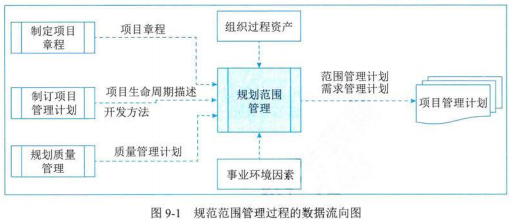
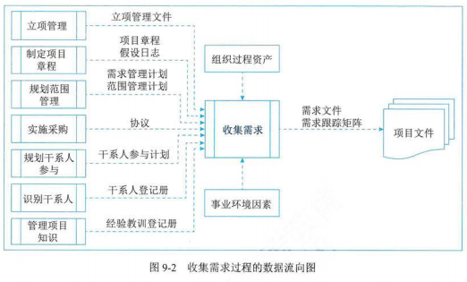
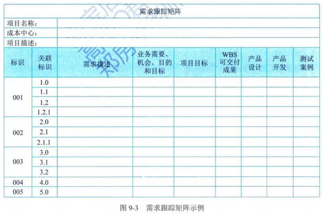
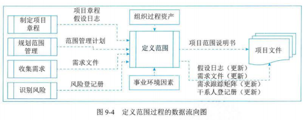
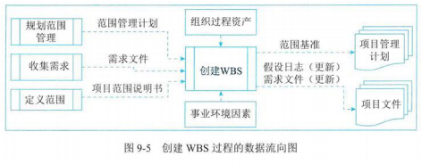
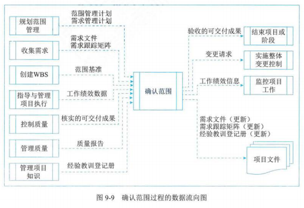
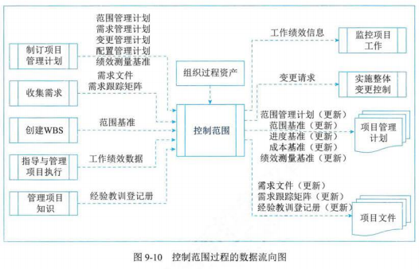

## 1 范围管理基础

- 产品范围和项目范围
  - 产品范围
    - 定义：指某项产品、服务或成果所具有的特征和功能
    - 衡量是否完成：根据产品需求来衡量
  - 项目范围
    - 定义：包括产品范围，是为交付具有规定特性与功能的产品、服务或成果而必须完成的工作
    - 衡量是否完成：根据项目管理计划来衡量

## 2 项目范围管理过程

| 过程         | 输入                                                                                                     | 工具与技术                                                                                                       | 输出                                                                       |
| ------------ | -------------------------------------------------------------------------------------------------------- | ---------------------------------------------------------------------------------------------------------------- | -------------------------------------------------------------------------- |
| 规划范围管理 | 项目章程 项目管理计划 事业环境因素 组织过程资产                                           | 专家判断 数据分析 会议                                                                                 | 范围管理计划 需求管理计划                                             |
| 收集需求     | 立项管理文件 项目章程 项目管理计划 项目文件 协议 事业环境因素 组织过程资产 | 专家判断 数据收集 数据分析 决策 数据表现 人际关系与团队技能 系统交互图 原型法 | 需求文件 需求跟踪矩阵                                                 |
| 定义范围     | 项目章程 项目管理计划 项目文件 事业环境因素 组织过程资产                             | 专家判断 数据分析 决策 人际关系与团队技能 产品分析                                           | 项目范围说明书 项目文件（更新）                                       |
| 创建 WBS     | 项目管理计划 项目文件 事业环境因素 组织过程资产                                           | 专家判断 分解                                                                                               | 范围基准 项目文件（更新）                                             |
| 确认范围     | 项目管理计划 项目文件 工作绩效数据 核实的可交付成果                                       | 检查 决策                                                                                                   | 验收的可交付成果 变更请求 工作绩效信息 项目文件（更新）     |
| 控制范围     | 项目管理计划 项目文件 工作绩效数据 组织过程资产                                           | 数据分析                                                                                                         | 工作绩效信息 变更请求 项目管理计划（更新） 项目文件（更新） |

## 3 规划范围管理

- 定义：为了记录如何定义、确认和控制项目范围及产品范围，而创建范围管理计划的过程
- 主要作用：在整个项目期间对如何管理范围提供指南和方向
- 开展频率：仅开展一次或仅在项目的预定义点开展

### 输入

- 项目章程
- 项目管理计划
- 事业环境因素
- 组织过程资产

### 工具与技术

- 专家判断
- 数据分析
- 会议

### 输出

- 范围管理计划
  - 特征：可以是正式/非正式的，非常详细或高度概括的
- 需求管理计划
  - 定义：是项目管理计划的组成部分，描述如何分析、记录和管理需求
  - 主要内容
    - 如何规划、跟踪和报告各种需求活动
    - 配置管理活动
    - 需求优先级排序过程
    - 测量指标及使用这些指标的理由
    - 反映哪些需求将被列入跟踪矩阵等

## 4 收集需求

- 定义：为实现目标而确定，记录并管理干系人的需要和需求的过程
- 主要作用：是为定义产品范围和项目范围奠定基础
- 开展频率：仅开展一次或仅在项目的预定义点开展

### 输入

- 立项管理文件
- 项目章程
- 项目管理计划
  - 范围管理计划
  - 需求管理计划
  - 干系人参与计划
- 项目文件
- 协议
- 事业环境因素
- 组织过程资产

### 工具与技术

- 专家判断
- 数据收集
  - 头脑风暴
  - 访谈
  - 焦点小组
  - 问卷调查
  - 标杆对照
- 数据分析
  - 文件分析
- 决策
  - 投票
  - 独裁型决策制定
  - 多标准决策分析
- 数据表现
  - 亲和图：用来对大量创意进行分组的技术，以便进一步审查和分析
  - 思维导图
- 人际关系与团队技能
  - 名义小组技术
    - 用于促进头脑风暴的一种技术，通过投票排列最有用的创意，以便进一步开展头脑风暴或优先排序
    - 四个步骤
      1. 向集体提出一个问题或难题，每个人在沉思后写出自己的想法
      1. 主持人在活动挂图上记录所有人的想法
      1. 集体讨论各个想法，指导全体成员达到一个明确的共识
      1. 个人私下投票决出各种想法的优先排序，通常采用 5 分制。1 分最低，5 分最高
  - 观察和交谈
  - 引导
- 系统交互图
- 原型法
  - 故事板

### 输出

- 需求文件
  - 定义：描述各种单一需求将如何满足项目相关的业务需求
  - 作为基准需求的特征：由明确的（可测量、可测试的）、可跟踪的、完整的、相互协调的，且主要干系人愿意认可的需求，才能作为基准
  - 需求的类别
    - 业务需求
    - 干系人需求
    - 解决方案需求
      - 为满足业务需求和干系人需求，产品、服务或成果必须具备的特性、功能和特征
      - 分类
        - 功能需求
          - 描述产品应具备的功能
          - 如：产品应执行的行动、流程、数据和交互
        - 非功能需求
          - 对功能需求的补充，是产品正常运行所需的环境条件或质量要求
          - 如：可靠性、保密性、性能、安全性、服务水平、可支持性、保留或清除等
    - 过度和就绪需求
      - 如数据转换和培训需求。这些需求描述了从“当前状态”过渡到“将来状态”所需的临时能力
    - 项目需求
      - 项目需要满足的行动、过程或其他条件
      - 如：里程碑日期、合同责任、制约因素等
    - 质量需求
      - 用于确认项目可交付成果的成功完成，或其他项目需求的实现的任何条件或标准
      - 如：测试、认证、确认等
- 需求跟踪矩阵
  - 需求文件
  - 需求跟踪矩阵
    - 定义：是把产品需求从其来源，连接到能满足需求的可交付成果的一种表格
    - 内容
      - 业务需要、机会、目的、目标
      - 项目目标
      - 项目范围、WBS 可交付成果
      - 产品设计
      - 产品开发
      - 测试策略、测试场景
      - 高层级需求到详细需求等
        

## 5 定义范围

- 定义：是制定项目和产品详细描述的过程
- 主要作用：描述产品、服务或成果的边界和验收标准
- 开展频率：在整个项目期间多次反复开展

### 输入

- 项目章程
- 项目管理计划
- 项目文件
  - 假设日志
  - 需求文件
  - 风险登记册
- 事业环境因素
- 组织过程资产

### 工具与技术

- 专家判断
- 数据分析
  - 备选方案分析
- 决策
- 人际关系与团队技能
- 产品分析
  - 可用于定义产品和服务，包括针对产品或服务提问并回答，以描述要交付产品的用途、特征及其他方面

### 输出

- 项目范围说明书
  - 定义：对项目范围、主要可交付成果、假设条件和制约因素的描述
  - 内容
    - 产品范围描述
    - 可交付成果
    - 验收标准
    - 项目的除外责任
  - 与项目章程的区别
    - 存在一定程度重叠，但详细程度不同
    - 项目章程包含工程及信息，而项目范围说明书则是对范围组成部分的详细描述，这些组成部分需要再项目过程中渐进明细
- 项目文件（更新）

## 6 创建 WBS

- 定义：把项目可交付成果和项目工作分解成较小、更易于管理的组件的过程
- 主要作用：为所要交付的内容提供架构
- 开展频率：仅开展一次，或仅在项目的预定义点开展
- 工作包：WBS 最底层的组成部分，其中包括计划的工作

### 输入

- 项目管理计划
- 项目文件
  - 需求文件
  - 项目范围说明书
- 事业环境因素
- 组织过程资产

### 工具与技术

- 专家判断
- 分解
  - 定义：是一种把项目范围和项目可交付成果逐步划分为更小、更便于管理的组成部分的技术
  - 创建 WBS 方法
    - 自上而下的方法
    - 使用组织特定的指南
    - 使用 WBS 模板
  - 分解步骤
    1. 识别和分析可交付成果及相关工作
    1. 确定 WBS 的结构和编排方法
    1. 自上而下的逐层细化分解
    1. 为 WBS 组成部分制定和分配标识码
    1. 核实可交付成果分解的程度是否恰当
  - WBS 结构
    - 以项目生命周期的各个阶段作为分解的第二层
    - 以主要可交付成果作为分解的第二层
    - 包含外包的工作
    - 滚动式规则
      - 要在未来远期才完成的交付成果或组件，当前可能无法分解。项目管理团队因而通常需要等待对该可交付成果或组成部分达成一致意见，才能够制定出 WBS 中的相应细节
  - 注意事项
    - 必须是面向可交付成果的
    - 必须符合项目范围
      - 继续包括也仅包括为了完成项目的可交付成果的活动
    - 底层应支持计划和控制
    - 元素必须有人负责，且只有一人负责
    - 应控制在 4-6 层
    - 应包括项目管理工作（因为管理是项目具体工作的一部分），也要包括分包出去的工作
    - 编制需要所有（主要）项目干系人的参与
    - 并非一成不变的

### 输出

- 范围基准
  - 定义：是经过批准的范围说明书、WBS 和相应的 WBS 词典，只有通过正式变更控制程序才能进行变更，它被用作比较的基础
  - 其他概念
    - 项目范围说明书
    - WBS
    - 工作包
      - 控制账户
        - 每个工作包都是控制账户的一部分，而控制账户则是一个管理控制点
        - 在该控制点上，把范围、预算和进度加以整合，并与挣值相比较来测量绩效
      - 工作包与控制账户的关系
        - 控制账户包含两个或更多工作包，每个工作包只与一个控制账户关联
    - 规划包
      - 低于控制账户，高于工作包的结构组件，工作内容一致，但详细的进度活动位置，一个控制账户可以包含一个或多个规划包
    - WBS 字典
      - 是针对 WBS 中的每个组件，详细描述可交付成果、活动和进度信息的文件
- 项目文件（更新）
  - 假设日志
  - 需求文件

## 7 确认范围

- 定义：是正式验收已完成的项目可交付成果的过程
- 主要作用
  - 使验收过程具有客观性
  - 通过确认每个可交付成果来提高最终产品、服务或陈国获得验收的可能性
- 开展频率：在整个项目期间定期开展
- 概念
  - 确认范围的步骤
    1. 确认需要进行的时间
    1. 识别需要哪些投入
    1. 正式被接受的标准和要素
    1. 确认会议的组织步骤
    1. 组织会议
  - 与控制质量的区别
    - 确认范围关注可交付成果的验收
    - 控制质量关注可交付成果的正确性，及是否满足质量要求
    - 控制质量过程通常先于确认范围过程，但二者也可同时进行
  - 需要检查的问题
    - 可交付成果是否是确定的、可确认的
    - 每个可交付成果是否有明确的里程碑，里程碑是否有明确的、可辨别的事件
    - 是否有明确的质量标准
    - 审核和承诺是否有清晰的表达
    - 项目范围是否覆盖了需要完成的产品或服务的所有活动，有没有遗漏或错误
    - 项目范围的风险是否太高
  - 干系人关注点的不同
    - 管理层
      - 关注项目范围
      - 范围对项目的进度、资金和资源的影响，这些因素是否超过了组织承受范围，是否在投入产出上具有合理性
    - 客户
      - 关注产品范围
      - 项目的可交付成果是否足够完成产品或服务
    - 项目管理人员
      - 关注项目制约因素
      - 关心项目可交付成果是否足够和必须完成，事件、资金和资源是否足够，主要的潜在风险和预备解决的方法
    - 项目团队成员
      - 项目范围中自己参与和负责的元素
      - 通过定义范围中的时间检查自己工作的时间是否足够，自己在项目范围中是否有多项工作，而这些工作是否有冲突的地方

### 输入

- 项目管理计划
  - 范围管理计划
  - 需求管理计划
  - 范围基准
- 项目文件
  - 需求文件
  - 需求跟踪矩阵
  - 质量报告
  - 经验教训登记册
- 工作绩效数据
- 核实的可交付成果
  - 指已经完成，并被控制质量过程检查为正确的可交付成果

### 工具与技术

- 检查
- 决策

### 输出

- 验收的可交付成果
  - 符合验收标准的可交付成果应由客户或发起人正式签字批准
- 变更请求
- 工作绩效信息
  - 如：哪些被验收，那些没被验收及原因
- 项目文件（更新）
  - 需求文件
  - 需求跟踪矩阵
  - 经验教训登记册

## 8 控制范围

- 定义：监督项目和产品的范围状态，管理范围基准变更的过程
- 主要作用：在整个项目期间保持对范围基准的维护
- 开展频率：在整个项目期间开展
- 范围蔓延：未经控制的产品或项目范围的扩大（未对时间、成本和资源做相应调整）被称为范围蔓延

### 输入

- 项目管理计划
- 项目文件
- 工作绩效数据
- 组织过程资产

### 工具与技术

- 数据分析
  - 偏差分析
  - 趋势分析

### 输出

- 工作绩效信息
- 变更请求
- 项目管理计划（更新）
- 项目文件（更新）
